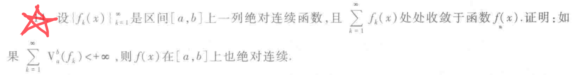

# 实变函数复习
## 实变每日一题

该命题的证明和Cantor-Bernstein定理的证明相似,都是使用轨道法

$
\begin{aligned}
&
\end{aligned}
$

$
\begin{aligned}
&解决本题的关键是考虑不连续点的集合论表示方法\\
&\\
&若我们考虑从连续的\epsilon -\delta 定义出发\\
&i.e.对于固定的x_{0}\\
&\forall \epsilon >0,\exists \delta >0,\\
&s.t. \forall x满足|x-x_{0}|<\delta \\
&有|f(x)-f(x_{0})|\leq \epsilon \\
&\\
&但我们注意到\\
&如果从这种视角下对不连续点做集合论表示\\
&那么我们无法处理\forall |x-x_{0}|<\delta 的不可数个x\\
&因此欲考虑不连续点的集合论表示\\
&我们需要从另一个角度出发——振幅\\
&\\
&记w_{f}(x,\delta )=sup_{t\in U(x,\delta )}f(t)-inf_{t\in U(x,\delta )}f(t)\\
&则w_{f}(x,\delta  )\geq 0\\
&且对于固定的\delta >0,w_{f}(x,\delta )单调递减\\
&故由单调有界原理可知\\
&\lim_{\delta \to 0}w_{f}(x,\delta )存在\\
&记\lim_{\delta \to 0}w_{f}(x,\delta )=w_{f}(x)\\
&因此f(x)在点x_{0}处连续\iff\\
&w_{f}(x_{0})=0\\
&f(x)在点x_{0}处不连续\iff\\
&w_{f}(x_{0})>0\\
&故f(x)的所有不连续点构成的集合为\\
&\{x|w_{f}(x)>0\}\\
&i.e \cup _{n=1}^{\infty}\{x|w_{f}(x)>\frac{1}{n}\}\\
&故我们只需证明\\
&\forall n,\{x|w_{f}(x)>\frac{1}{n}\}是至多可数集\\
&\\
&记上述集合为D_{n}\\
&考虑对D_{n}做切片\\
&设D_{n}^{M}=D_{n}\cap [-M,M]\\
&由f(x)单调可知\\
&w_{f}(x)=f(x^{+})-f(x^{-})\\
&在D_{n}^{M}中,任取有限个互不相同的点\\
&不妨设有k个\\
&不妨设为-M\leq x_1<x_2<\cdots <x_{k}\leq M\\
&\Rightarrow k\cdot \frac{1}{n}\sum_{i=1}^{k}w_{f}(x_{i})\leq f(M)-f(-M)\\
&\Rightarrow k\leq n(f(M)-f(-M))\\
&故知D_{n}^{M}为有限集\\
&故知D_{n}=\cup _{M=1}^{\infty}D_{n}^{M}\\
&故知D_{n}为至多可数集\\
&故知原命题成立\\
&同类问题:\\
&(严格局部极值点的数量)\\
\end{aligned}
$

(使用Kuratowski投影法进行证明)

$
\begin{aligned}
&
\end{aligned}
$

$
\begin{aligned}
&
\end{aligned}
$

$
\begin{aligned}
&本题就是典型的利用闭区间套定理来证明的题目\\
\end{aligned}
$

$
\begin{aligned}
&本题可以利用截口理论使用Fubini定理来证明\\
&(但是需要注意截口理论只有对于可测集才成立)\\
&因此我们需要做如下铺垫:\\
&由f(x)是连续函数可知\\
&(x,f(x))构成的集合是闭集\\
&故该集合是可测集\\
&故由截口理论可知:\\
&m(E)=\int _{a}^{b}m(E_{x}(f(x)))dx\\
&由于f(x)是函数故只每个x只和一个y值对应\\
&故知m(E_{x}(f(x)))=0\\
&故知m(E)=0\\
&\\
&本题也可以利用构造的方法来进行证明\\
&由f(x)是连续函数可知\\
&f(x)一定在[a,b]上一致连续\\
&故知\forall \epsilon >0,\exists \delta >0,\\
&s.t.\forall x,y 满足|x-y|<\delta\\
&有|f(x)-f(y)|\leq \epsilon\\
&故我们对[a,b]做N等分\\
&取N充分大可使得分划后每部分的长度小于\delta \\
&则E\subseteq \cup_{i=0}^{N-1}[x]_{i},x_{i+1}]\cup [f(x_{i})-\epsilon ,f(x_{i})+\epsilon]\\
&故知m^*(E)\leq 2\epsilon(b-a)\\
&令\epsilon \to 0,即知原命题成立\\
\end{aligned}
$

$
\begin{aligned}
&本题的正确解法是使用Vitali集进行构造\\
\end{aligned}
$
 

$
\begin{aligned}
&取全体有理点,然后取r_{n}=\frac{\epsilon }{2^{n}}构造开球\\
&利用其边界时闭包减去集合本身\\
&而闭包是整个全空间,但是这个集合本身的测度\leq \epsilon \\
&故知原命题成立\\
\end{aligned}
$

可测复合不可测

可测的非Borel集

## 课本习题

$
\begin{aligned}
&4-4证明:\\
&f(x)在E上可测\iff \forall Borel集B\\
&f^{-1}(B)都可测\\
&\\
&且若f(x)在R上连续,则f^{-1}(B)是Borel集\\
&\\\\
&证明:\\
&由f(x)连续,故若B是开集,则f^{-1}(B)也是开集\\
&若B是G_{\delta }集,则f^{-1}(B)也是G_{\delta }集\\
&\\
&若B是Borel集\\
&则f^{-1}(B)也是Borel集\\
&\\\\
&4-5若f(x)在E上可测\\
&g(y)在R上连续\\
&证明g\circ f在E上可测\\
&\\
&需要证明:\{x\in E:g\circ f(x)>a\}可测\\
&\{x\in E:g(f(x))>a\}=\{x\in E,f(x)\in g^{-1}(a,+\infty)\}\\
&(a,+\infty)是Borel集\\
&由g连续,故知g^{-1}(a,+\infty)也是Borel集\\
&又有f可测知\\
&对于任意Borel集B,f^{-1}(B)也是Borel集\\
&又由Borel集一定可测\\
&故知\{x\in E:g\circ f(x)>a\}可测\\
&(!!!需要注意的是这里可测和连续的顺序不可以交换)\\
&\\\\
&4-6\\
&若f(x)=f(x_1,\cdots ,x_{n})在R^{n}上可微\\
&证明:\frac{\partial f}{\partial x_{i}}可测,\forall i\\
&\frac{\partial f}{\partial x_{i}}=\lim_{m\to \infty}m(f(x_1,\cdots ,x_{i}+\frac{1}{m},x_{i+1},\cdots,x_{n})-f(x_1,\cdots ,x_{n}))\\
&由于可测函数的极限仍然可测得证\\
&\\\\
&4-7\\
&f_{n}\Rightarrow f,g_{n}\Rightarrow g\\
&证明f_{n}+g_{n}\Rightarrow g+f\\
&\\
&\\
&4-8\\
&|f_{n}(x)|\leq k,a.e. 于E\\
&f_{n}\Rightarrow f\\
&证明:|f(x)|\leq k,a.e. 于E\\
&(使用Riesz定理即可得证)\\
&由Riesz定理可知\\
&\exists f_{n_{i}}\\
&\lim_{i\to \infty}f_{n_{i}}=f(x)\\
&定义E_{i}=\{x\in E,|f_{n_{i}}|>k\}\\
&则m(E_{i})=0\\
&考虑\cup _{i=1}^{\infty} E_{i}=T\\
&则m(T)=0\\
&考虑在E/T上\\
&\lim_{i\to \infty}f_{n_{i}}=f(x)\\
&故由极限保号性有\\
&|f(x)|\leq k\\
&\\\\
&5-1\\
&f(x)在E上非负可测\\
&若\int _{E}f(x)dx=0，则f(x)=0,a.e.\\
&设\{x\in E,f(x)>0\}=\cup_{k=1}^{\infty}\{x\in E,f(x)>\frac{1}{k}\}\\
&目标证明:\\
&\forall k\in N_{+}\\
&m(\{x\in E,f(x)>\frac{1}{k}\}) =0\\
&显然\\
&\\\\
&5-2\\
&f(x)g(x)非负可测,且m(\{x\in E,f(x)\geq a\})=m(\{x\in E,g(x)\geq a\})\\
&则\int _{E}f(x)dx=\int _{E}g(x)dx\\
&证明:\\
&利用定义\\
&若\exists b,s.t.m(\{x\in E,f(x)>b\})=\infty\\
&则\int _{E}f(x)=\int _{E}g(x)dx=+\infty\\
&\\
&下设\forall b,\\
&m(\{x\in E,f(x)\geq b\})<+\infty\\
&\forall a<b\\
&m(x,a\leq f(x)< b)=m(x,a\leq g(x)<b)\\
&定义:\\
&\Psi _{n}=\sum _{k=1}^{n\cdot 2^{n}}\frac{k}{2^{n}}\cdot \mathcal {X}_{E_{n,k}}(x)\\
&\tilde{\Psi _{n}}(x)=\sum _{k=1}^{n\cdot 2^{n}}\frac{k}{2^{n}}\cdot \mathcal {X}_{\tilde{E_{n,k}}}(x)\\
&\psi_{n}(x)上升到f,\tilde{\psi_{n}(x)}上升到g\\
&\\
&\int _{E}f(x)dx=\lim \int \psi _{n}(x)dx=\lim \int \tilde{\psi _{n}}(x)dx=\int _{E}g(x)dx\\
&\\\\
&5-3\\
&mE<+\infty,f(x)非负可测,\\
&\int _{E}f(x)dx<+\infty\\
&e_{n}=\{x,f(x)\geq n\}\\
&证明:\lim_{n\to \infty}n\cdot me_{n}=0\\
&\\
&证明:\\
&n\cdot me_{n}=\int _{e_{n}}ndx\\
&\leq \int _{e_{n}}f(x)dx\\
&下面只需证明\\
&\lim_{n\to \infty}\int _{e_{n}}f(x)dx=0\\
&由e_{n}\supseteq e_{n+1}\\
&e_{n}是一个下降的序列\\
&考虑\\
&\cap _{n=1}e_{n}\\
&则由Levi定理可知\\
&\int _{E/e_{n}}f(x)dx\to \int _{E}f(x)dx\\
&(由于f(x)=+\infty是零测集)\\
&\\\\
&5-4\\
&证明:\\
&若有f(x)在E上非负可测,\\
&\int _{E}f(x)dx<+\infty,\\
&则\forall c\in [0,\int _{E}f(x)dx]\\
&都有F\subset E,使得\int _{F}f(x)dx=c\\
&\\\\
&令F(r)=\int _{x\in E,|x|<r}f(x)dx\\
&下面只需证明\\
&F(r)连续\\
&\iff F(r+h)-F(r)\to 0(h\to 0)\\
&方法一:(利用绝对连续性直接得证)\\
&\\
&方法二:\\
&f(x)有界,\cdots \\
&f(x)无界,就是利用积分绝对连续性的证明方法进行证明\\
&\\\\
&5-5\\
&mE<+\infty,f(x)>0,证明:\\
&\forall \delta >0\\
&\exists d>0,\\
&s.t. \\
&只要mE_{1}\geq \delta ,E_{1}\subseteq E\\
&就有\int _{E_{1}}f(x)dx\geq d\\
&反证:\\
&若\exists \delta _{0}\\
&s.t. \\
&\forall k,\exists E_{k}\\
&s.t. mE_{k}\geq \delta _{0}\\
&但\int _{E_{k}}f(x)dx<\frac{1}{k}\\
&令F_{n}=\{x\in E,\frac{1}{n+1}\leq f(x)<\frac{1}{n}\}\\
&n=1,2,\cdots \\
&F=\{x\in E,f(x)\geq 1\}\\
&E=\cup_{n=1}^{\infty}F_{n}\cup F\\
&mE<+\infty\\
&\exists n_{0},s.t. \sum_{n=n_{0}+1}^{+\infty}m(F_{n})<\frac{1}{2}\delta _{0}\\
&从而\forall k\\
&\frac{1}{n_{0}+1}\frac{\delta _{0}}{2}\leq \int _{E_{k}}f(x)dx<\frac{1}{k}\\
&\\\\
&5-6\\
&mE<+\infty,f(x)非负可测\\
&证明:存在[0,mE]上的非负单调函数g(y)\\
&s.t. m(\{x\in E,f(x)\geq a\})=m(\{y,0\leq y\leq mE,g(y)\geq a\}),\forall a\\
&且\\
&\int _{E}f(x)dx=\int _{[0,mE]}g(y)dy\\
&\\
&证明:\\
&E_{n,k}=\{x\in E,\frac{k}{2^{n}}\leq f(x)<\frac{k+1}{2^{n}}\}\\
&\\\\
&5-7\\
&f(x)在R^{p}可积,g(y)在R^{q}可积\\
&则f(x)g(y)在R^{p+q}可积\\
&\\
&Step1:\\
&f(x)g(y)在(x,y)\in R^{p+q}上可测\\
&由f(x,y)g(x,y)分别可测\\
&故知f(x)g(y)在(x,y)\in R^{p+q}上可测\\
&\\
&Step2:\\
&证明可积:\\
&\iff \int _{R^{p+q}}|f(x)g(y)|dxdy<+\infty\\
&\int _{R^{p}}|f(x)|dx\int _{R^{q}}|g(y)|dy<+\infty\\
&\\\\
&5-8(5-4习题5)\\
&证明:\\
&\\
&\int _{0}^{x}\frac{1}{2}dx=\frac{1}{2}x=m([0,x]\cap E)\\
&=\int _{0}^{x}\mathcal {X}_{E}(t)dt,\forall x\\
&\\
&故知\mathcal {X}_{E}(t)=\frac{1}{2},a.e. \\
&矛盾\\
&\\\\
&5-9(5-4习题14)\\
&设\{f_{k}\}_{k=1}^{\infty}
\end{aligned}
$

## 课后题目

$
\begin{aligned}
&1.构造一个开集G,满足m(\overline{G})>m(G)\\
&这个题目我们有两种构造方法:\\
&(1)借助有理点和指数递增半径构造开球(详见每日实变31)\\
&(2)借助胖Cantor集进行构造\\
&胖Cantor集指的是在保留Cantor集的拓扑结构的基础上\\
&在测度角度上让集合的测度非零\\
&一种自然的构造方式是\\
&对于[0,1]区间我们将最中间的\frac{1}{4}长度的开区间去掉得到F_1\\
&对于F_1的两个闭子区间而言,我们将每个子区间中间\frac{1}{8}长度的开区间去掉得到F_2\\
&\vdots\\
&以此类推得到\{F_{i}\}_{i=1}^{\infty}\\
&取F=\cup_{i=1}^{\infty}F_{i}\\
&我们也就完成了胖Cantor集的构造\\
&\\\\
&2.设E\subset R^{n},那么E可测\iff\forall \epsilon >0,\exists 可测集合E_1和E_2,\\
&s.t. E_1\subset E\subset E_2\\
&且m(E_2-E_1)<\epsilon \\
&(本题可以直接利用Caratheodory条件结合\epsilon -\delta 语言进行证明)\\
&也可以使用集合论方法来给出证明:\\
&\forall n\in N_{+},\exists E_{1n},E_{2n}\\
&满足E_{1n}\subset E\subset E_{2n}\\
&且m(E_{2n}-E_{1n})<\frac{1}{n} \\
&考虑G=\cup _{n=1}^{\infty}E_{2n}\\
&F=\cup_{n=1}^{\infty}E_{1n}\\
&则m*(G-E)=0\\
&E=G\cup (G-E)\\
&由G-E是零测集,G是可测集知\\
&E可以写作两个可测集的并\\
&故知E是可测集\\
&\\\\
&3.可测的Borel集描述:\\
&若f(x)是定义在R^{n}上的可测子集E上的几乎处处有限的函数\\
&证明f(x)可测\iff \\
&\forall Borel集B,f^{-1}(B)可测\\
&\\\\
&证明:\\
&一方面,\\
&若\forall B是Borel集,f^{-1}(B)可测\\
&则f^{-1}((c,+\infty))可测\\
&因此有f(x)是可测函数\\
&\\
&另一方面,\\
&若f(x)可测\\
&令\mathcal {B_{0}}=\{B是Borel集,f^{-1}(B)可测\}\\
&下面我们只需证明全体Borel集构成的集合\mathcal {B}\subset \mathcal {B_{0}}\\
&\\
&由f(x)可测可知\\
&全体开集\in \mathcal {B_{0}}\\
&故知我们只需证明B_{0}是一个\sigma 代数\\
&\\
&显然E\subset \mathcal {B_{0}}\\
&\\
&对于E_{1},E_{2},\cdots ,E_{n},\cdots \in \mathcal {B_{0}}\\
&考虑E=\cup _{i=1}^{\infty}E_{i}\\
&\forall x\in f^{-1}(E)\\
&\exists i\in N_{+},f(x)\in E_{i}\\
&i.e. x\in f^{-1}(E_{i})\\
&故知f^{-1}(E)\subset \cup_{i=1}^{\infty}f^{-1}(E_{i})\\
&\forall x\in \cup_{i=1}^{\infty}f^{-1}(E_{i})\\
&\exists i\in N_{+},x\in f^{-1}(E_{i})\\
&故知f(x)\in E_{i}\\
&故知f(x)\in E\\
&故知x\in f^{-1}(E)\\
&故知f^{-1}(E)=\cup _{i=1}^{\infty}f^{-1}(E_{i})\\
&由可数多个可测集的并仍为可测集可知\\
&f^{-1}(E)可测\\
&\forall E_{0}\subset \mathcal {B_{0}}\\
&f^{-1}(E_{0})可测\\
&下面考虑证明E/E_{0}\in \mathcal {B_{0}}\\
&\iff 证明f^{-1}(E/E_{0})可测\\
&\forall x\in f^{-1}(E/E_{0})\\
&f(x)\in E/E_{0}\\
&\Rightarrow f(x)\notin E_{0}\\
&\Rightarrow x\notin f^{-1}(E_{0})\\
&\forall x\notin f^{-1}(E_{0})\\
&f(x)\notin E_{0}\\
&\Rightarrow f(x)\in E/E_{0}\\
&\Rightarrow x\in f^{-1}(E/E_{0})\\
&故知f^{-1}(E/E_{0})=E/f^{-1}(E_{0})\\
&故知f^{-1}(E/E_{0})仍为可测集\\
&故知\mathcal {B_{0}}是一个\sigma 代数\\
&故知原命题得证\\
&\\\\
&4.承接上题:\\
&若f(x)是一个连续函数\\
&则对于任意的Borel集B,f^{-1}(B)仍为Borel集\\
&令\mathcal {B_{1}}=\{B是Borel集,f^{-1}(B)是Borel集\}\\
&我们只需证明\mathcal {B}\subset \mathcal {B_1}\\
&由于f(x)是连续函数,故知开集的原像一定是开集\\
&因此\\
&我们只需证明\mathcal {B_1}是一个\sigma 代数\\
&R\subset f(x)\\
&与上文论证方式类似即可得证\\
&\\\\
&5.(应用上题结论)\\
&已知f(x)是可测函数,g(x)是连续函数\\
&证明g(f(x))是可测函数\\
&考虑g(f(x))>c\\
&\iff f(x)\in g^{-1}((c,+\infty))\\
&由g(x)连续可知\\
&g^{-1}(c,+\infty)必为一开集\\
&不妨设为G\\
&f(x)\in G\\
&\iff x\in f^{-1}(G)\\
&故只需说明f^{-1}(G)为可测集\\
&而由上题的结论可知\\
&可测函数将Borel集映射为可测集\\
&故知得证\\
&\\\\
&上面的(4,5,6)三道问题研究的是逆映射与Borel集\\
&下面的6,7两道题将会考虑一些正向映射和Borel集之间的关系\\
&6.设f:R\to R是严格单调增函数,证明f^{-1}是一个连续函数\\
&\\\\
&7.设B\subset R 是Borel集,f:R\to R是单调函数\\
&证明:f(B)也是Borel集\\
&
&\\\\
&8.\\
&设mE<+\infty,f(x)是E上的非负可测函数,\\
&\int _{E}f(x)dx<+\infty,\\
&e_{n}=E[x;f(x)\geq n],\\
&证明\lim_{n\to \infty}n\cdot me_{n}=0\\
&本题需要积累的是这个引理:\\
&一个几乎处处有限的可测函数在一个零测集上的积分是0\\
&利用该引理和Chebyshev不等式我们即可完成该题目的证明:\\
&\int _{e_{n}}f(x)dx\geq nme_{n}\\
&令e=\cup _{n=1}^{\infty}e_{n}\\
&则\int _{e_{n}}f(x)dx=\int _{E}f(x)\cdot \mathcal {X}_{e_{n}}(x)dx\\
&\\
&f(x)\cdot \mathcal {X}_{e_{n}}\geq  f(x)\cdot \mathcal {X}_{e_{n+1}}\geq \cdots \\
&且f(x)\cdot \mathcal {X}_{e_{n}}\leq f(x)\\
&故由Lebesgue控制收敛定理可知\\
&\lim_{n\to \infty}\int _{e_{n}}f(x)dx\\
&=\lim_{n\to \infty}\int _{E}f(x)\cdot \mathcal {X}_{e_{n}}(x)dx\\
&=\int _{E}0dx=0\\
&\Rightarrow \\
&\lim_{n\to \infty}n\cdot me_{n}\leq \int _{e_{n}}f(x)dx=0\\
&故知原命题得证\\
&\\\\
&9.\\
&设mE<+\infty,f(x)>0在E上可测.\\
&证明:\\
&\forall \delta >0,\exists d>0\\
&s.t. \forall E_1\subset E,m(E_1)\geq \delta \\
&\int _{E_1}f(x)dx\geq d\\
&经过分析我们只需要对E_1做控制\\
&使得其中包含的使得f(x)比较小的点比较少即可\\
&\\
&我们考虑F_{n}=\{x|f(x)\leq \frac{1}{n}\}\\
&则F_1\supset F_2\supset \cdots \supset F_n\supset\cdots \\
&考虑\cap _{n=1}^{\infty}F_{n}\\
&\forall x\in E\\
&f(x)>0\\
&故知x\notin \cap _{n=1}^{\infty}F_{n}\\
&故知m(\cap _{n=1}^{\infty}F_{n})=0\\
&即m(\lim_{n\to \infty}F_{n})=0\\
&由F_{n}是下降序列,m(F_1)\leq m(E)<\infty可知\\
&0=m(\lim_{n\to \infty}F_{n})=\lim_{n\to \infty}m(F_{n})\\
&故知\forall \delta >0\\
&\exists N\in N_{+}\\
&s.t. \forall n\geq N\\
&m(F_{n})\leq \frac{\delta}{2}\\
&故知\int _{E_1}f(x)dx\geq \frac{\delta }{2}\frac{1}{N}\\
&故知取d=\frac{\delta }{2}\frac{1}{N}即可\\
&\\\\
&10.\\
&设f_{n}(x)(n=1,2,3\cdots )都是E上的可测函数\\
&\sum_{n=1}^{\infty}\int _{E}|f_{n}(x)|dx<+\infty\\
&证明:\\
&\sum_{n=1}^{\infty}f_{n}(x)在E上几乎处处绝对收敛，其和函数在E上可积\\
&且:\\
&\int _{E}\sum_{i=1}^{\infty}f_{i}(x)dx=\sum_{i=1}^{\infty}\int _{E}f_{i}(x)dx\\
&(本题的关键是考虑到非负级数一定可以换序)\\
&(由Levy定理保障)\\
&令g(x)=\sum_{n=1}^{\infty}|f_{n}(x)|\\
&由Levy定理可知\\
&\int _{E}g(x)dx=\sum_{n=1}^{\infty}\int _{E}|f_{n}(x)|dx\\
&故知g(x)可积\\
&故知g(x)几乎处处收敛\\
&令S_{n}=\sum_{i=1}^{n}f_{i}(x)\\
&则|S_{n}|\leq g(x)\\
&故由Lebesgue控制收敛定理可知\\
&原命题成立\\
&\\\\
&11.设\{f_{n}(x)\}_{k=0}^{\infty}是区间[a,b]上的一列单调不减函数\\
&且\lim_{n\to \infty}V_{a}^{b}(f_{0}-\sum_{k=1}^{n}f_{k})=0\\
&(本题涉及的重要技巧在于)\\
&(利用L_1收敛推出p收敛推出a.e. 收敛)\\
&令g_{n}=f_{0}-\sum_{k=1}^{n}f_{k}\\
&则由其有界变差可知\\
&g_{n}可导\\
&并且\\
&g_{n}'=f_{0}'-\sum_{k=1}^{n}f_{k}'\\
&故知我们只需证明\lim_{n\to \infty}g_{n}几乎处处为0\\
&考虑\int _{a}^{b}|g_{n}'(x)|dx\\
&=\int _{a}^{b}|f_{0}'(x)-\sum_{k=1}^{n}f_{k}'(x)|dx\\
&=V_{a}^{b}(g_{n})\\
&令n\to \infty可知\\
&\int _{a}^{b}|f_{0}'(x)-\sum_{k=1}^{\infty}f_{k}'(x)|dx=0\\
&故知\sum_{k=1}^{n}f'_{k}(x)\overset{L_1}{\to }f_{0}\\
&故知\sum_{k=1}^{n}f'_{k}(x)\overset{p}{\to }f_{0}\\
&设S_{n}(x)=\sum_{k=1}^{n}f_{k}(x)\\
&故知由Riesz定理\\
&\exists S_{n_{i}},s.t. \\
&\lim_{i\to \infty}S_{n_{i}}'(x)\overset{a.e.}{\to }f_{0}(x)\\
&而由S_{n}'关于n单调\\
&故知S_{n}\overset{a.e. }f_{0}\\
&\\\\
&12.设\{f_{n}\}_{n=1}^{\infty}是区间[a,b]上一列绝对连续函数\\
&且\sum_{k=1}^{\infty}f_{k}(x)处处收敛于f(x),证明:\\
&若\sum_{k=1}^{\infty}V_{a}^{b}(f_{k})<+\infty\\
&则f(x)在[a,b]上也绝对连续\\
&记F_{n}(x)=\sum_{i=1}^{n}f_{i}(x)\\
&由f_{i}(x)绝对连续可知\\
&F_{n}(x)绝对连续\\
&F_{n}(x)=F_{n}(a)+\int _{a}^{b}F_{n}'(x)dx\\
&\\
&令\lim_{n\to \infty}F_{n}(x)=\lim_{n\to \infty}F_{n}(a)+\lim_{n\to \infty}\int _{a}^{x}F_{n}'(t)dt\\
&f(x)=f(a)+\lim_{n\to \infty}\int _{a}^{x}F_{n}'(t)dt\\
&V_{a}^{b}(f_{k})=\int _{a}^{b}|f_{k}'(x)|dx\\
&\Rightarrow \\
&由levy定理有\\
&\int _{a}^{b}\sum_{k=1}^{\infty}|f_{k}'(x)|dx=\sum_{k=1}^{\infty}\int _{a}^{b}|f'_{k}(x)|dx<+\infty\\
&因此有\\
&F_{n}'(x)\leq \sum_{k=1}^{\infty}|f_{k}'(x)|\\
&故由Lebesgue控制收敛定理有\\
&f(x)=f(a)+\int _{a}^{x}\lim_{n\to \infty}F_{n}'(t)dt\\
&故知f(x)可表示为f(a)+可积函数的变上限积分\\
&故知f(x)绝对连续\\
&\\\\
&13.设f是区间[0,b]上的有界变差函数\\
&设F(x)=\frac{1}{x}\int _{0}^{x}f(t)dt,F(0)=0\\
&证明F是区间[a,b]上的有界变差函数\\
&本题若使用定义法进行估计较为麻烦\\
&\\
&我们可以直接利用有界变差函数的Jordan分解进行证明\\
&\\
&由f有界变差可知,\exists 单调函数f_1,f_2\\
&s.t. f=f_1-f_2\\
&F(x)=\frac{1}{x}\int _{0}^{x}f_1(t)dt-\frac{1}{x}\int _{0}^{x}f_2(t)dt\\
&而由f_1(t),f_2(t)单调可知\\
&\frac{1}{x}\int _{0}^{x}f_1(t)dt和\frac{1}{x}\int _{0}^{x}f_2(t)dt均单调\\
&故知F(x)是有界变差函数\\
&\\\\
&14.设f是区间[a,b]上的增函数\\
&满足\int _{a}^{b}f'(x)dx=f(b)-f(a)\\
&证明:\\
&f是区间[a,b]上的绝对连续函数\\
&考虑\int _{a}^{x}f'(x)dx\leq f(x)-f(a)\\
&\int _{x}^{b}f'(x)dx\leq f(b)-f(x)\\
&集合\int _{a}^{b}f'(x)dx=f(b)-f(a)\\
&故知f(x)=\int _{a}^{x}f'(x)+f(a)\\
&故知f(x)绝对连续\\
\end{aligned}
$

## 