# 实变函数复习
## 实变每日一题
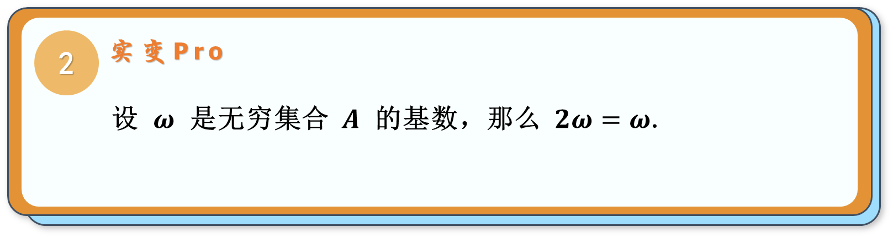
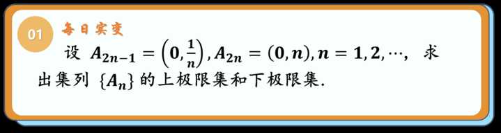
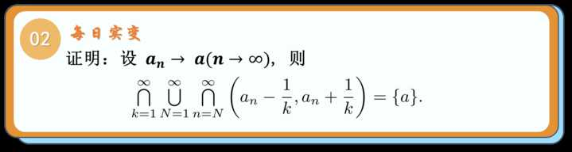
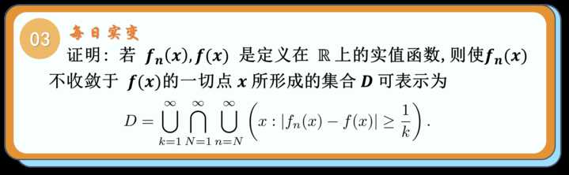
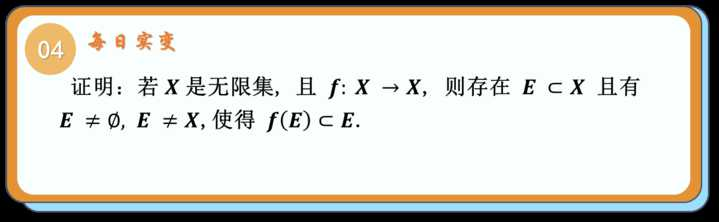

该命题的证明和Cantor-Bernstein定理的证明相似,都是使用轨道法

$
\begin{aligned}
&
\end{aligned}
$

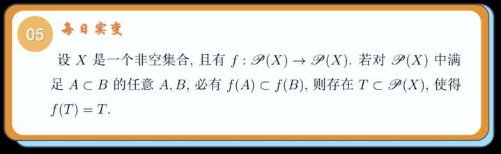
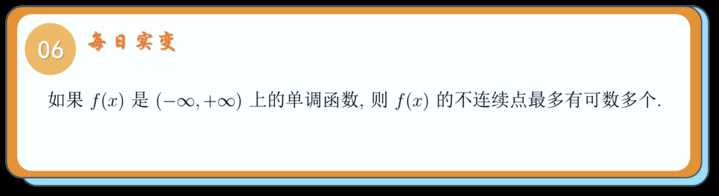

$
\begin{aligned}
&解决本题的关键是考虑不连续点的集合论表示方法\\
&\\
&若我们考虑从连续的\epsilon -\delta 定义出发\\
&i.e.对于固定的x_{0}\\
&\forall \epsilon >0,\exists \delta >0,\\
&s.t. \forall x满足|x-x_{0}|<\delta \\
&有|f(x)-f(x_{0})|\leq \epsilon \\
&\\
&但我们注意到\\
&如果从这种视角下对不连续点做集合论表示\\
&那么我们无法处理\forall |x-x_{0}|<\delta 的不可数个x\\
&因此欲考虑不连续点的集合论表示\\
&我们需要从另一个角度出发——振幅\\
&\\
&记w_{f}(x,\delta )=sup_{t\in U(x,\delta )}f(t)-inf_{t\in U(x,\delta )}f(t)\\
&则w_{f}(x,\delta  )\geq 0\\
&且对于固定的\delta >0,w_{f}(x,\delta )单调递减\\
&故由单调有界原理可知\\
&\lim_{\delta \to 0}w_{f}(x,\delta )存在\\
&记\lim_{\delta \to 0}w_{f}(x,\delta )=w_{f}(x)\\
&因此f(x)在点x_{0}处连续\iff\\
&w_{f}(x_{0})=0\\
&f(x)在点x_{0}处不连续\iff\\
&w_{f}(x_{0})>0\\
&故f(x)的所有不连续点构成的集合为\\
&\{x|w_{f}(x)>0\}\\
&i.e \cup _{n=1}^{\infty}\{x|w_{f}(x)>\frac{1}{n}\}\\
&故我们只需证明\\
&\forall n,\{x|w_{f}(x)>\frac{1}{n}\}是至多可数集\\
&\\
&记上述集合为D_{n}\\
&考虑对D_{n}做切片\\
&设D_{n}^{M}=D_{n}\cap [-M,M]\\
&由f(x)单调可知\\
&w_{f}(x)=f(x^{+})-f(x^{-})\\
&在D_{n}^{M}中,任取有限个互不相同的点\\
&不妨设有k个\\
&不妨设为-M\leq x_1<x_2<\cdots <x_{k}\leq M\\
&\Rightarrow k\cdot \frac{1}{n}\sum_{i=1}^{k}w_{f}(x_{i})\leq f(M)-f(-M)\\
&\Rightarrow k\leq n(f(M)-f(-M))\\
&故知D_{n}^{M}为有限集\\
&故知D_{n}=\cup _{M=1}^{\infty}D_{n}^{M}\\
&故知D_{n}为至多可数集\\
&故知原命题成立\\
&同类问题:\\
&(严格局部极值点的数量)\\
\end{aligned}
$

(使用Kuratowski投影法进行证明)
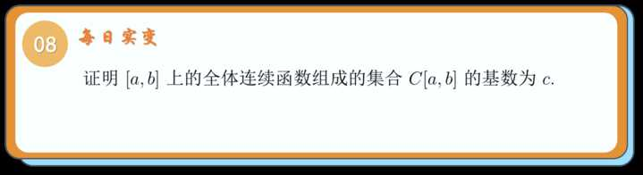
$
\begin{aligned}
&
\end{aligned}
$

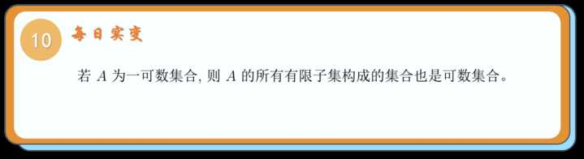
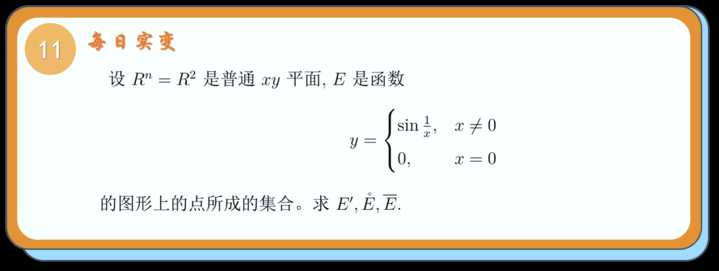
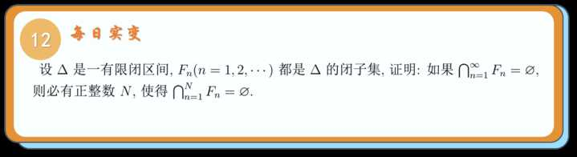
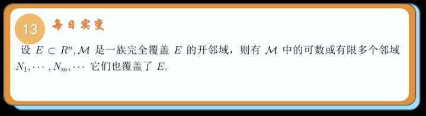

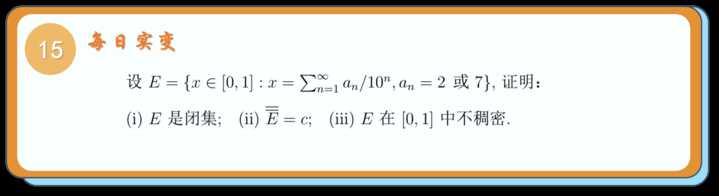
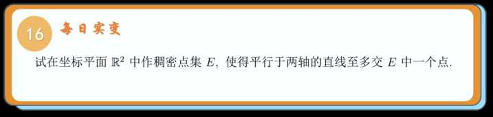
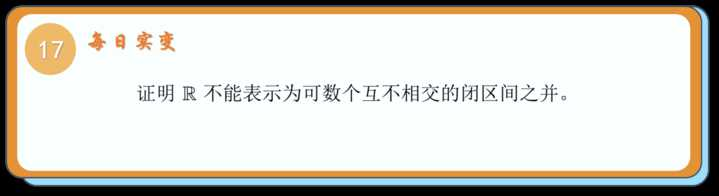

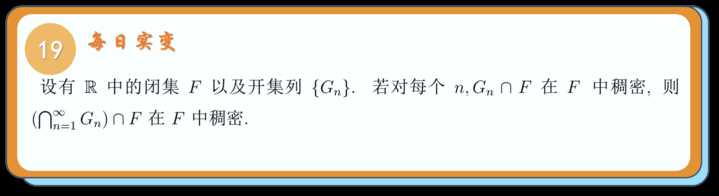
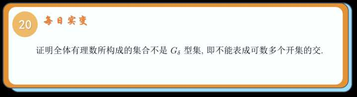

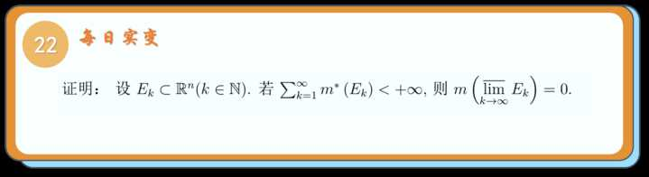
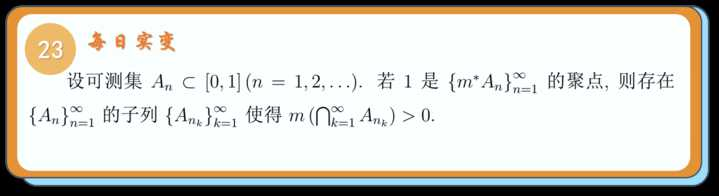
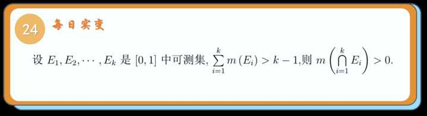
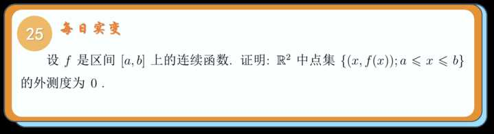
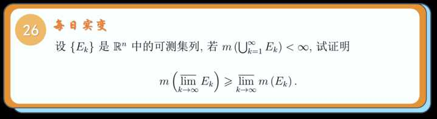
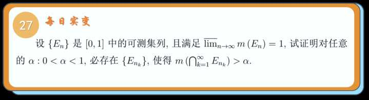
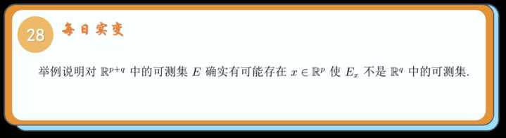
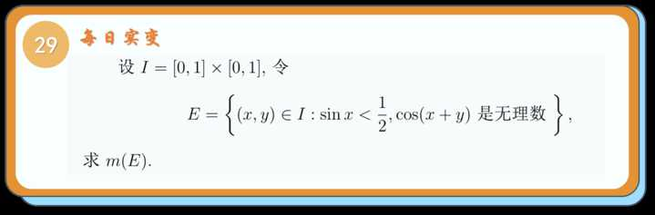 
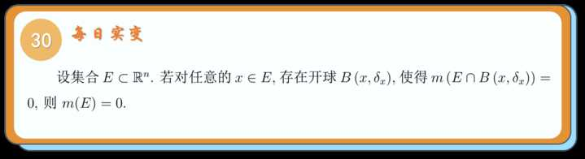
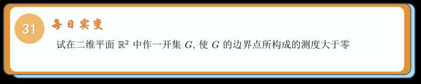
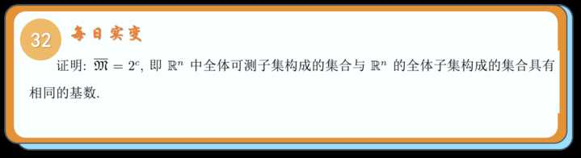
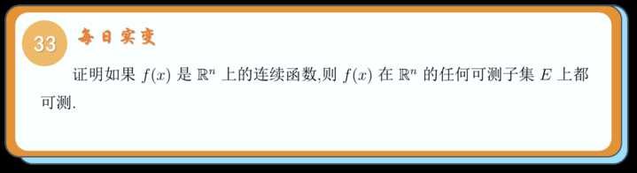
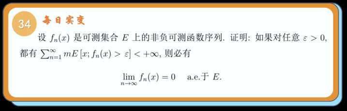
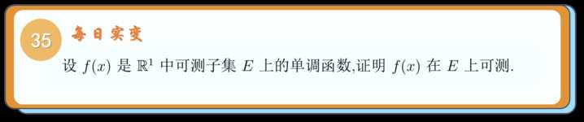
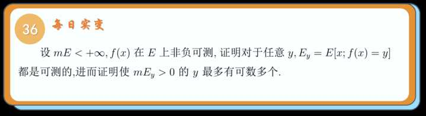
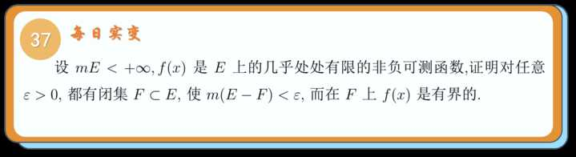
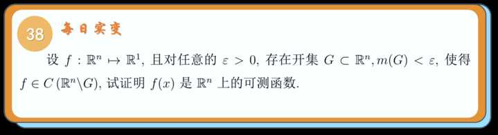
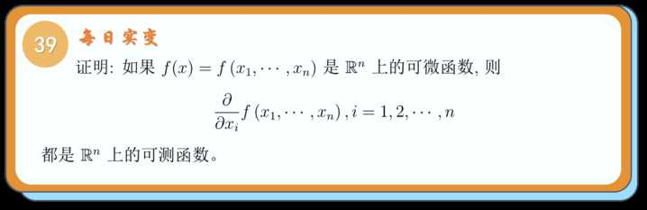
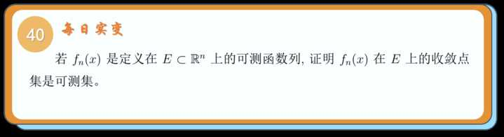
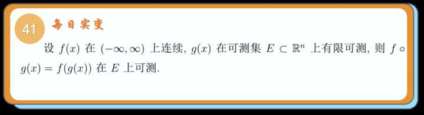
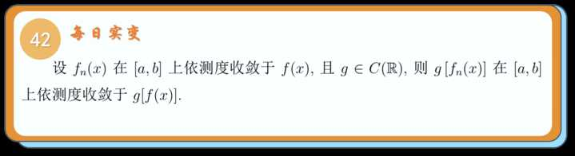
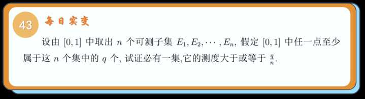
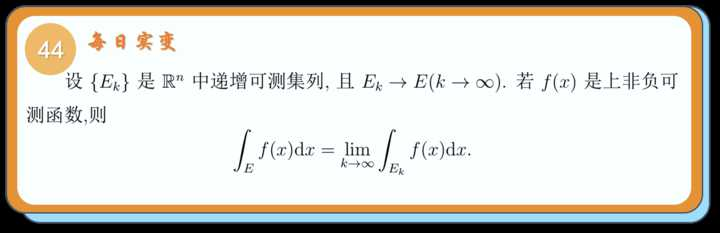
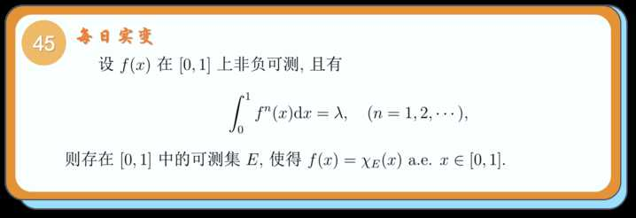
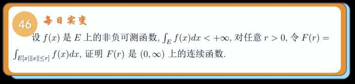
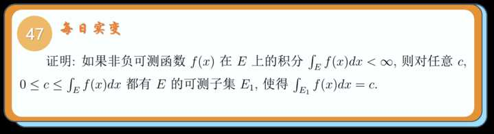
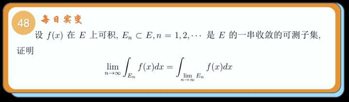
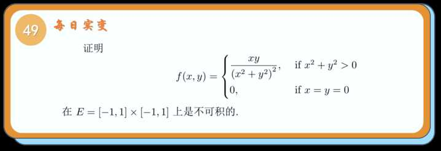
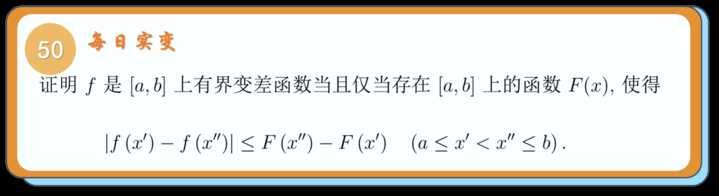
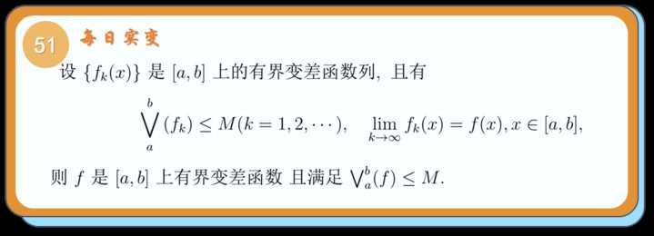
可测复合不可测
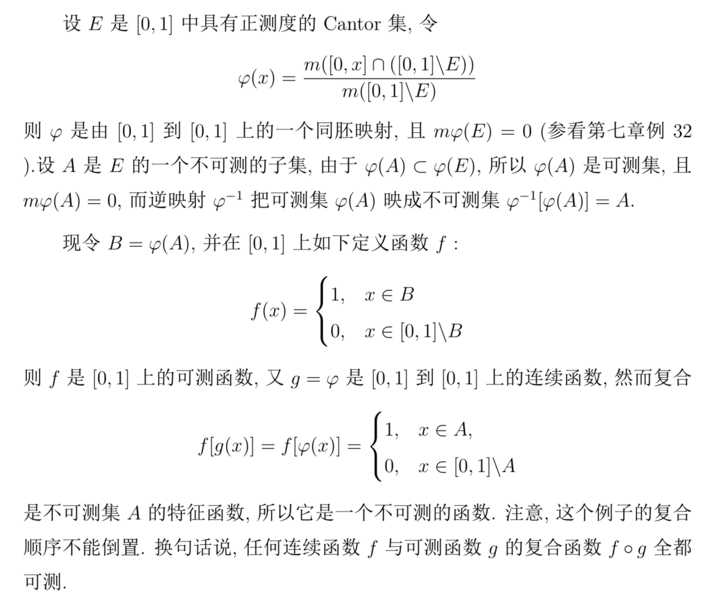
可测的非Borel集
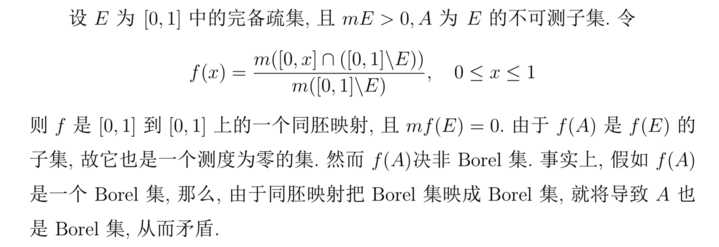