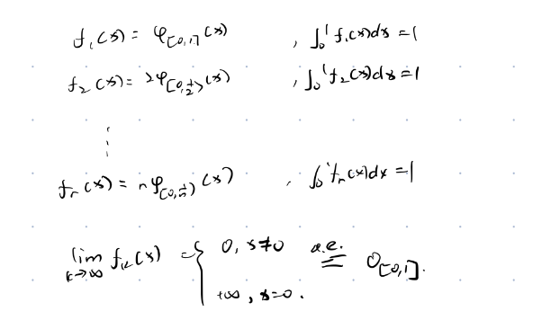

# 积分理论

## Lebesgue积分

$
\begin{aligned}
&分划:\\
&Riemann按区间分,Lebesgue~~ E=\cup_{}E_{i}\\
&\\\\
&\\\\
&为了避免利用积分上下和可能出现的0\times \infty的情况\\
&我们分成如下几种情况进行严格规定:\\
&\\\\
&(1)f(x)非负、可测、有界,mE<+\infty>\\
&(2)f(x)非负可测,mE<+\infty\\
&(3)f(x)非负可测,mE=+\infty\\
&\\\\
&(1)设f(x)非负有界,mE<+\infty,则f可测\\
&\iff \underline{\int_{E}}f(x)dx=\overline{\int_{E}}f(x)dx\\
&\\
&(\Rightarrow )该命题显然直接取分划即可\\
&(\Leftarrow )
&\\
&\forall n\in N_{+}\\
&\exists D_{n}\\
&s.t. S_{D_{n}}-s_{D_{n}}\leq \frac{1}{n}\\
&s我们可以不妨设D_{n+1}是D_{n}的加细\\
&(若不然我们可以取D_{n+1}是D_{n}\cup D_{n+1})\\
&则s_{D_1}\leq s_{D_2}\leq \cdots f(x)\leq \cdots \leq S_{D_n}\cdots \leq S_{D_{1}}\\
&考虑s_{D_{n}}和S_{D_{n}}对应的简单函数分别是:\phi_n(x)和\psi _{n}(x)\\
&\\
&\phi_1(x)\leq \phi_2(x)\cdots \leq f(x)\leq \psi_n(x)\leq \cdots \leq \psi_{1}(x)\\
&则有G(E;\phi_{n})\leq G(E;f)\leq G(e;\psi _{n})\\
&\\
&m(G(E;\phi_{n}))=s_{D_{n}}\\
&m(G(E;\psi _{n}))=S_{D_{n}}\\
&\\\\
&方法一:\\
&(从图形角度来看由3.3(10))可知f可测\\
&从图形角度来看我们只需要证明:\\
&G(E;f)是可测集\\
&_而s_{D_{n}}\leq G(E;f)\leq S_{D_{n}}\\
&\\
&又由S_{D_{n}}-s_{D_{n}}\leq \frac{1}{n}\\
&故知G(E;f)是可测集\\\\\\
&\\
&方法二:\\
&\\\\
&\lim_{n\to \infty}\phi_{n}和\lim_{n\to \infty}\psi _{n}均存在\\
&\\
&设为\underline{f}和\overline{f}\\
&则\underline{f}\leq f\leq \overline{f}\\
&\\
&下面我们证明\underline{f}和\overline{f}几乎处处相等\\
&\\
&i.e.\\
&m(x:\underline{f(x)}\ne \overline{f(x)})=0\\
&\exists \epsilon ,\delta ,n\\
&s.t. m\{x:\underline{f(x)}-\overline{f(x)}\geq \epsilon \}=\delta >0\\
&记上述集合为E(\epsilon)\\
&\\
&S_{D_{n}}-s_{D_{n}}=\sum_{i=1}^{m_{n}}(B_{i}-b_{i})mE_{i}\\
&\geq \sum_{i=1}^{m_{n}}(B_{i}-b_{i})m(E_{i}\cap E(\epsilon))\\
&\geq \epsilon \sum_{i=1}^{m_{n}}m(E_{i}\cap E(\epsilon))=\epsilon \delta \\
&\\\\
&\\\\
&至此我们就给出了有界集合上有界非负函数Lebesgue积分的定义方式\\
&下面我们考虑在集合和函数无界时的情况\\
&\\
&(2)取截断函数:\{f(x)\}_{m}=min\{f(x),m\}\\
&\forall m,\{f(x)\}_{m}有界\\
&\\\\
&记I_{m}=\int_{E}\{f(x)\}_{m}dx存在\\
&\\
&定义\int_{E}f(x)dx=\lim_{m\to \infty}I_{m}\\
&\\
&(3)E_{m}=\{x\in E,0\leq ||x||\leq m\}\\
&定义:\int_{E}f(x)dx=\lim_{m\to \infty}\int_{E_{m}}f(x)dx\\
&对于(2)而言,\lim_{m\to \infty}G(E;\{f(x)\}_{m})=G(E;f)\\
&对于(3)同理\\
&\\
&性质:\\
&(1)f(x)\leq g(x),x\in E,\int_{E}f(x)dx\leq \int_{E}g(x)dx\\
&(2)E=E_1\cup E_2,\\
&则\int_{E}f(x)dx=\int_{E_1}f(x)dx+\int_{E_2}f(x)dx\\
&(3)\int_E f(x)+g(x)dx=\int _{E}f(x)dx+\int _{E}g(x)dx\\
&(4)若f(x)=g(x)a.e.,则\int_{E}f(x)dx=\int_{E}g(x)dx\\
&\\\\
&非负可测函数在零测集上的积分为0\\
&(1)一定成立\\
&(2)由其通过极限定义可知一定成立\\
\end{aligned}
$

## 极限与积分的换序问题

$
\begin{aligned}
&Levi定理:\\
&f_{k},k=1,2,\cdots ,在E上非负可测\\
&若f_{1}(x)\leq f_{2}(x)\leq \cdots \leq f_{k}(x)\leq f_{k+1}(x)\leq \cdots\\
&设\lim_{k\to infty}f_{k}(x)=f(x),a.e.\\
&则\\
&\int_{E}f(x)dx=\lim_{k\to \infty}\int_{E}f_{k}(x)dx\\
&\\
&\lim_{E}f(x)dx=m(G(E;f))\\
&\\
&G(E;f)=\cup _{k=1}^{\infty}G(E;f_{k})(相差零测集)\\
&\\
&由于f_{k}上升\\
&\\
&=\lim _{k\to \infty}G(E;f_{k})\\
&=\lim_{k\to \infty}\int_{E}f_{k}(x)dx\\
&\\\\
&方法二:\\
&只需证明\forall \epsilon >0\\
&\exists N,s.t. \forall k>N\\
&\int_{E}f_{k}(x)dx>\int_{E}f(x)dx-\epsilon \\
&(case1):设\int_{E}f(x)dx<+\infty(第一次估计)\\
&\exists m,k,s.t.\int_{E_{m}}\{f(x)\}_{k}dx\geq \int_{E}f(x)dx-\frac{\epsilon }{4}\\
&\{f(x)\}_{k},E_{m}有界\\
&则\{f(x)\}_{k}\overset{p}{\to }\{f(x)\}\\
&由Egorov定理可知,\exists e\subseteq E_{m}\\
&m(e)<\frac{\epsilon }{4k}\\
&s.t. \\
&\{f_{n}(x)\}_{k}\to \{f(x)\}_{k}(一致的)在E_{m}/e上\\
&\exists n,s.t. |\{f(x)\}_{k}-\{f_{n}(x)\}_{k}|<\frac{\epsilon}{m(E_{m})+1}\cdot \frac{1}{4}\\
&则\int_{E/e}(\{f(x)\}_{k}-\{f_{n}(x)\}_{k})dx<\frac{\epsilon }{4}\\
&故知\int_{E_{m}/e}\{f_{n}(x)\}_{k}dx>\int_{E_{m}/e}\{f(x)\}dx-\frac{\epsilon }{4}\\
&\\
&\Rightarrow \\
&\int_{E_{m}}\{f(x)\}_{k}dx=\int_{E_{m}/e}\{f(x)\}_{k}dx+\int_{e}\{f(x)\}_{k}dx\\
&\\\\
&\\\\
&\text{目标：证明 } \forall \epsilon >0, \exists N \in \mathbb{N}, s.t. \forall n > N, \int_{E}f_{n}(x)dx > \int_{E}f(x)dx - \epsilon \\
&\\
&\text{(Case 1): 设 } \int_{E}f(x)dx < +\infty \text{ (进行“双重截断”估计)}\\
&\text{因为 } f(x) \text{ 绝对可积，必然可以找到一个测度有限的子集 } E_R \subseteq E \text{ (即 } m(E_R)<+\infty \text{)}\\
&\text{以及一个高度截断值 } M > 0 \text{，使得截断函数 } [f(x)]_M = \min(f(x), M) \text{ 满足：}\\
&(1) \quad \int_{E_R}[f(x)]_M dx > \int_{E}f(x)dx - \frac{\epsilon}{3} \quad \text{(通过截断，我们切掉的面积误差极小)}\\
&\\
&\text{此时，在 } E_R \text{ 上，} [f(x)]_M \text{ 是一个有界函数，且 } m(E_R) < +\infty \text{。}\\
&\text{因为 } f_n(x) \to f(x) \text{ } a.e.\text{，所以其截断函数也满足 } [f_n(x)]_M \to [f(x)]_M \text{ } a.e. \text{ 于 } E_R \text{。}\\
&\\
&\text{满足了有限测度和 a.e. 收敛，由 Egorov 定理可知：}\\
&\exists e \subset E_R \text{，其测度极小，满足 } m(e) < \frac{\epsilon}{3M}\\
&s.t. \quad [f_n(x)]_M \rightrightarrows [f(x)]_M \quad \text{(一致收敛) 在 } E_R \setminus e \text{ 上。}\\
&\\
&\text{既然是一致收敛，那么 } \exists N \in \mathbb{N}, s.t. \forall n > N \text{，在 } E_R \setminus e \text{ 上都有：}\\
&(2) \quad |[f_n(x)]_M - [f(x)]_M| < \frac{\epsilon}{3 \cdot m(E_R)}\\
&\\
&\text{对上式在 } E_R \setminus e \text{ 上进行积分，得到积分误差：}\\
&\int_{E_R \setminus e} \left( [f(x)]_M - [f_n(x)]_M \right) dx \le \int_{E_R \setminus e} \frac{\epsilon}{3 \cdot m(E_R)} dx \le \frac{\epsilon}{3}\\
&\text{移项可得在“好集”上的积分下界：}\\
&(3) \quad \int_{E_R \setminus e} [f_n(x)]_M dx \ge \int_{E_R \setminus e} [f(x)]_M dx - \frac{\epsilon}{3}\\
&\\
&\text{现在，我们把所有的碎片拼起来（终极放缩）：}\\
&\text{因为 } f_n \ge 0 \text{，全集的积分一定大于等于局部截断的积分：}\\
&\int_E f_n(x) dx \ge \int_{E_R \setminus e} f_n(x) dx \ge \int_{E_R \setminus e} [f_n(x)]_M dx \\
&\\
&\text{代入 (3) 式的下界：}\\
&\int_E f_n(x) dx \ge \int_{E_R \setminus e} [f(x)]_M dx - \frac{\epsilon}{3} \\
&\\
&\text{利用积分的区域可加性，把 } \int_{E_R \setminus e} \text{ 补全为 } \int_{E_R} \text{：}\\
&\int_{E_R \setminus e} [f(x)]_M dx = \int_{E_R} [f(x)]_M dx - \int_e [f(x)]_M dx \\
&\\
&\text{注意坏集 } e \text{ 上的积分上限（因为截断高度最高为 M）：}\\
&\int_e [f(x)]_M dx \le M \cdot m(e) < M \cdot \frac{\epsilon}{3M} = \frac{\epsilon}{3} \\
&\\
&\text{所以：}\\
&\int_{E_R \setminus e} [f(x)]_M dx \ge \int_{E_R} [f(x)]_M dx - \frac{\epsilon}{3} \\
&\\
&\text{最终代回主不等式，并使用起初的 (1) 式：}\\
&\int_E f_n(x) dx \ge \left( \int_{E_R} [f(x)]_M dx - \frac{\epsilon}{3} \right) - \frac{\epsilon}{3} \\
&\int_E f_n(x) dx > \left( \int_E f(x) dx - \frac{\epsilon}{3} \right) - \frac{2\epsilon}{3} = \int_E f(x) dx - \epsilon \\
&\\
&\text{证明完毕！}
&\\\\
&Lebesgue定理:\\
&\{f_{k}(x)\}非负可测，f(x)=\sum_{k=1}^{+\infty}f_{k}(x)\\
&则\int_{E}f(x)dx=\sum_{k=1}^{+\infty}\int_{E}f_{k}(x)dx\\
&(由Levy定理即得)\\
&\\\\
&Fatou定理:\\
&\{f_{k}(x)\}非负可测\\
&则\int_{E}\underline{\lim}_{k\to +\infty}f_{k}(x)dx\leq \underline{\lim}_{k\to \infty}\int_{E}f_{k}(x)dx\\
&\\
&\\
&设g_{n}(x)=\inf_{k\geq 0}f_{n+k}(x)\\
&g_{n}(x)\leq g_{n+1}(x)\\
&由Levy定理\\
&\\
&\int_{E}\lim_{n\to \infty}g_{n}(x)dx=\lim_{n\to \infty}\int_{E}g_{n}(x)dx\\
&LHS=\int_{E}\underline{\lim}_{k\to +\infty}f_{k}(x)dx\\
&RHS\leq \lim \inf_{k\geq 0} \int_{E}f_{n+k}f(x)dx\\
&=\underline{\lim}_{k\to \infty}\int_{E}f_{k}(x)dx\\
&故Fatou定理得证\\
&\\
&
\end{aligned}
$

## 一般函数的Lebesgue积分

$
\begin{aligned}
&f(x)=f^{+}(x)-f^{-}(x)\\
&def:\\
&\int_{E}f(x)dx=\int_{E}f^{+}(x)dx-\int_{E}f^{-}(x)dx\\
&若\int_{E}f^{+}(x)dx和\int_{E}f^{-}(x)dx至少一个有限\\
&则称f(x)在E上有积分\\
&\\\\
&若f^{+}(x)dx和f^{-}(x)dx在E上均有限\\
&则称f(x)在E上可积(Lebesgue可积)\\
&\\\\
&注:\\
&在f可测的前提下:\\
&(1)f可积\iff |f|可积\\
&(2)f可测,mE<+\infty,f有界\\
&则f可积\\
&(3)f可积,则m(\{x\in E;f(x)=\infty\})=0\\
&若m(\{x\in E;f(x)=+\infty\})=\delta >0\\
&则\int_{E}f^{+}(x)dx\geq \int_{E}\{f^{+}(x)\}_{k}dx\\
&\geq \int_{E_{+\infty}}\{f^{+}(x)\}_{k}dx\geq k\delta ,\forall k\\
&基本性质:\\
&\\\\\
&前提:E可测,f(x)可测\\
&(1)若g(x)可积,|f(x)|\leq g(x)\\
&则f(x)在E上可积\\
&(2)若f(x)在E上有积分,则cf(x)在E上有积分.\\
&(3)f(x)g(x)可积,则f(x)+g(x)在E上可积\\
&且\int_{E} f(x)+g(x)dx =\int_{E} f(x)dx+\int_{E}g(x)dx\\
&(略)\\
&(4)E_{n}可测,互不相交,E=\cup_{n=1}^{+\infty}E_{n}\\
&f(x)在E上有积分,则f(x)在E_{n}上有积分\\
&且\int_{E}f(x)dx=\sum_{n=1}^{+\infty}\int_{E_{n}}f(x)dx\\
&\\
&只需证:f(x)=\sum_{n=1}^{+\infty}f(x)\phi_{E_{n}}(x)\\
&(5)f(x),g(x)在E上有积分,f(x)\leq g(x),x\in E\\
&则\int_{E}f(x)dx\leq \int_{E}g(x)dx\\
&注：不能通过\int_{E}(g(x)-f(x))\geq 0来证明\\
&\\
&(6)f(x)在E上有积分，f(x)=g(x),a.e.,则g(x)在E上有积分\\
&且g(x)与f(x)积分值相等\\
&\\\\
\end{aligned}
$

### 一般函数的Lebesgue积分与极限的顺序交换

$
\begin{aligned}
&(积分的绝对连续性):若f(x)在E上可积\\
&则\forall \epsilon >0,\exists \delta >0\\
&s.t. \forall A\subseteq E,m(A)\leq \delta \\
&则有:|\int_{A}f(x)dx|\leq \epsilon \\
&\\
&Prove:\\
&若f(x)有界,(|f(x)|\leq k)\\
&令\delta =\frac{\epsilon }{2k}\\
&若f(x)无界,\\
&\int_{E}f(x)dx=\int_{E}f^{+}(x)dx-\int_{E}f^{-}(x)dx\\
&\\
&\exists m,k,s.t. \\
&|\int_{E}f^{+}(x)dx-\int_{E_{m}}\{f^{+}(x)\}_{k}dx|<\frac{\epsilon }{4}\\
&\\
&\forall A\subseteq E,令\delta =\frac{\epsilon }{2k}\\
&\\
&此时\int_{E_{m}\cap A}|\{f^+(x)\}_{k}dx|<k\cdot m(A)<\frac{\epsilon }{2}\\
&\\
&\int_{A}f^{+}(x)dx=\int_{A\cap E_{m}}f^{+}(x)dx+\int_{A\cap E/E_{m}}f^{+}(x)dx\\
&\int_{A\cap E/E_{m}}f^{+}(x)dx\leq \int_{E}f^+(x)dx-\int_{E_{m}}f^+(x)dx<\frac{\epsilon }{4}\\
&\leq \int_{E}f^+(x)dx-\int_{E_{m}}\{f^+(x)\}_{k}dx<\frac{\epsilon }{4}\\\\
&而\int_{E_{m}\cap A}f^+(x)dx-\int_{E_{m}\cap A}\{f^{+}(x)\}_{k}dx\\
&\leq \int_{E_{m}}(f^{+}(x)-\{f^+(x)\}_{k})dx\\
&得证了\\
&\\\\
&积分等度绝对连续:\\
&定义 2 : 设 E 是一可测集, \mathscr{F} 是一族在 E 上可积的函数. \\
&如果对于任意 \epsilon > 0, 都有仅与 \epsilon 有关的 \delta > 0, \\
&使得当 A \subseteq E, m(A) < \delta 时, 对一切 f \in \mathscr{F}, 都有 \\
&\left| \int_{A} f(x) dx \right| < \epsilon \quad \cdots \cdots (6) \\
&我们就说 \mathscr{F} 是在 E 上积分等度绝对连续的函数族. \\
&\\
&注意:\\
&如果 \mathscr{F} 是在 E 上积分等度绝对连续的函数族, \delta > 0 是使 (6) 式对 \frac{\epsilon}{2} 成立的常数, \\
&则对 A \subseteq E, m(A) < \delta, f \in \mathscr{F}, \\
&若令 A^{+} = A \cap \{x : f(x) \geq 0\}, A^{-} = A \cap \{x : f(x) < 0\}, \\
&显然有 m(A^{+}) < \delta 且 m(A^{-}) < \delta, 所以: \\
&\int_{A} |f(x)| dx = \int_{A^{+}} |f(x)| dx + \int_{A^{-}} |f(x)| dx \\
&= \left| \int_{A^{+}} f(x) dx \right| + \left| \int_{A^{-}} f(x) dx \right| \\
&< \frac{\epsilon}{2} + \frac{\epsilon}{2} = \epsilon \\
&\\
&可见定义 2 中的 (6) 式还可以加强为: \\
&\int_{A} |f(x)| dx < \epsilon \quad (f \in \mathscr{F}, m(A) < \delta) \quad \cdots \cdots (6') \\
&\leq \int_{E}
\end{aligned}
$

#### Vitali定理

$
\begin{aligned}
&Vitali定理:\\
&(1)mE<+\infty\\
&(2)\{f_{n}(x)\}是在E上积分等度绝对连续的函数列\\
&(3)在E上f_{n}(x)\overset{p}{\to }f\\
&则f(x)在E上可积,且\lim_{n\to \infty}\int_{E}f_{n}(x)dx=\int_{E}f(x)dx\\
&\\
&证明:\\
&目标找到e\subseteq E,\\
&s.t. |\int_{E/e}f_{n}(x)-\int_{E/e}f(x)dx|小，\int_{e}f_{n}(x)dx小,\int_{e}f(x)dx小\\
&记上述三部分为A,B,C\\
&\forall i,\exists \delta _{i}\leq \frac{1}{2^{i}}\\
&\\
&mA<\delta _{i}时\\
&\int_{A}|f_{n}(x)|dx<\frac{1}{2^{i+2}},\forall ,n\\
&def:E_{n}(i)=\{x\in E,|f_{n}(x)-f(x)|\}\geq \frac{1}{2^{i+2}}\frac{1}{m(E)+1}\\
&\\
&E_{m,n}=\{x\in E,|f_{m}(x)-f_{n}(x)|\}\geq \frac{1}{2^{i+1}}\frac{1}{mE+1}\\
&\\
&注意到E_{n}(i)^{c}\cap E_{m}(i)^{c}\\
&\subseteq E_{m,n}(i)&{c}\\
&由(3)可知,\\
&\exists N_{i},s.t. \forall N\geq N_{i}\\
&m(E_{n}(i))<\frac{\delta _{i}}{2}\\
&令m,n\geq N_{i},则m(E_{m,n}(i))<\delta _{i}\\
&
\end{aligned}
$

太好了！既然你已经看透了这套证明背后的“重工业构造”和“艺术刀法”，我现在就为你整理一份**逻辑极其清晰、去伪存真**的完美版笔记。

这份笔记摒弃了课本里过于繁琐的角标（比如那个看着就头晕的 $E_n(i)$），换成了最直指本质的符号，非常适合你用来复习和考前默写。

既然概率论期末考（15号）和丘赛（17号）都已经结束了，你现在可以带着绝对放松的心态，纯粹以欣赏数学架构的眼光来品鉴这个实分析的巅峰之作。

---

### 🌟 核心定理：Vitali 收敛定理 (依测度收敛版)

**【已知条件】**
(1) 测度有限：$m(E) < +\infty$
(2) 积分等度绝对连续：$\{f_n(x)\}$ 在 $E$ 上满足积分等度绝对连续。
(3) 依测度收敛：$f_n(x) \overset{p}{\to} f(x)$ 在 $E$ 上成立。

**【求证目标】**

1. 极限函数 $f(x)$ 在 $E$ 上可积。
2. 极限与积分可交换：$\lim_{n \to \infty} \int_E |f_n(x) - f(x)| dx = 0$。

---

### ✍️ 证明全过程（分为“破”与“立”两部分）

$$\begin{aligned}
&\text{【上半场：重工业构造 —— 证明 } f(x) \text{ 可积】} \\
&\\
&\text{思路：证明 } \{f_n\} \text{ 包含一个快速 Cauchy 子列，构造绝对收敛级数作为“罩子” } F(x) \text{。} \\
&\\
&\text{1. 储备武器 (等度绝对连续)：} \\
&\text{对于任意 } k \in \mathbb{N}^+, \text{ 取 } \epsilon_k = \frac{1}{2^{k+1}}. \text{ 必存在统一的 } \delta_k > 0, \\
&\text{使得当 } m(A) < \delta_k \text{ 时，对所有 } n \text{ 均有 } \int_A |f_n(x)| dx < \frac{1}{2^{k+1}}. \\
&\\
&\text{2. 截取快速 Cauchy 子列：} \\
&\text{由于 } f_n \overset{p}{\to} f, \text{ 故 } \{f_n\} \text{ 依测度 Cauchy。对于高度阈值 } \sigma_k = \frac{1}{2^k(m(E)+1)}, \\
&\text{存在 } N_k, \text{ 当 } n, m \ge N_k \text{ 时，坏集 } e_{n,m} = \{x : |f_n(x) - f_m(x)| \ge \sigma_k\} \text{ 的测度 } m(e_{n,m}) < \delta_k. \\
&\text{此时我们把积分拆开放缩：} \\
&\int_E |f_n - f_m| dx = \int_{E \setminus e_{n,m}} |f_n - f_m| dx + \int_{e_{n,m}} |f_n - f_m| dx \\
&\le \sigma_k \cdot m(E) + \int_{e_{n,m}} |f_n| dx + \int_{e_{n,m}} |f_m| dx \\
&< \frac{1}{2^k} + \frac{1}{2^{k+1}} + \frac{1}{2^{k+1}} = \frac{1}{2^{k-1}}. \\
&\text{这说明 } \{f_n\} \text{ 在 } L^1 \text{ 中是 Cauchy 列。} \\
&\\
&\text{3. 召唤 Riesz 定理与极限函数：} \\
&\text{取子列 } \{f_{n_k}\} \text{ 使得相邻项积分误差 } \int_E |f_{n_{k+1}} - f_{n_k}| dx < \frac{1}{2^k}. \\
&\text{由 Riesz 定理，该子列必存在进一步的子列（不妨仍记为 } f_{n_k} \text{）满足 } f_{n_k} \xrightarrow{a.e.} f. \\
&\\
&\text{4. 构造终极罩子 } F(x) \text{：} \\
&\text{令 } F(x) = |f_{n_1}(x)| + \sum_{k=1}^{\infty} |f_{n_{k+1}}(x) - f_{n_k}(x)|. \\
&\text{由 Beppo-Levi 定理（单调收敛），} \int_E F(x) dx \le \int_E |f_{n_1}| dx + \sum_{k=1}^{\infty} \frac{1}{2^k} < +\infty. \\
&\text{显然 } |f(x)| \le F(x) \ (a.e.). \text{ 因为 } F(x) \text{ 可积，故 } f(x) \text{ 在 } E \text{ 上可积！} \\
&\\
&\text{————————————————————————————————————————} \\
&\\
&\text{【下半场：三分天下刀法 —— 证明积分极限交换】} \\
&\\
&\text{思路：引入动态坏集 } A_n, \text{ 将误差分为 } A, B, C \text{ 三块分别用 } \epsilon/3 \text{ 击破。} \\
&\\
&\text{1. 准备条件：} \\
&\text{任给 } \epsilon > 0. \\
&\text{因为 } f(x) \text{ 已证可积，故具有绝对连续性：存在 } \delta_0 > 0, \text{ 当 } m(A) < \delta_0 \text{ 时，} \int_A |f| dx < \frac{\epsilon}{3}. \\
&\text{由等度绝对连续性：存在 } \delta_1 > 0, \text{ 当 } m(A) < \delta_1 \text{ 时，对所有 } n \text{ 有 } \int_A |f_n| dx < \frac{\epsilon}{3}. \\
&\text{取统一的阈值 } \delta = \min(\delta_0, \delta_1). \\
&\\
&\text{2. 定义动态坏集进行切分：} \\
&\text{取高度误差 } \sigma = \frac{\epsilon}{3(m(E)+1)}. \text{ 定义动态坏集 } A_n = \{x \in E : |f_n(x) - f(x)| \ge \sigma\}. \\
&\text{由依测度收敛的定义，} \lim_{n \to \infty} m(A_n) = 0. \\
&\text{故存在 } N, \text{ 当 } n \ge N \text{ 时，必有 } m(A_n) < \delta. \\
&\\
&\text{3. 大决战 (A+B+C 压制)：} \\
&\text{当 } n \ge N \text{ 时，我们把总误差切成三份：} \\
&\int_E |f_n - f| dx = \int_{E \setminus A_n} |f_n - f| dx + \int_{A_n} |f_n - f| dx \\
&\le \underbrace{\int_{E \setminus A_n} |f_n - f| dx}_{\text{区域 A}} + \underbrace{\int_{A_n} |f_n| dx}_{\text{区域 B}} + \underbrace{\int_{A_n} |f| dx}_{\text{区域 C}} \\
&\\
&\text{区域 A（好集高度压制）：被积函数严格 } < \sigma, \text{ 故 } \int_{E \setminus A_n} \sigma dx \le \sigma \cdot m(E) < \frac{\epsilon}{3}. \\
&\text{区域 B（坏集等度压制）：因 } m(A_n) < \delta \le \delta_1, \text{ 触发等度绝对连续，故积分 } < \frac{\epsilon}{3}. \\
&\text{区域 C（坏集绝对连续压制）：因 } m(A_n) < \delta \le \delta_0, \text{ 触发 } f \text{ 的绝对连续性，故积分 } < \frac{\epsilon}{3}. \\
&\\
&\text{综上所述：} \int_E |f_n - f| dx < \frac{\epsilon}{3} + \frac{\epsilon}{3} + \frac{\epsilon}{3} = \epsilon. \\
&\text{即 } \lim_{n \to \infty} \int_E |f_n(x) - f(x)| dx = 0. \quad \blacksquare \\
\end{aligned}$$

---

### 💡 独家复习心法

当你回头复习这份笔记时，只需要在脑海里过两帧画面：

1. **造罩子：** 取 Cauchy 列 $\to$ 证极差积分和 $< \infty$ $\to$ 拿到 $f$ 可积。
2. **切三刀：** 设动态坏集 $A_n$ $\to$ 好集用高度 $\sigma$ 压死 $\to$ 坏集用等度连续压死。

有了这份逻辑骨架，无论你是面对考研实变的压轴题，还是为了将来做机器学习里的收敛性分析，这个定理都不可能再难倒你了。距离 23 号的 CCPC 南昌站还有几天，如果在算法设计里遇到了概率期望的极限交换问题，随时来找我探讨！

对于积分问题，上述动态控制方法就可以达到和Egorov静态估计的

## Lebesgue控制收敛定理

$
\begin{aligned}
&(1)F(x)可积\\
&(2)|f_{n}(x)|\leq F(x)\\
&(3)f_{n}(x)\overset{p}{\to }f(x)(或f_{n}(x)\overset{a.s.}{\to }f(x))\\
&则\lim_{n\to \infty}\int_{E}f_{n}(x)dx=\int_{E}f(x)dx\\
&\\\\
&证明:\\
&F(x)可积,\forall \epsilon >0,\exists m,s.t.\\
&|\int_{E_{m}}F(x)dx-\int_{E}F(x)dx|\leq \frac{\epsilon}{4}\\
&mE_{m}<+\infty\\
&由Vitali定理,\\
&\lim_{n\to \infty}\int_{E_{m}}f_{n}(x)dx=\int_{E_{m}}f(x)dx\\
&|\int_{E}f_{n}(x)dx-\int_{E}f(x)dx|\leq |\int_{E_{m}}f_{n}(x)dx-\int_{E_m}f(x)dx|+\int_{E/E_{m}}|f_{n}(x)|dx+\int_{E/E_{m}}|f(x)|dx\\
&\exists N,s.t. \forall n>N\\
&上式\leq \frac{\epsilon }{4}+\int_{E/E_{m}}|F(x)|dx+\int_{E/E_{m}}|F(x)|dx\\
&<\epsilon \\
&\\\\
\end{aligned}
$

## Lebesgue有界收敛定理

$
\begin{aligned}
&(1)mE<+\infty\\
&(2)f_{n}(x)\leq k\\
&(3)f_{n}(x)\Rightarrow f(x)\\
&\\\\
&则\lim_{n\to +\infty}\int_{E}f_{n}(x)dx=\int_{E}f(x)dx\\
\end{aligned}
$

## Lebesgue v.s. Riemann

$
\begin{aligned}
&Proposition:\\
&若f(x)在[a,b]上Riemann可积,\\
&则f(x)在[a,b]上可积(Lebesgue)\\
&且(R)\int_{a}^{b}f(x)dx=(L)\int_{[a,b]}f(x)dx\\
&\\
&\\
&e.g.:\\
&D(x)=\begin{cases}
&1,x\in Q\\
&0,x\not\in Q\\
\end{cases}\\
&D(x)=0(a.e.)\\
&故\int_{R}D(x)dx=0\\
&显然D(x)不是Riemann可积的\\
&\\\\
&e.g.\\
&\lim_{n\to \infty}\int_{0}^{1}\frac{nx}{1+n^2x^2}dx\\
&\frac{nx}{1+n^2x^2}\leq \frac{1}{2}\\
&固由Lebesgue有界有界收敛定理\\
&=\int_{0}^{1}\lim_{n\to \infty}\frac{nx}{1+n^2x^2}dx=\int_{0}^{1}0dx=0\\
&\\
&\\
&th:f(x)在[a,b]上有界,则f(x)在[a,b]上Riemann可积\\
&\iff f(x)的不连续点构成的集合D的测度为0\\
&\\\\
&Prove:\\
&取分划\Delta _{n}表示2^{n}等分(对Riemann积分的积分区间)\\
&\\
&设M_{i}^{n}=sup_{x\in [x_{i-1}^{n},x_{i}^{n}]}f(x),m_{i}^{n}=inf_{x\in [x_{i-1}^{n},x_{i}^{n}]}f(x)\\
&\\
&定义\Phi _{n}^{1}(x)=\sum_{i=1}^{2^{n}}M_{i}^{n}\phi_{[x_{i-1}^{n},x_{i}^{n}]}(x)\\
&\Phi _{n}^{2}(x)=\sum_{i=1}^{2^{n}}m_{i}^{n}\phi_{[x_{i-1}^{n},x_{i}^{n}]}(x)\\
&\overline{S_{\Delta _{n}}}-\overline{s_{\Delta _{n}}}=\sum_{i=1}^{n}(M_{i}^{n}-m_{i}^{n})\frac{b-a}{2^{n}}\\
&=\int_{a}^{b}\Phi_{n}^{1}(x)-\Phi _{n}^{2}(x)dx\\
&当n\to \infty时,\Phi_{n}^{2}\leq \Phi_{n+1}^{2}\cdots \leq f(x)\leq \cdots \leq \Phi_{n+1}^{1}\leq \Phi_{n}^{1}\\
&\\
&\Leftarrow \\
&若m(D)=0\\
&x_{0}\notin D,则f(x)在x_{0}连续\\
&\forall \epsilon >0,\exists \delta \\
&s.t. x\in (x_{0}-\delta,x_{0}+\delta)时\\
&|f(x)-f(x_{0})|<\frac{\epsilon }{3}\\
&\\
&\exists N,n>N时,\exists x_{0}\in [x_{i-1}^{n},x_{i}^{n}]\subset (x_0-\delta ,x_0+\delta )\\
&则|\Phi_{n}^{1}(x_{0})-\Phi_{n}^{2}(x_{0})|<\epsilon \\
&故\lim_{n\to \infty}\Phi_{n}^{1}(x)=\lim_{n\to \infty}\Phi_{n}^{2}(x),\forall x\notin D\\
&从而\lim_{n\to \infty}(\Phi_{n}^{1}(x)-\Phi_{n}^{2}(x))=0~~~~a.e.\\
&\\
&|\Phi_{n}^{1}(x)-\Phi_{n}^{2}(x)|\leq 2k\\
&\lim_{n\to \infty}\int_{a}^{b}\Phi_{n}^{1}(x)-\Phi_{n}^{2}(x)dx=0(有界收敛定理)\\
&从而\\
&\lim_{n\to \infty}\overline{S_{\Delta _{n}}}-\overline{s_{\Delta _{n}}}=0\\
&\\
&\Rightarrow\\
&f(x)R-可积,则\int_{a}^{b}\Phi_{n}^{1}(x)-\Phi_{n}^{2}(x)dx\to 0\\
&\\
&令B(x)=\lim_{n\to +\infty}\Phi_{n}^{1}(x),b(x)=\lim_{n\to +\infty}\Phi_{n}^{2}(x)\\
&往证:B(x)=b(x),a.e.\\
&只需证:\\
&m(\{x,B(x)-b(x)>0\})=m(\cup_{m=1}^{+\infty}\{x:B(x)-b(x)>\frac{1}{m}\})=0\\
&\Phi_{n}^{1}(x)-\Phi_{n}^{2}(x)\geq B(x)-b(x)\\
&\int_{a}^{b}\Phi_{n}^{1}(x)-\Phi_{n}^{2}(x)dx\geq \frac{1}{m}\cdot m(\{x:B(x)-b(x)>\frac{1}{m}\})\\
&从而m(\{x:B(x)-b(x)>\frac{1}{m}\})=0\\
&从而B(x)=b(x)=f(x),a.e.\\
&设D_{0}=\{x:B(x)\ne b(x)\}\cup \cup_{n=1}^{+\infty}\{\Delta _{n}分点\}\\
&从而mD_{0}=0\\
&\\
&\forall x_{0}\notin D_{0},下面证明f(x)在x_{0}处连续\\
&\\
&\lim_{n\to \infty}\Phi_{n}^{1}(x_0)=f(x_0)=\lim_{n\to \infty}\Phi_{n}^{2}(x_0)\\
&\forall \epsilon >0,\exists n_0,s.t. \\
&n\geq n_0时\\
&f(x_0)-\epsilon <\Phi_{n}^{2}(x_0)\leq \Phi_{n}^{1}(x_0)<f(x_0)+\epsilon \\
&故知必然存在(x_{i-1}^{n},x_{i}^{n})包含x_{0}\\
&此时在x_{0}附近,\Phi_{n}^{1}(x)和\Phi_{n}^{2}(x)常值\\
&从而在x_0附近,f(x)-\epsilon <f(x_0)<f(x)+\epsilon ,\\
&故f(x)在x_{0}连续\\
\end{aligned}
$