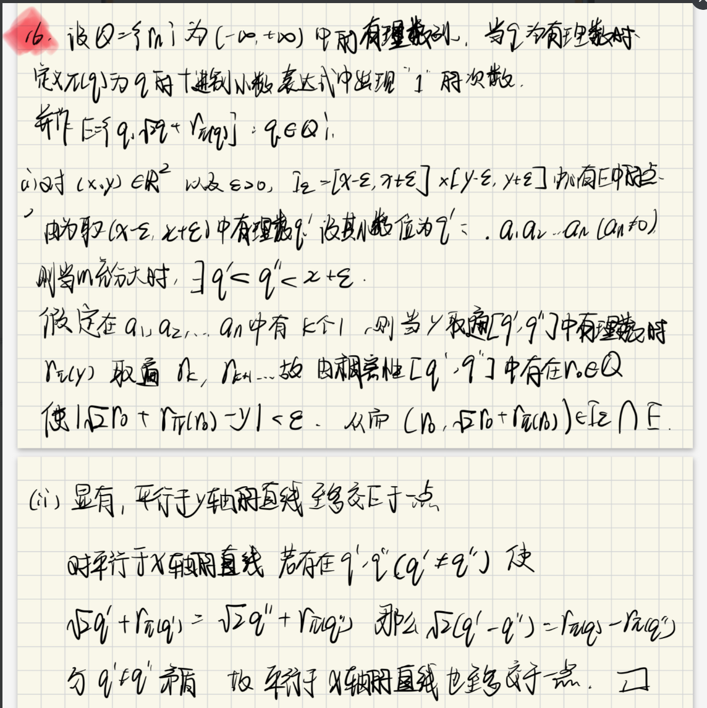

全体Borel集的势为c,是否有不依赖于超限归纳的证明方法

$(q_1+q_2\sqrt{2},q_1+q_2\sqrt{3})$

$
\begin{aligned}
&下面我们考虑使用Tietze延拓定理来证明该命题\\
&由Lusin定理可知\\
&\forall \epsilon >0\\
&\exists 闭集F\\
&s.t. m(E-F)<\epsilon \\
&且f|_{F}连续\\
&但是我们注意到此时\\
&如果想直接利用Tietze定理进行延拓\\
&会由于F未必是有界集从而f|_{F}未必有界出现问题\\
&考虑到f在E上可积\\
&我们只需对E做一下微调即可\\
&\\
&考虑到f在E上可积\\
&故知\forall \epsilon >0\\
&\exists N\in N_{+}\\
&s.t. \\
&\int _{\{x:|f(x)|\geq N\}}|f(x)|dx\leq \epsilon \\
&设E_{0}=E/\{x:|f(x)|\geq N\}\\
&故知我们下面只需对E_{0}进行考虑\\
&对于E_{0}而言\\
&\exists F_{0}\subset E_{0}\\
&满足F_{0}是闭集\\
&且f|_{F_{0}}连续\\
&且f|_{F_{0}}有界N\\
&且|E-F_{0}|\leq \frac{\epsilon }{2N}\\
&故由Tietze延拓定理可知\\
&\exists g(x)满足\\
&g(x)=f(x),x\in F_{0}\\
&|g(x)|\leq N\\
&故知\int _{E}|f(x)-g(x)|dx\\
&=\int _{E_{0}-F_{0}} |f(x)-g(x)|dx+\int _{F_{0}}|f(x)-g(x)|dx+\int _{\{x:|f(x)|\geq N\}}|f(x)-g(x)|dx\\
&=\int _{E_{0}-F_{0}}|f(x)-g(x)|dx+\int _{\{x:|f(x)|\geq N\}}|f(x)-g(x)|dx\\
&\leq 2N\frac{\epsilon }{2N}+\int _{x:|f(x)|\geq N}2|f(x)|dx\\
&\leq \epsilon +2\epsilon =3\epsilon \\
&取\epsilon =\frac{\epsilon }{3}\\
&即可知原命题得证\\
\end{aligned}
$

结论能否直接使用：

$
\begin{aligned}
&1.集合势的运算\\
&2.Baire纲\\
&3.A\cap B=\emptyset,A,B可测,m(A\cup B)=m(A)+m(B)\\
&4.f(x)在E上可积\\
&\forall \epsilon >0\\
&\exists N\in N_{+}\\
&s.t. \int _{x\in E||f(x)|\geq N}|f(x)|dx\leq 0\\
&5.Tietze延拓\\
&
\end{aligned}
$