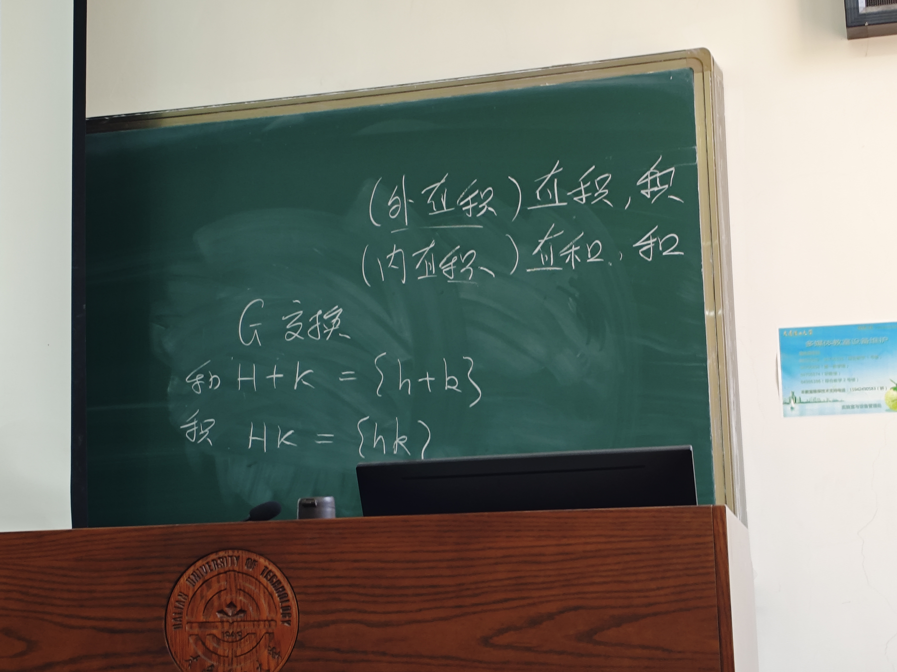

## 群

### 1 基本例子
- $GL(n, \mathbb{R})$ 关于矩阵乘法构成群。
- $GL(n, \mathbb{R})$ 关于矩阵加法不构成群（一般元素在加法下不保可逆）。

### 2 Klein 四元群

**定义**：Klein 四元群（记作 $V_4$ 或 $K_4$）是一个由四个元素组成的群：
$$V_4 = \{e, a, b, c\}$$
其中 $e$ 为单位元，运算规则由如下乘法表给出：

| $\cdot$ | $e$ | $a$ | $b$ | $c$ |
|---------|-----|-----|-----|-----|
| $e$     | $e$ | $a$ | $b$ | $c$ |
| $a$     | $a$ | $e$ | $c$ | $b$ |
| $b$     | $b$ | $c$ | $e$ | $a$ |
| $c$     | $c$ | $b$ | $a$ | $e$ |

**基本性质**：
1. **每个非单位元的阶均为 2**：$a^2 = b^2 = c^2 = e$，因此每个非平凡元素都是自逆元（$a^{-1} = a$，$b^{-1} = b$，$c^{-1} = c$）。
2. **交换群（阿贝尔群）**：乘法表关于主对角线对称，故 $V_4$ 是阿贝尔群。
3. **最小的非循环群**：$V_4$ 不能由单个元素生成，是阶最小的非循环群。
4. **同构刻画**：$V_4 \cong \mathbb{Z}_2 \times \mathbb{Z}_2$（两个 2 阶循环群的直积）。

**几何实现**：$V_4$ 同构于矩形（非正方形）的对称群，该对称群由以下四个变换组成：
- $e$：恒等变换（不动）
- $a$：关于水平轴的反射
- $b$：关于竖直轴的反射
- $c$：旋转 $180°$（等于先关于水平轴再关于竖直轴反射）

**子群结构**：$V_4$ 的所有子群为：
$$\{e\},\quad \{e, a\},\quad \{e, b\},\quad \{e, c\},\quad V_4$$
共 5 个子群，且每个子群都是正规子群（因为 $V_4$ 是阿贝尔群）。

**命名来源**：由德国数学家菲利克斯·克莱因（Felix Klein）引入，"Vier" 在德语中意为"四"，故称四元群。

### 3 二面体群 $D_n$

**定义**：二面体群 $D_n$ 是正 $n$ 边形的全部对称变换所组成的群，包括旋转与反射两类变换，因此
$$|D_n| = 2n$$
其中有 $n$ 个旋转、$n$ 个反射。

通常记：
- $r$：绕中心旋转 $\dfrac{2\pi}{n}$
- $s$：关于某一条对称轴的反射

则 $D_n$ 可由生成元与关系写成
$$D_n = \langle r, s \mid r^n = e,\ s^2 = e,\ srs = r^{-1} \rangle$$
也常写为
$$sr = r^{-1}s$$

**元素表示**：$D_n$ 的任意元素都可唯一写成下列两类之一：
$$e, r, r^2, \dots, r^{n-1}, \quad s, sr, sr^2, \dots, sr^{n-1}$$
前一类是旋转，后一类是反射。

**基本性质**：
1. **非交换性**：当 $n \geq 3$ 时，$D_n$ 一般不是交换群，因为通常 $sr \neq rs$，而是满足 $sr = r^{-1}s$。
2. **旋转子群**：由 $r$ 生成的子群 $\langle r \rangle = \{e, r, \dots, r^{n-1}\}$ 是一个 $n$ 阶循环群，同构于 $\mathbb{Z}_n$。
3. **反射元素的阶为 2**：任意反射 $sr^k$ 都满足
$$ (sr^k)^2 = e $$
4. **阶数**：$r$ 的阶为 $n$，而每个反射元素的阶都为 2。

**几何理解**：
- 旋转保持正 $n$ 边形的顶点循环移动。
- 反射对应于关于某条对称轴翻折。
- 所有保形的刚性对称变换恰好组成二面体群。

**典型例子**：
1. $D_3$：正三角形的对称群，共 6 个元素，且
$$D_3 \cong S_3$$
2. $D_4$：正方形的对称群，共 8 个元素，包括 4 个旋转与 4 个反射。

**与 Klein 四元群的关系**：
当 $n = 2$ 时，按抽象表示可得
$$D_2 \cong V_4$$
因为此时有 4 个元素，且每个非单位元的阶都为 2。不过在几何上，“正二边形”的直观意义不强，所以通常从 $n \geq 3$ 开始讨论二面体群。

### 4 群的等价定义

**定义 A（左单位元与左逆元版本）**：若代数系统 $G$ 满足如下条件：

1. 结合律；
2. 存在左单位元 $e$，即对任意 $a\in G$，有 $ea=a$；
3. 对每个 $a\in G$，存在左逆元 $b$，即 $ba=e$。

则 $G$ 是群。

证明中的关键等式可整理为：

$$
ea=a,\quad ba=e,\quad cb=e
$$

$$
ae=eae=(cb)ae=c(ba)e=ce=e
$$

$$
ab=eab=(cb)ab=c(ba)b=cb=e
$$

从而左单位元也是右单位元，左逆元也是右逆元，因此满足群定义。

**定义 B（标准定义）**：

1. 运算封闭；
2. 结合律；
3. 存在单位元；
4. 每个元素存在逆元。

满足 (1)(2) 称为半群；在此基础上再满足 (3)(4) 即为群。

（半群的经典例子：字符串拼接。）

**命题**：设 $G$ 是有限半群，则

$$
G\text{ 是群 }\iff G\text{ 中消去律成立}。
$$

“$\Rightarrow$” 显然，只证 “$\Leftarrow$”。

首先证单位元存在。原草稿中如下推导不严谨：

$$
\exists a\in G,\ a^i=a^j\ (i>j)\ \Rightarrow\ a\cdot a^{i-1}=a\cdot a^{j-1}.
$$

一个可用的证明框架如下：

$$
\mathrm{设}\ G=\{a_1,\dots,a_n\}.
$$

由左消去律，映射 $x\mapsto xa_1$ 为单射；因 $G$ 有限，故为双射。
因此存在 $a\in G$ 使得

$$
aa_1=a_1.
$$

对任意 $a_j\in G$，由双射性可取 $b\in G$ 使 $a_1b=a_j$，于是

$$
a(a_1b)=(aa_1)b=a_1b=a_j,
$$

即

$$
aa_j=a_j\quad(\forall a_j\in G),
$$

所以 $a$ 是左单位元。类似可证右单位元，从而得到单位元。

再由消去律可证每个元素存在逆元，故 $G$ 为群。

若 $G$ 是交换群，则 $G$ 的单位元又叫零元，逆元又叫负元。

**命题**：$2,3,4$ 阶群一定是交换群。

**备注**：常用证明思路是先分类，再利用拉格朗日定理和元素阶性质。
- $|G|=2,3$ 时，群必为循环群，从而交换。
- $|G|=4$ 时，群同构于 $\mathbb{Z}_4$ 或 $V_4$，二者都交换。

### 5 子群

#### 1 子群定义

子群的定义是:
若 $G$ 是群，则 $G$ 的非空子集 $H$，若满足：
(1) $H$ 是群；
(2) $H$ 中元素按 $G$ 中运算封闭；
则称 $H$ 是 $G$ 的子群。

记为 $H\leq G$。

注意：$G$ 的子群 $H$ 的运算必须与 $G$ 的运算一致。

$H$ 与 $G$ 的关系：

$H$ 的单位元素就是 $G$ 的单位元素。

#### 2 子群例子
$(m\mathbb{Z},+)$ 是整数加法群 $(\mathbb{Z},+)$ 的一个子群。
$(\mathbb{C},+)$ 以 $(\mathbb{R},+),(\mathbb{Q},+),(\mathbb{Z},+)$ 为其真子群。
$SL(n,\mathbb{R})$ 是 $GL(n,\mathbb{R})$ 的子群。
子群的交是子群

**定理（子群判别法）**：设 $H$ 是群 $G$ 的非空子集，则下面条件等价：
$
1.H\text{ 是 }G\text{ 的子群}\\
2.\forall a,b\in H,\ a^{-1}\in H\ \text{且}\ ab\in H\\
3.\forall a,b\in H,\ ab^{-1}\in H\\
$

**例**：设 $S$ 为所有 $n$ 阶置换矩阵组成的集合，则 $S$ 在矩阵乘法下构成群，并同构于 $S_n$。

**定理（有限子集判别）**：设 $H$ 是群 $G$ 的非空有限子集。若 $hk\in H$（$\forall h,k\in H$），则 $H\le G$。

**例**：$SL_n(\mathbb{R})$ 在矩阵乘法下是群。

#### 3 置换群与表示观点
- 对称群 $S_n$、交错群 $A_n$ 都是置换群。
- 凯莱定理表明：任何一个群都同构于某个置换群的子群。
- 一些线性群可以用矩阵表示（表示论视角）。

#### 4 中心化子与中心

设 $H$ 是群 $G$ 的非空子集，定义
$$
C_G(H)=\{x\in G\mid xa=ax,\ \forall a\in H\}.
$$
则 $C_G(H)$ 是 $G$ 的子群，称为 $H$ 在 $G$ 中的中心化子。

当 $H=G$ 时，$C_G(G)$ 称为 $G$ 的中心，常记为 $Z(G)$。

$GL(n,\mathbb{R})$ 的中心是
$$
\{aI_n\mid a\in \mathbb{R}^*\}.
$$

群的中心一定是交换群

群 $G$ 是交换群的充要条件是 $G=Z(G)$。

#### 5 子集乘积与陪集

**定义（两个子集的乘积）**：

设 $A,B\subseteq G$，定义它们的乘积为
$$
AB=\{ab\mid a\in A,\ b\in B\}.
$$

特别地，对任意 $g\in G$ 与子集 $A\subseteq G$，记
$$
gA=\{ga\mid a\in A\},\qquad Ag=\{ag\mid a\in A\}.
$$
这分别是 $A$ 的左平移与右平移。

**陪集**：

设 $H\le G$，$g\in G$。

- 左陪集：$gH=\{gh\mid h\in H\}$。
- 右陪集：$Hg=\{hg\mid h\in H\}$。

基本性质：

1. $g_1H=g_2H\iff g_2^{-1}g_1\in H$；同理 $Hg_1=Hg_2\iff g_1g_2^{-1}\in H$。
2. 任意两个左陪集要么相等要么不交；所有左陪集构成对 $G$ 的一个划分（右陪集同理）。
3. 每个左（右）陪集与 $H$ 等势；若 $G$ 有限，则每个陪集的元素个数都等于 $|H|$。

注：一般不一定有 $gH=Hg$。当对任意 $g\in G$ 都有 $gH=Hg$ 时，称 $H$ 为正规子群，记作 $H\trianglelefteq G$。

两个子群的乘积不一定是子群

#### 6 正规化子与共轭

设 $H$ 是群 $G$ 的非空子集，定义
$$
N_G(H)=\{x\in G\mid xHx^{-1}=H\}.
$$
则 $N_G(H)$ 是 $G$ 的子群，称为 $H$ 在 $G$ 中的正规化子。

对任意 $a\in G$ 与子集 $X\subseteq G$，集合
$$
aXa^{-1}=\{axa^{-1}\mid x\in X\}
$$
称为 $X$ 在 $a$ 下的共轭。

进一步，对固定 $g\in G$，定义映射
$$
\operatorname{ad}_g:G\to G,\qquad x\mapsto gxg^{-1}.
$$

**命题**：$\operatorname{ad}_g$ 是群 $G$ 的自同构（称为由 $g$ 诱导的内自同构）。

**证明**：
对任意 $a,b\in G$，有
$$
\operatorname{ad}_g(ab)=g(ab)g^{-1}=(gag^{-1})(gbg^{-1})=\operatorname{ad}_g(a)\operatorname{ad}_g(b),
$$
故 $\operatorname{ad}_g$ 是同态。

又由
$$
\operatorname{ad}_{g^{-1}}\big(\operatorname{ad}_g(x)\big)=g^{-1}(gxg^{-1})g=x
$$
及
$$
\operatorname{ad}_g\big(\operatorname{ad}_{g^{-1}}(x)\big)=g(g^{-1}xg)g^{-1}=x,
$$
可知 $\operatorname{ad}_{g^{-1}}=(\operatorname{ad}_g)^{-1}$，因此 $\operatorname{ad}_g$ 双射。

综上，$\operatorname{ad}_g$ 是 $G$ 的自同构。

**推论**：对子群 $H\le G$，有
$$
H\trianglelefteq G\iff gHg^{-1}=H\quad(\forall g\in G).
$$

### 6 两个子群的交、并与乘积

**定理**：

若 $H$ 和 $K$ 都是群 $G$ 的子群，则
$(1)\ H\cap K\leq G\\
(2)\ HK\leq G\iff HK=KH\\
(3)\ H\cup K\leq G\iff H\subseteq K\ \text{或}\ K\subseteq H\\
$

**证明**：

**(1) $H\cap K\leq G$**

设 $M=H\cap K$，用子群判别法验证 $M$ 是 $G$ 的子群。

1. 非空：$e\in H$，$e\in K$，故 $e\in H\cap K$。
2. 乘法封闭：任取 $a,b\in H\cap K$，则 $a,b\in H$ 且 $a,b\in K$。因 $H,K$ 是子群，故 $ab\in H$ 且 $ab\in K$，因此 $ab\in H\cap K$。
3. 逆元封闭：任取 $a\in H\cap K$，则 $a\in H$ 且 $a\in K$。因 $H,K$ 是子群，故 $a^{-1}\in H$ 且 $a^{-1}\in K$，因此 $a^{-1}\in H\cap K$。

所以 $H\cap K\le G$。

---

**(2) $HK\le G\iff HK=KH$**

共两个方向：

**$\Rightarrow$（若 $HK\le G$，则 $HK=KH$）：**

若 $HK$ 是 $G$ 的子群，则 $HK$ 对逆元封闭，故
$$
(HK)^{-1}=HK.
$$
另一方面，由于 $H,K$ 是子群，有 $H^{-1}=H$，$K^{-1}=K$，因此
$$
(HK)^{-1}=K^{-1}H^{-1}=KH.
$$
结合上两式得 $HK=KH$。

**$\Leftarrow$（若 $HK=KH$，则 $HK\le G$）：**

用子群判别法验证 $HK$ 是子群。

1. 非空：$e=e\cdot e\in HK$（$e\in H$，$e\in K$）。
2. 乘法封闭：任取 $h_1k_1, h_2k_2\in HK$（$h_i\in H, k_i\in K$），则
   $$
   (h_1k_1)(h_2k_2)=h_1(k_1h_2)k_2.
   $$
   因 $k_1h_2\in KH=HK$，可写 $k_1h_2=h_3k_3$（某个 $h_3\in H, k_3\in K$），故
   $$
   (h_1k_1)(h_2k_2)=h_1h_3\,k_3k_2\in HK.
   $$
3. 逆元封闭：任取 $hk\in HK$（$h\in H, k\in K$），则
   $$
   (hk)^{-1}=k^{-1}h^{-1}\in KH=HK.
   $$

所以 $HK\le G$。

---

**(3) $H\cup K\leq G\iff H\subseteq K或K\subseteq H$**

共两个方向：

**$\Rightarrow$（若 $H\cup K\le G$，则 $H\subseteq K$ 或 $K\subseteq H$）：**

反证法。假设 $H\not\subseteq K$ 且 $K\not\subseteq H$，则存在 $a\in H\setminus K$ 及 $b\in K\setminus H$。

因 $H\cup K\le G$ 是群，故 $ab\in H\cup K$，即 $ab\in H$ 或 $ab\in K$。

- 若 $ab\in H$：则 $b=a^{-1}(ab)\in H$（因 $a^{-1}\in H$，$H$ 对乘法封闭），矛盾于 $b\notin H$。
- 若 $ab\in K$：则 $a=(ab)b^{-1}\in K$（因 $b^{-1}\in K$，$K$ 对乘法封闭），矛盾于 $a\notin K$。

两种情况皆矛盾，故 $H\subseteq K$ 或 $K\subseteq H$。

**$\Leftarrow$（若 $H\subseteq K$ 或 $K\subseteq H$，则 $H\cup K\le G$）：**

不妨设 $H\subseteq K$，则 $H\cup K=K\le G$，结论显然成立。同理若 $K\subseteq H$，则 $H\cup K=H\le G$。

设G是群,A是G的非空子集,称G的所有包含A的子群的交为A生成的子群，记为< A >

另一种描述:
$
令集合A=\{x_1,x_2,\cdots \},子群<A> 是所有\{x_1,x_2,x_1^{-1},x_2^{-1},\cdots \}所构成的字的集合$

若G=< A >,则称A为G的生成集,称A中的元素为G的生成元

可以由有限个元素生成的群称为有限生成群

可以由一个元素生成的群称为循环群

证明整数加法群Z的所有子群都是循环群

首先一定有0，若只有0证完了
若还有其他整数，设绝对值最小的为x

如果有不是x倍数的数，辗转相除就可以得到矛盾了

群的秩：群G的最少生成元的个数为群的秩，记为r(G).

$r(S_3)$=2,$S_3可由(1,2)和(1,3)生成$

问题r(Q)=$\infty$

### 正规子群和商群

#### 陪集相等判定——Lagrange定理

Proposition3.1:
$
设H是G的子群,则\forall a,b\in G,下列结论等价:\\
1.aH=bH\\
2.b\in aH\\
3.\exists h\in H,b=ah\\
4.a^{-1}b\in H\\
$

Proposition3.2:

设H是群G的子群,则
$
1.a\in aH,\forall a\in G\\
2.aH=bH或aH\cap bH=\emptyset,\forall a,b\in G\\
3.G=\cup _{a\in G}aH\\$å

定义:

设G是群,H$\leq $G,称H的互不相同的左陪集的个数为H在G中的指数,记为|G:H|

th(Lagrange):
设G是有限群,$H\leq G$则|G|=|G:H||H|

推论:素数阶群只有平凡子群

推论:
(telescopiny)
设H,K是有限群G的子群,若$H\subseteq K\subseteq G$
则|G:H|=|G:K||K:H|

#### 商群

$正规子群定义:
H是群G的子群,满足\forall a\in G,aH=Ha\\
则称H是G的正规子群\\\\
\\
中心一定是正规子群\\
正规化子\\
N_G(H)包含H\\
$
th:
$
设H是G的子群,则下列结论等价:\\
(1)H\lhd G\\
(2)gHg^{-1}=H,\forall g\in G\\
(3)gHg^{-1}\subseteq H,\forall g\in G\\
(4)ghg^{-1}\in H,\forall h\in H,\forall g\in G\\
例：证明:指数为2的子群都是正规子群\\
例题:设G的阶为n的子群只有一个,记为H\\
证明:H\lhd G\\
思路:\\
证明gHg^{-1}是一个子群\\
并且元素个数也为n\\
故知gHg^{-1}=H\\
\\
th:令H\lhd G,若\Sigma _{H}=\{aH|a\in G\}\\
则\Sigma _{H}关于G的子集合的乘法运算是群\\
称上面的群为G关于H的商群，记为G/H\\
将商群中的元素gH,简记为\overline{g}$

对应定理:
$若H\lhd G,则\\
(1)G的包含H的子群与G/H的子群一一对应\\
特别地,G/H的任意一个子群形如K/H\\
其中K是G的包含H的子群\\
(2)G的包含H的正规子群与G/H的正规子群一一对应\\
(1)直接构造映射即可得证\\
\\
(2)已知H<K\lhd G\\
证明:H/H<K/H\lhd G/H\\
只需证明:\\
\forall gH\in G/H\\
gH(K/H)g^{-1}H=K/H\\
\iff gH(kH)g^{-1}H\in K/H
LHS=(gkg^{-1})H\\
而gkg^{-1}\in K\\
故得证\\$

### 单群
def:
$设群G的阶数大于1\\
若G的正规子群仅有G和\{e\}\\
则称G是单群\\
\\
自然地:任意素数阶群是单群\\
A_3是单群\\
Z_p是单群\\
th:n\geq 5时,A_n是交错群\\
只需证明:\\
若\{e\}\ne H\lhd A_n\Rightarrow H=A_n\\
证明分为两步:\\
1.证明H包含一个长度为3的轮换\\
2.A_n的一个正规子群,如果包含一个长度为3的轮换\\
那么一定包含长度是3的所有轮换\\
1.对于\sigma \in S_n,\\
我们定义\sigma 的作用长度为ch(\sigma)\\
意思是\sigma 移动了多少个点\\
\forall \sigma (i)=i,则称i是\sigma 的不动点.\\
下面我们用d(\sigma)表示\sigma 的不动点个数\\
我们要找一个\sigma ,s.t. ch(\sigma)=3\\
首先ch(\sigma)\ne 1,2\\
若ch(\sigma)=1则\sigma是单位元\\
如果ch(\sigma)=2,则\sigma=(ab)不是偶置换\\
取\tau \in A_n\\
由于H是A_n的正规子群\\
因此有\tau \sigma \tau ^{-1}\in H\\
进而,\sigma ^{-1}\tau \sigma \tau ^{-1}\in H\\
\\
下面证明,若\sigma 的长度大于3\\
则\exists \delta \in H\\
s.t. ch(\delta )<ch(\sigma )\\
(1)ch(\sigma )=4\Rightarrow \sigma =(ab)(cd)\\
取\tau=(cde)令\delta=\sigma ^{-1}\tau \sigma \tau ^{-1}\\
则\delta \in H\\
\\
由引理3.1即可知\\
所有的三轮换都在正规子群中\\
\\\\
A\lhd G,B\leq G \Rightarrow AB\leq G\\
A\lhd G,B\lhd G \Rightarrow AB\lhd G$

## 群的同态和同构

例4.4
共轭作用是同构映射,这个同构被称之为内自同构

$
自然映射\pi :G\to G/H\\
g\mapsto gH\\
canonical map\\
th4.1:(群同态基本定理):\\
设\phi是群G到G'的同态映射,\\
则G/Ker\phi \cong Im \phi\\
\\\\
定理4.2:\\
设H是群G的正规子群,K是G的子群.证明:\\
(1)HK是G的子群,H是HK的正规子群.\\
(2)(群的第一同构定理)K/(K\cap H)\cong (HK)/H\\
(3)(群的第二同构定理)若K是G的正规子群,且H\subseteq K,则\frac{G/H}{K/H}\cong \frac{G}{K}\\
则(G/H)/(K/H)\cong G/K.\\
定理4.3:\\
(Cayley定理)任何一个群都与一个变换群同构.\\
推论:任意有限群都与置换群同构\\$

## 元素的阶与循环群
$
th5.1:\\
设循环群G=<a>,若a的所有不同的整数幂都互不相等,\\
则<a>含有无穷多个元素\\
$
Property5.1:
$设a是群G中的元素,a的阶为n\\
则:\\
\begin{cases}
(1)a^k=e\iff n|k\\
(2)若G是有限阶群,则n||G|\\且a^{|G|}=e\\
(3)设r是正整数,则a^r的阶为\frac{n}{(n,r)}\\
\end{cases}
$
Property5.2:
$设a,b分别是群G的阶为n,m的元素\\
若<a>\cap <b>=e,且ab=ba\\
则ab的阶为[n,m]\\
如果(n,m)=1\\
那么不需要<a>\cap <b>=e\\
也可以推导出ab的阶为nm\\
证明:\\
一方面充分性显然\\
另一方面\\
设ab的阶为k\\
做带余除法有a^{x}b^{y}=e\\
两边同时n次幂\\
即有b^{ny}=e\\
故有m|ny,有(m,n)=1,故有y=0\\
同理可得x=0故得证\\
\\
另一方面我们也可以考虑\\
在(n,m)=1的条件下证明<a>\cap <b>=e\\
\\
该定理的转化应用:\\
(a,b)\in Z_4\times Z_6\\
证明|(a,b)|=[m,n]\\
取a'=(a,0),b'=(0,b)\\
即可得证\\
\\
转化应用的应用:\\
求|(a,b)|=2的所有(a,b)\\
|(a,b)|=2\Rightarrow (a,b)=(2,2),(1,2),(2,1)\\
按照分类去找Z_4和Z_6中对应阶为2和1的元素个数\\
然后用乘法原理来计算即可\\
\\$
例5.3: 素数阶群G是循环群
例5.4: 4阶群只有$Z_4$和$K_4$两种结构
$另证:\\
若\forall x\in G,x^2=e\\
证明G是交换群\\
e=(ab)^2=abab\\
ab=(ab)^{-1}=b^{-1}a^{-1}\\
又由a^2=b^2=e\\
故知ab=ba\\$
六阶群也有两种结构:
$\begin{cases}
Z_6 \cong Z_2\times Z_3\\
S_3\\
\end{cases}\\
证明:Z_6\cong Z_2\times Z_3\\
只需注意到(1,1)的阶为6即可\\
\\
推广:\\
Z_x\times Z_y\cong Z_{x\times y}(若(x,y)=1)\\$
Property5.3
$(1)在无限循环群<a>中，其生成元只有a和a^{-1}\\
(2)在n阶循环群<a>中,a^r是生成元\iff (r,n)=1\\
因此n阶循环群<a>中,生成元的个数为\phi(n)\\
$
补充定理:
$\phi :G\to H是同态,a\in G,\phi (a)=b\\
则orb(b)|ord(a)\\
\phi :G\to H是同构,a\in G,\phi (a)=b\\
则orb(b)=ord(a)\\
G=<a>是循环群,\phi :G\to H是同构,\\
则\phi (a)是H的生成元\\$
## 群的直积和直和

<正合列 ：解0\to A\to X\to B\to 0已知A，B求X>

(external direct product)

外直积 、内直积

加法群的积也写作和

和和直积的区别:
$\begin{cases}
1.\forall H,K都可以定义H\times K,不需要G\\
2.H,K\leq G，G是交换群时,H+K才有定义\\
3.在交换群H\leq G得情况下:\\
H+H=H,H\times H的元素个数为|H|^2\\
\end{cases}$

Property6.1:
$\Pi _{i=1}^{n}G_i是有限群\iff G_i都是有限群\\
\Pi _{i=1}^{n}G_i是交换群\iff G_i都是交换群\\
\\
$
th 6.1:
$设G_1,G_2,...,G_n是n个群\\
令G_i^{'}=\{e_1\}\times \cdots \times \{e_{i-1}\}\times G_i\times \{e_i+1\}\times \cdots \times \{e_n\}\\
(1)则G_i'是\Pi_{i=1}^{n}G_i的正规子群,\\
且G_i'\cong G_i\\
(2)\Pi _{i=1}^{n}G_i=G_1'G_2'\cdots G_n'\\
(3)G_i'\cap (G_1'\cdots G_{i-1}'G_{i+1}'\cdots G_{n})=\{e_1,e_2,\cdots ,e_n\}$

def6.2(内直积)

(教材中将外直积称之为直积，内直积称之为直和)

$若G=A\oplus B\oplus C\\
则一定有A\oplus B\oplus C\cong A\times B\times C$

Property6.3:
$
设群G=\oplus_{i=1}^{n}G_i,\\
证明a_ia_j=a_ja_i\\
其中a_i\in G_i,a_j\in G_j,i\ne j\\
取x=aba^{-1}b^{-1}\\
考虑x=a(ba^{-1}b^{-1})\\
则a\in A,a^{-1}\in A,又A是正规子群\\
故ba^{-1}b^{-1}\in A\\
同理可知x\in B\\
因此x\in A\cap B\\
故知ab=ba\\
\\\\\\
设G_1,\cdots G_n是G的正规子群\\
则G=\oplus _{i=1}^{n}G_i\\
\iff G中每个元素可以唯一地表示为\\
a_1\cdots a_n的形式,\\
其中a_i\in G_i,i\in \{1,...,n\}\\\\
我们需要证明这两种定义等价:$

推论6.2:
$
\begin{aligned}
&设G是交换群,G_1,...,G_n是G的子群,则\\
&\sum_{i=1}^{n}G_i=\oplus_{i=1}^{n}G_i\iff\\
&G_j\cap \sum_{i\ne j}G_i=\{0\},1\leq j\leq n\\\\\\
&e.g.6.4\\
&设G是交换群,G_1,\cdots G_n是G的有限子群\\
&(|G_i|,|G_j|)=1\\
&证明:|\sum_{i=1}^{n}G_i|=|G_1|\cdots |G_n|\\
&考虑G_1\cap (G_2G_3G_4)\\
&A=G_1\cap (G_2G_3G_4)\\
&由Lagrange定理可知G_1|A,(G_2G_3G_3)|A\\
&故知A=\{e\}\\
&(可以用数学归纳法给出更严密的证明)\\
&\\\\\\
&e.g.6.5\\
&设G是有限交换群，且|G|=p_1^{s_1}\cdots p_n^{s_n}\\
&其中s_i\in Z^+\\
&p_i是互不相同的素数\\
&若G有阶为p_i^{s_i}的子群G_i\\
&证明G=\oplus_{i=1}^{n}G_i(\forall i)\\
&证明:\\
&(1)G_i\lhd G\\
&(2)|G_1\cdots G_n|=G\\
&(3)G_i\cap (除去G_i的所有G的积)=e\\
&\\\\
&
\end{aligned}
$

## 研究群的几个经典方法
$
\begin{aligned}
&e.g.3 \\
&非空集合A上所有双射变换构成的集合S_A\\
&关于映射的复合运算构成群\\
&称为A上的全变换群.\\
\\\\
&def:\\
&G在集合A上的作用,\\
&就是一个G到S_A的同态\\
&\\\\
&th4.3(Cayley)\\
&任何一个群都和一个置换群同构\\
&\\\\
&稳定子群:\\
&设S是G-集,s\in S,\\
&则G_s=\{g\in G|gs=s\}是G的子群\\
&称为s的稳定子群\\
&也常记为Stag_{G}(s)\\
&\\\\
&th7.1:\\
&设G是有限群,\\
&S是G-集\\
&若s\in S,则|G{s}|=|G:G_s|\\
&(轨道公式):\\
&|\overline{s}|\times |G_{s}|=|G|\\
&\\
&轨道可以将集合拆分为不交并\\
&\\
&证明:\\
&\forall g_1,g_2\in G\\
&有g_1s=g_2s\iff g_1^{-1}g_2s=s\iff g_1^{-1}g_2\in G_s\\
&\iff g_1G_{s}=g_2G_{s}\\
&从而gG_{s}\to gs 给出了由\\
&G_{s}的所有左陪集集合 到 轨道Gs中的元素之间的双射\\
&\\
&推论7.1:\\
&设G是有限群,S是有限集合\\
&且S是G-集,\\
&则|S|=\sum_{s\in I}|\overline{s}|\\
&=\sum_{s\in I}|G:G_{s}|\\
&(s的轨道分解方程)\\
&其中I是互不相交轨道的代表元集合\\
\\\\
&e.g.7.1:\\
&(可迁作用)
\\\\
&def7.3:\\
&共轭作用\\
&按照共轭类做分解的轨道分解方程\\
&称为类方程\\
&也可以写为:\\
&|G|=|C(G)|+\sum_{a\in I-C(G)}|G:G_{a}|\\
&\\\\
&def 7.4:\\
&若|G|=p^n,则称G是p-群\\
&\\\\
&若|G|=p^n\\
&由|\overline{a}|=|G:G_{a}|是G的因数\\
&故知p||G:G_{a}|\\
&故p|C(G)\\
&又由e\in C(G)\\
&故|C(G)|\geq p\\
&\\\\\\\\
&共轭类:\\
&引理3.1:\\
&设\sigma =(i_1i_2\cdots i_t)是S_n中的一个轮换\\
&则\forall \tau \in S_n\\
&有\tau \sigma \tau ^{-1}=(\tau(i_1)\tau (i_2)\cdots \tau (i_t))\\
&\\\\
&例题:\\
&求S_3的所有共轭类:\\
&\{1\},\{(12),(13),(23)\},\{(123),(321)\}\\
&\\
&在S_n中任意两个k轮换都共轭\\
&(该结论只在S_n中成立,若在A_n中未必成立)\\
&\\
&一个(k轮换)(m轮换),经过共轭作用后还是(k轮换)(m轮换)的形式\\
&\\\\
&置换的型:\\
&(34)(125)\in S_5的型为1^02^13^1\\
&S_n中两个型相同的置换一定共轭\\
&(一定要保障轮换之间互不相交)\\
&\\\\
&Propositon 7.3:\\
&证明:\\
&G的正规子群是G的某些共轭类的并\\
&若G的某些共轭类的并是子群,则是正规子群\\
&\\
&\\\\
&例题:\\
&求S_4的所有正规子群:\\
&\\
&首先找出S_4的所有共轭类:\\
&1^4:\\
&1^22^1\\
&1^13^1\\
&2^2\\
&4^1\\
&\\\\
&由Lagrange定理,S_4的子群大小只可能为1,2,3,4,6,8,12,24\\
&其中2,3,6,8不能由共轭类拼出\\
&1,24的情况是平凡的\\
&这几种共轭类对应的元素个数为:\\
&1,6,8,3,6\\
&\\
&12可由1,8,3拼出(这实际上恰好是A_4)\\
&\\
&4可由1,3拼出(实际上同构于K_4)\\
&\\
&例:\\
&求S_4 \to S_3的所有同态\\
&\\
&f:S_4\to S_3\\
&kerf 是S_4的正规子群\\
&S_4的正规子群有\{e\},K_4,A_4,S_4\\
&若kerf =\{e\},则f是同构,显然不可能\\
&若ker f =S_4,则f是0映射\\
&若ker f =A_4\\
&则imf \cong S_4/kerf \cong Z_2\\
&考虑到S_3的二阶元素有(12),(13),(23)3个\\
&对于x\in A_4,f(x)=0\\
&对于x\in S_4 -A_4 , f(x)=(12)\\
&上面的(12)也可以换成(13),(23)\\
&故这样的同态共有3个\\\\
&若kerf \cong K_4\\
&则imf \cong S_4/K_4 \cong S_3\\
&这意味着f等价于S_4/K_4到S_3的同构\\
&故这样的同态f的个数=|S_3|=6\\
&\\\\
&
&\end{aligned}
$
### |G|=p^2
证明:素数平方阶群是交换群
$\begin{aligned}
&p||C(G)|| p^2\\
&若|C(G)|=p^2\\
&显然\\
&若|C(G)|=p\\
&则G/C(G)\cong Z_p\\
&设C(G)=<a>\\
&C/C(G)=<b(C(G))>\\
&则G=\{e,a,a^2,\cdots ,a^{p-1}\}\cup\{b,ba,ba^2,\cdots ,ba^{p-1}\},\cdots \cup \{b^{p-1},b^{p-1}a,b^{p-1}a^2,\cdots ,b^{p-1}a^{p-1}\}\\
&\\\\
&由C(G)定义可知ab可交换\\
&故知G可交换\\\\\\
\end{aligned}$

## Sylow定理
$\begin{aligned}
&引理8.1:\\
&设G是交换群,若素数p||G|\\
&则G含有p阶子群\\
&\\
&证明:\\
&考虑数学归纳法:\\
&若n=2时命题显然\\
&设对<n时成立\\
&当n时\\
&\\
&\forall a\in G,a\ne e\\
&设a的阶为k\\
&记A=<a>\\
&考虑B=G/A\\
&若p|k\\
&则显然\\
&若p||B|\\
&则\exists y\in G/A\\
&y的阶为p\\
&考虑从G\to G/A的自然同态f\\
&y在f中的原像为x\\
&则x的阶一定被p整除\\
&设x的阶为^{pm}\\
&若pm=n则G为循环群\\
&命题显然成立\\
&若pm<n\\
&则由归纳假设知原命题成立\\
&\\\\
&A\to B\\
&a\to b\\
&f(a)\to f(b)\\
&\\\\
&(Sylow定理):\\
&设|G|=N=p^rl,p是素数,(p,l)=1\\
&th1:存在性:\\
&\forall 1\leq k\leq r,G有p^k阶子群\\
&th1:包含性:\\
&G的任意p-子群包含在一个Sylow子群中\\
&\\
&th2:共轭:\\
&G的任意两个Sylow子群都共轭\\
&\\
&th3:计数:\\
&G的Sylow子群的个数记为N(p^k),\\
&则N(p^k)\equiv 1\pmod p\\
\end{aligned}$