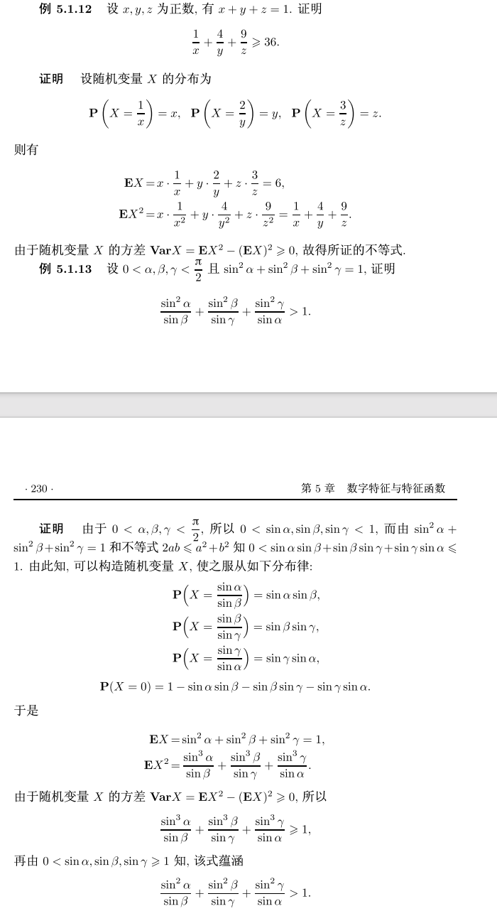

# 数字特征与特征函数

## 矩与分位数

### Cauchy、Peter和Paul分布
Cauchy分布:反正切的导数
Peter、Paul分布:$P(x=2^k)=2^{-k},k\geq 0$(重尾)

### 积分变换定理

下面把你图里的"积分变换定理"整理成一版可直接放笔记的内容。

设随机变量 
\(X:(\Omega,\mathcal F,P)\to\mathbb R\)，其分布函数为 \(F_X\)。  
对任意 Borel 可测函数 \(g:\mathbb R\to\mathbb R\)，有
\[
\int_{\mathbb R} g(x)\,dF_X(x)
=
\int_{\Omega} g(X(\omega))\,dP(\omega).
\]
若写成期望形式，就是
\[
\mathbb E[g(X)] = \int_{\mathbb R} g(x)\,dF_X(x).
\]
意义：一端存在则另一端也存在，且两者相等（通常在非负或绝对可积条件下表述最稳妥）。

---

**常用等价写法**

1. 非负情形：\(g\ge 0\)
\[
\mathbb E[g(X)] = \int_{\mathbb R} g(x)\,dF_X(x)\in[0,\infty].
\]

2. 可积情形：\(\mathbb E|g(X)|<\infty\)（等价于 \(\int |g|\,dF_X<\infty\)）
\[
\mathbb E[g(X)] = \int g\,dF_X.
\]

---

**离散/连续特例**

1. 若 \(X\) 离散，\(P(X=x_i)=p_i\)，则
\[
\mathbb E[g(X)] = \sum_i g(x_i)p_i.
\]

2. 若 \(X\) 有密度 \(f_X\)，则
\[
\mathbb E[g(X)] = \int_{-\infty}^{\infty} g(x)f_X(x)\,dx.
\]

---

**为什么重要（你这章会反复用）**

1. 取 \(g(x)=x\)：\(\mathbb E[X]=\int x\,dF_X(x)\)。  
2. 取 \(g(x)=x^k\)：得到 \(k\) 阶矩。  
3. 取 \(g(x)=e^{itx}\)：得到特征函数
\[
\varphi_X(t)=\mathbb E[e^{itX}]=\int e^{itx}\,dF_X(x).
\]

---

**证明思路（四步法，简记）**

1. 先对指标函数 \(g=\mathbf 1_B\) 成立（两边都等于 \(P(X\in B)\)）。  
2. 推到简单函数 \(g=\sum c_i\mathbf 1_{B_i}\)。  
3. 对非负可测函数，用单调收敛定理逼近。  
4. 对一般可积函数，分解 \(g=g^+-g^-\)。

如果你愿意，我可以下一条直接给你“和你现有记号一致”的一段 LaTeX 成稿（含定理+证明框架+两个例子）。

## 利用期望函数的可加性计算期望
### 利用可加性计算超几何分布的期望
### 抽卡片那个问题

可以把“矩”理解成：用不同权重去度量分布形状的一组数字特征。最核心的是下面这些。

**1. 原点矩（raw moment / about origin）**  
随机变量 \(X\) 的 \(k\) 阶原点矩定义为
\[
m_k'=\mathbb E[X^k],\quad k=1,2,\dots
\]
常见对应：
\[
m_1'=\mathbb E[X],\quad m_2'=\mathbb E[X^2].
\]
它是“相对于 0 点”的矩。

**2. 中心矩（central moment）**  
\(k\) 阶中心矩定义为
\[
\mu_k=\mathbb E[(X-\mu)^k],\quad \mu=\mathbb E[X].
\]
常见对应：
\[
\mu_1=0,\quad \mu_2=\mathrm{Var}(X),\quad \mu_3,\mu_4\text{ 用于偏度和峰度}.
\]
它反映“围绕均值”的波动与形状。

**3. 绝对矩（absolute moment）**  
\(k\) 阶绝对矩定义为
\[
\alpha_k=\mathbb E[|X|^k].
\]
对应的中心绝对矩也常用：
\[
\beta_k=\mathbb E[|X-\mu|^k].
\]
绝对矩常用于重尾分布分析，因为它比带符号幂更稳健。

**4. 标准化矩（standardized moment）**  
若 \(\sigma^2=\mu_2>0\)，定义
\[
\tilde\mu_k=\frac{\mu_k}{\sigma^k}.
\]
常见两个量：
\[
\gamma_1=\frac{\mu_3}{\sigma^3}\quad(\text{偏度}),
\qquad
\gamma_2=\frac{\mu_4}{\sigma^4}-3\quad(\text{超额峰度}).
\]

**5. 阶乘矩（factorial moment，离散型常用）**  
\[
\mathbb E[(X)_k],\quad (X)_k=X(X-1)\cdots(X-k+1).
\]
在计数型随机变量（如 Poisson、二项）里很自然，和概率母函数关系紧密。

**6. 混合矩与协方差矩阵（多维）**  
若 \(X=(X_1,\dots,X_d)\)，可定义
\[
\mathbb E\!\left[\prod_{j=1}^d X_j^{r_j}\right]
\]
这类混合矩。二阶混合中心矩就是协方差：
\[
\mathrm{Cov}(X_i,X_j)=\mathbb E[(X_i-\mu_i)(X_j-\mu_j)].
\]

**7. 条件矩（conditional moment）**  
给定信息 \(\mathcal G\) 后，
\[
\mathbb E[X^k\mid \mathcal G],\quad
\mathbb E[(X-\mathbb E[X\mid\mathcal G])^k\mid\mathcal G].
\]
在时间序列、贝叶斯、金融中非常常见。

**8. 累积量（cumulant，和矩“类似但更结构化”）**  
由特征函数或矩母函数的对数展开得到。前几阶：
\[
\kappa_1=\mu,\quad \kappa_2=\sigma^2,\quad \kappa_3=\mu_3,\quad \kappa_4=\mu_4-3\mu_2^2.
\]
优点是独立和可加：若 \(X,Y\) 独立，则
\[
\kappa_n(X+Y)=\kappa_n(X)+\kappa_n(Y).
\]

**9. 存在性要点**  
- \(k\) 阶原点矩存在通常要求 \(\mathbb E[|X|^k]<\infty\)。  
- 重尾分布可能低阶矩存在、高阶矩不存在。  
- 例如 Cauchy 分布连一阶矩都不存在。  
- Peter-Paul（圣彼得堡）型分布可出现 \(\mathbb E[X]=\infty\)。

**10. 一个关系式（原点矩与中心矩）**  
\[
\mu_2=m_2'-(m_1')^2,\quad
\mu_3=m_3'-3m_2'm_1'+2(m_1')^3.
\]
所以原点矩与中心矩可互相转换。

如果你愿意，我可以下一步给你做一张“矩概念速查表”（定义、几何意义、是否平移不变、典型用途四列）。

引理：
如果X是退化于0的随机变量,则$EX^2=0$,同时,
若$EX^2=0$则X是退化于0的随机变量.

这里有个记号重名，先理清：

- 大写 \(X\)（书里那一行 \(EX^2\)）是“两点距离”这个随机变量；
- \(X_1,X_2\) 是两点的横坐标。

所以
\[
X^2=(X_1-X_2)^2+(Y_1-Y_2)^2.
\]
取期望：
\[
E[X^2]=E[(X_1-X_2)^2]+E[(Y_1-Y_2)^2].
\]

再看第一项：
\[
E[(X_1-X_2)^2]
=\mathrm{Var}(X_1-X_2)+\big(E[X_1-X_2]\big)^2.
\]
由对称性 \(E[X_1]=E[X_2]=0\)，所以均值项为 0；且 \(X_1,X_2\) 独立同分布，
\[
\mathrm{Var}(X_1-X_2)=\mathrm{Var}(X_1)+\mathrm{Var}(X_2)=2\mathrm{Var}(X_1).
\]
同理
\[
E[(Y_1-Y_2)^2]=2\mathrm{Var}(Y_1).
\]
又因为圆盘均匀分布下 \(X\) 与 \(Y\) 同分布，
\[
\mathrm{Var}(Y_1)=\mathrm{Var}(X_1).
\]
因此
\[
E[X^2]=2\mathrm{Var}(X_1)+2\mathrm{Var}(X_1)=4\mathrm{Var}(X_1).
\]

这就是那一步的来源。

单位圆盘上任意两点距离的平方的期望（两种广义坐标两种计算方法）

### 标准化随机变量
