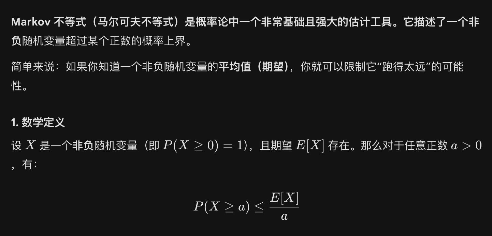
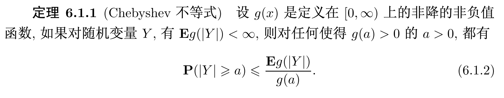
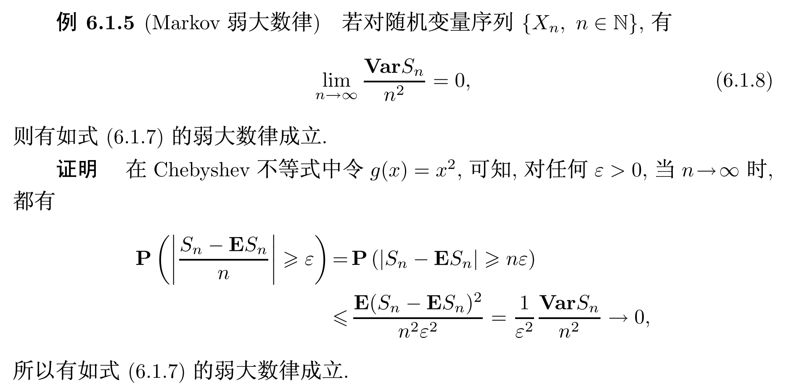
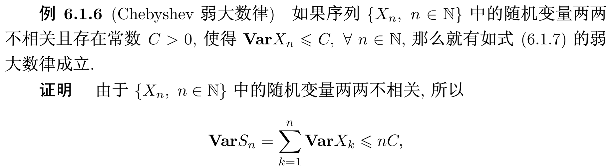
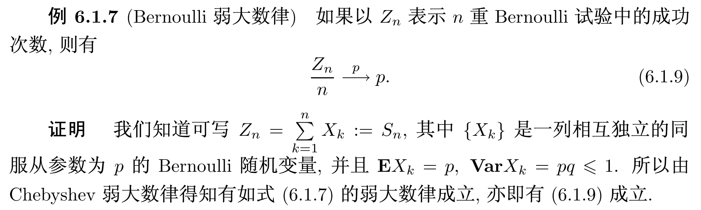
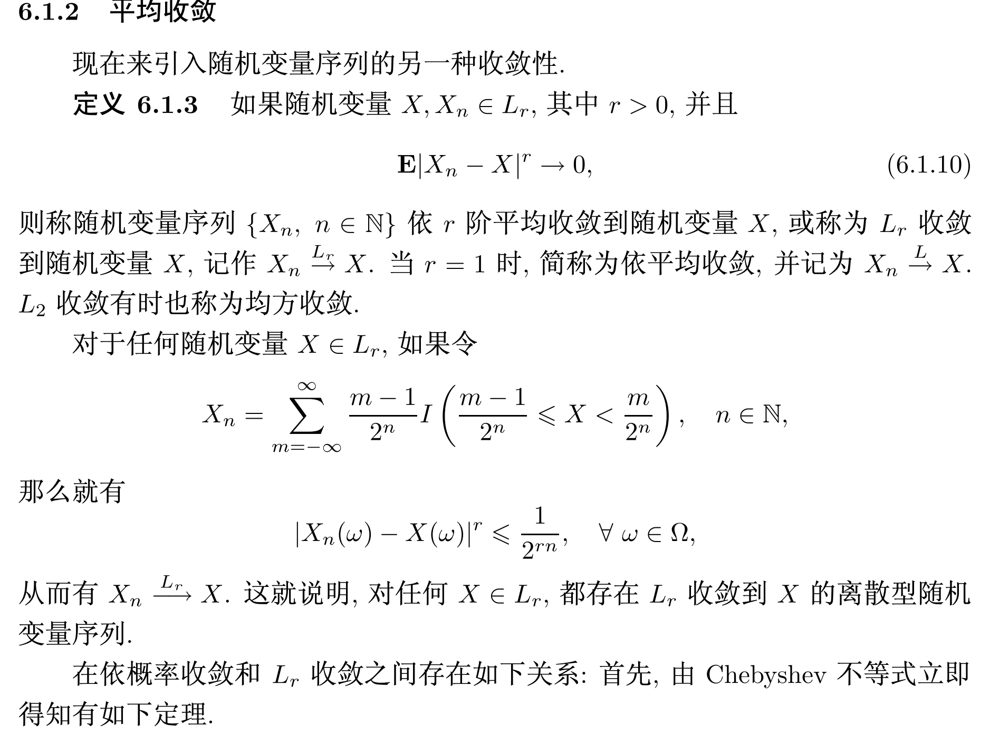
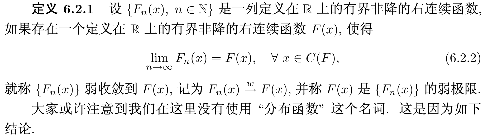
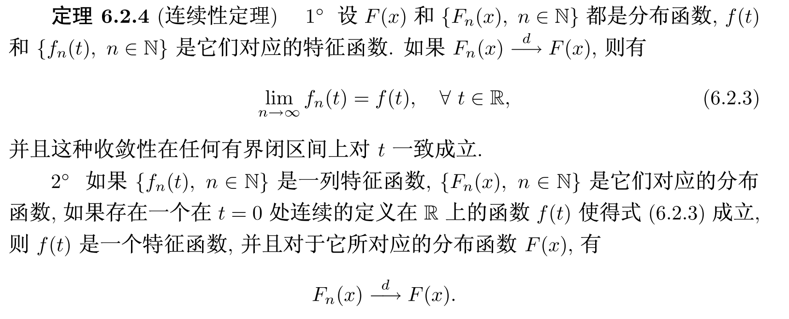

# 极限定理
## 依概率收敛与平均收敛
### 依概率收敛
### Chebyshev不等式

$\int_{-\infty}^{+\infty}g(|y|)p(y)dy
$

一阶矩方法和二阶矩方法

### 弱大数率
中心化数列、正则化数列
#### Markov弱大数定律

#### Chebyshev弱大数律

#### Bernoulli弱大数律

### 平均收敛

$L_r收敛可以推导出依概率收敛$
## 依分布收敛

分布函数在连续点处收敛

分布函数列的弱极限不一定是分布函数

## Lp收敛，概率收敛，分布收敛的联系
$Lp收敛\to 概率收敛\to 分布收敛\\
第一个\to 反推的条件为收敛到一个常数\\
第二个\to 反推的条件为一致可积$

### 连续性定理

分布函数依分布收敛那么特征函数一定一致逐点收敛,如果特征函数逐点收敛到一个在t=0处连续的函数,则这个极限也是一个特征函数,并且一定会有依分布收敛.

## 弱大数律和中心极限定理

# ***
$EX=\sum_{k=1}^{\infty}kp(x=k)=\sum_{k=1}^{\infty}p(x\geq k)\\
全期望公式:
EX=\sum_{k=1}^{\infty}E(X|Y=k)P(Y=k)\\
E(X|Y=y)=\int u f(u|y)du\\
EX=\int xf_X (x) dx\\
=\int\int xf(x,y)dxdy\\
=\int\int x\frac{f(x,y)}{f_Y(y)}f_Y(y)dydx\\
=\int\int xf(x|y)dx f_Y(y)dy\\$

$一个机场运送行李数量N服从参数为\lambda 的poisson分布\\
行李重量服从Y分布\\
每件行李都是独立同分布的期望为u\\
求托运的总质量的期望:\\
\\
解:S=\sum_{i=1}^{N}X_i\\
$

