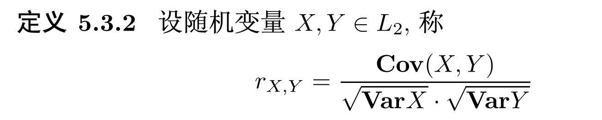
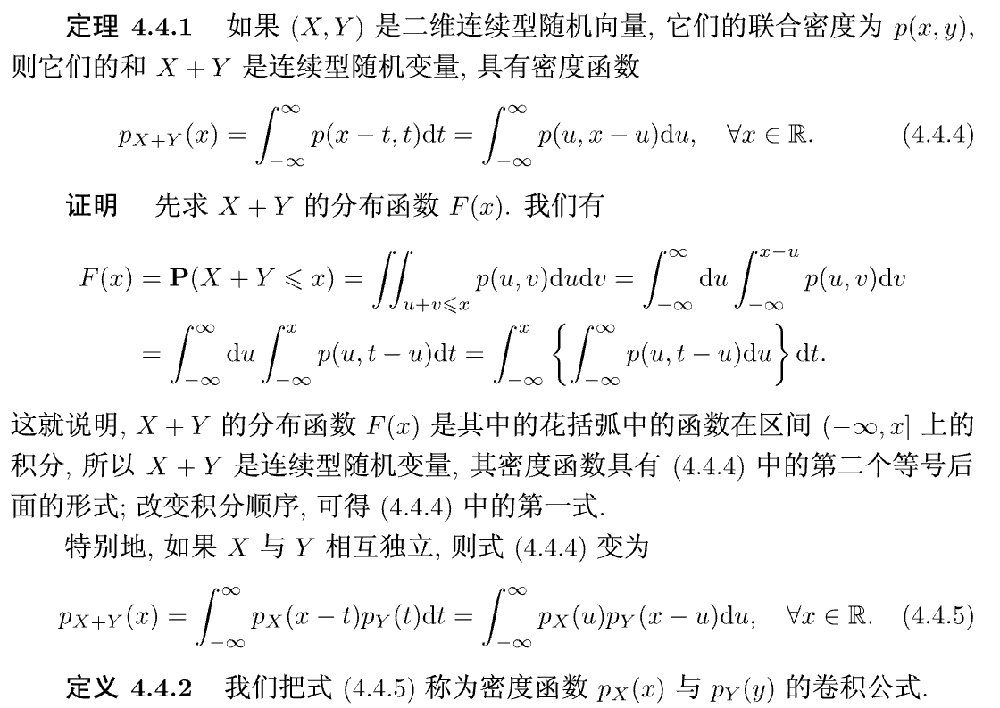
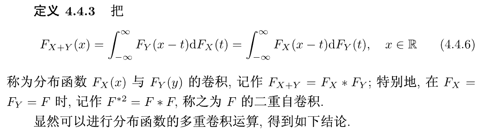

# 概率论
考前划重点
考试必考上下极限问题

数列上下极限用（inf sup定义和用子列极限的最大值定义效果一致）//TODO:补充证明

## 古典概型
无放回抽取和又放回抽取

有放回抽样，求最大号码为7的概率 $\iff$ 每个球的号码都不大于7减去每个球的号码都不大于6

### 例 1.4.1
盒子中放有 10 个分别标有号码 1,2,⋯,10 的小球,从中随机抽取 3 个球. 试分别对 "无放回抽取" 和 "有放回抽取" 方式求: (1) 3 个球的号码都不大于 7 的概率; (2) 球上的最大号码为 7 的概率.

**解** 以  A  表示 3 个球的号码都不大于 7 的事件; 以  B  表示球上的最大号码为 7 的事件; 再以  C  表示 3 个球的号码都不大于 6 的事件.

**无放回抽取**方式下:
- 样本空间 $\Omega$ 由 "从 10 个不同元素中选取 3 个不同元素" 的所有不同选法组成，故有 $|\Omega| = \binom{10}{3}$ .
- 事件 $A$ 由 "从 1~7 号球这 7 个不同元素中选取 3 个不同元素" 的所有不同选法组成，故有 $|A| = \binom{7}{3}$ .
- 事件 $B$ 中由于 7 号球一定被取出，所以只要再从 1~6 号球这 6 个不同元素中选取两个不同元素，故有 $|B| = \binom{6}{2}$ .
- 计算概率:
  $P(A) = \frac{\binom{7}{3}}{\binom{10}{3}} = \frac{7}{24}, \quad P(B) = \frac{\binom{6}{2}}{\binom{10}{3}} = \frac{1}{8}$

**有放回抽取**方式下:
- 样本空间 $\Omega$ 视为 "由 10 个不同元素中选取 3 个元素的可重排列" 的所有不同排法组成，故有 $|\Omega| = 10^3$ .
- 事件 $A$ 相应地有 $|A| = 7^3$ .
- 事件 $B$ 中最大号码为 7，意味着至少有一个 7 号球，且所有球的号码不超过 7，故 $|B| = 7^3 - 6^3$ .
- 计算概率:
  $P(A) = \frac{7^3}{10^3} = \frac{343}{1000}, \quad P(B) = \frac{7^3 - 6^3}{10^3} = \frac{343 - 216}{1000} = \frac{127}{1000}$

## 几何概型

### 例 1.5.1
在单位正方形 $0 \leq x \leq 1, 0 \leq y \leq 1$ 中任取一点 $(x, y)$, 求满足以下条件的概率:
(1) $x + y \leq \frac{1}{2}$;
(2) $xy \leq \frac{1}{2}$.

**解** 样本空间 $\Omega$ 为单位正方形，其面积为 1.

(1) 事件 $A$ 为 $x + y \leq \frac{1}{2}$，对应的区域是由直线 $x + y = \frac{1}{2}$ 与坐标轴围成的三角形，其面积为 $\frac{1}{2} × \frac{1}{2} × \frac{1}{2} = \frac{1}{8}$。因此：
  $P(A) = \frac{\text{Area}(A)}{\text{Area}(Ω)} = \frac{1}{8}$

(2) 事件 $B$ 为 $xy \leq \frac{1}{2}$，对应的区域是单位正方形中位于双曲线 $xy = \frac{1}{2}$ 下方的部分。其面积计算如下：
  当 $x \in [0, \frac{1}{2}]$ 时，$y$ 可取 $[0, 1]$，这部分面积为 $\frac{1}{2} × 1 = \frac{1}{2}$；
  当 $x \in [\frac{1}{2}, 1]$ 时，$y \leq \frac{1}{2x}$，这部分面积为 $\int_{\frac{1}{2}}^1 \frac{1}{2x} dx = \frac{1}{2} \ln 2$。
  因此，$\text{Area}(B) = \frac{1}{2} + \frac{1}{2} \ln 2$，故：
  $P(B) = \frac{\text{Area}(B)}{\text{Area}(Ω)} = \frac{1}{2} + \frac{1}{2} \ln 2$

## 例：1.4.2

## 随机变量

### 2.1 随机变量的定义
- **随机变量**：样本空间到实数轴的映射，即对于每个样本点 $\omega \in \Omega$，都有唯一的实数 $X(\omega)$ 与之对应。
- **离散型随机变量**：取值为有限个或可列无限个的随机变量。
- **连续型随机变量**：取值为某个区间内所有实数的随机变量。

### 2.2 离散型随机变量

#### 概率质量函数（PMF）
对于离散型随机变量 $X$，其概率质量函数为：
  $P(X = x_k) = p_k, \quad k = 1, 2, \ldots$
满足：
  (1) $p_k \geq 0, \quad (2) \sum_{k=1}^∞ p_k = 1$

#### 常见离散分布

**(1) 二项分布 $B(n, p)$**
- **背景**：n 重伯努利试验中成功的次数。
- **概率质量函数**：$P(X = k) = \binom{n}{k} p^k (1-p)^{n-k}, \quad k = 0, 1, \ldots, n$
- **期望**：$E(X) = np$
- **方差**：$Var(X) = np(1-p)$

**(2) 泊松分布 $P(λ)$**
- **背景**：单位时间内随机事件发生的次数。
- **概率质量函数**：$P(X = k) = \frac{e^{-λ} λ^k}{k!}, \quad k = 0, 1, 2, \ldots$
- **期望**：$E(X) = λ$
- **方差**：$Var(X) = λ$

**(3) 几何分布 $G(p)$**
- **背景**：首次成功所需的试验次数。
- **概率质量函数**：$P(X = k) = (1-p)^{k-1} p, \quad k = 1, 2, \ldots$
- **期望**：$E(X) = \frac{1}{p}$
- **方差**：$Var(X) = \frac{1-p}{p^2}$

**(4) 超几何分布 $H(N, M, n)$**
- **背景**：无放回抽样中成功的次数。
- **概率质量函数**：$P(X = k) = \frac{\binom{M}{k} \binom{N-M}{n-k}}{\binom{N}{n}}, \quad k = 0, 1, \ldots, \min(M, n)$
- **期望**：$E(X) = n \cdot \frac{M}{N}$
- **方差**：$Var(X) = n \cdot \frac{M}{N} \cdot \frac{N-M}{N} \cdot \frac{N-n}{N-1}$

### 2.3 连续型随机变量

#### 概率密度函数（PDF）
对于连续型随机变量 $X$，其概率密度函数 $f(x)$ 满足：
  (1) $f(x) \geq 0, \quad (2) \int_{-∞}^{∞} f(x) dx = 1$

#### 分布函数（CDF）
对于随机变量 $X$，其分布函数为：
  $F(x) = P(X ≤ x) = \begin{cases} \sum_{x_k ≤ x} p_k, & \text{离散型} \\ \int_{-∞}^x f(t) dt, & \text{连续型} \end{cases}$

#### 常见连续分布

**(1) 均匀分布 $U(a, b)$**
- **概率密度函数**：$f(x) = \frac{1}{b-a}, \quad a \leq x \leq b$
- **期望**：$E(X) = \frac{a+b}{2}$
- **方差**：$Var(X) = \frac{(b-a)^2}{12}$

**(2) 正态分布 $N(μ, σ²)$**
- **概率密度函数**：$f(x) = \frac{1}{\sqrt{2π}σ} e^{-\frac{(x-μ)^2}{2σ^2}}, \quad -∞ < x < ∞$
- **期望**：$E(X) = μ$
- **方差**：$Var(X) = σ²$

**(3) 指数分布 $E(λ)$**
- **概率密度函数**：$f(x) = λ e^{-λ x}, \quad x \geq 0$
- **期望**：$E(X) = \frac{1}{λ}$
- **方差**：$Var(X) = \frac{1}{λ²}$
- **无记忆性**：$P(X > s + t | X > s) = P(X > t)$

**(4) 伽马分布 $Γ(α, β)$**
- **概率密度函数**：$f(x) = \frac{β^α}{Γ(α)} x^{α-1} e^{-β x}, \quad x \geq 0$
- **期望**：$E(X) = \frac{α}{β}$
- **方差**：$Var(X) = \frac{α}{β²}$

## 随机向量

### 3.1 二维随机向量

#### 联合分布函数
对于二维随机向量 $(X, Y)$，其联合分布函数为：
  $F(x, y) = P(X ≤ x, Y ≤ y), \quad -∞ < x, y < ∞$

**性质**：
1. $0 ≤ F(x, y) ≤ 1$
2. $F(x, y)$ 关于 $x$ 和 $y$ 均单调不减
3. $F(x, y)$ 关于 $x$ 和 $y$ 均右连续
4. $F(-∞, y) = F(x, -∞) = 0, F(∞, ∞) = 1$

#### 离散型联合概率质量函数
对于二维离散型随机向量 $(X, Y)$，其联合概率质量函数为：
  $P(X = x_i, Y = y_j) = p_{ij}, \quad i, j = 1, 2, \ldots$
满足：
  (1) $p_{ij} ≥ 0, \quad (2) \sum_{i=1}^∞ \sum_{j=1}^∞ p_{ij} = 1$

#### 连续型联合概率密度函数
对于二维连续型随机向量 $(X, Y)$，其联合概率密度函数 $f(x, y)$ 满足：
  (1) $f(x, y) ≥ 0, \quad (2) \int_{-∞}^{∞} \int_{-∞}^{∞} f(x, y) dx dy = 1$

联合分布函数与概率密度函数的关系：
  $F(x, y) = \int_{-∞}^x \int_{-∞}^y f(u, v) du dv$

### 3.2 边缘分布

#### 边缘分布函数
对于二维随机向量 $(X, Y)$，$X$ 和 $Y$ 的边缘分布函数分别为：
  $F_X(x) = P(X ≤ x) = F(x, ∞)$
  $F_Y(y) = P(Y ≤ y) = F(∞, y)$

#### 离散型边缘概率质量函数
对于二维离散型随机向量 $(X, Y)$，$X$ 和 $Y$ 的边缘概率质量函数分别为：
  $P(X = x_i) = \sum_{j=1}^∞ p_{ij} = p_i., \quad i = 1, 2, \ldots$
  $P(Y = y_j) = \sum_{i=1}^∞ p_{ij} = p_.j, \quad j = 1, 2, \ldots$

#### 连续型边缘概率密度函数
对于二维连续型随机向量 $(X, Y)$，$X$ 和 $Y$ 的边缘概率密度函数分别为：
  $f_X(x) = \int_{-∞}^{∞} f(x, y) dy$
  $f_Y(y) = \int_{-∞}^{∞} f(x, y) dx$

### 3.3 条件分布

#### 离散型条件概率质量函数
对于二维离散型随机向量 $(X, Y)$，在 $Y = y_j$ 条件下 $X$ 的条件概率质量函数为：
  $P(X = x_i | Y = y_j) = \frac{P(X = x_i, Y = y_j)}{P(Y = y_j)} = \frac{p_{ij}}{p_.j}, \quad P(Y = y_j) > 0$

#### 连续型条件概率密度函数
对于二维连续型随机向量 $(X, Y)$，在 $Y = y$ 条件下 $X$ 的条件概率密度函数为：
  $f(x | y) = \frac{f(x, y)}{f_Y(y)}, \quad f_Y(y) > 0$"

### 3.4 随机变量的独立性

#### 独立的定义
随机变量 $X$ 和 $Y$ 独立当且仅当：
  $F(x, y) = F_X(x) F_Y(y), \quad 对所有 x, y$

#### 离散型独立的条件
$X$ 和 $Y$ 独立当且仅当：
  $P(X = x_i, Y = y_j) = P(X = x_i) P(Y = y_j), \quad 对所有 i, j$

#### 连续型独立的条件
$X$ 和 $Y$ 独立当且仅当：
  $f(x, y) = f_X(x) f_Y(y), \quad 对所有 x, y$

### 3.5 二维随机变量的函数

#### 和的分布
对于二维随机变量 $(X, Y)$，$Z = X + Y$ 的分布：
- **离散型**：$P(Z = z) = \sum_{x} P(X = x, Y = z - x)$
- **连续型**：$f_Z(z) = \int_{-∞}^{∞} f(x, z - x) dx$

#### 商的分布
对于二维随机变量 $(X, Y)$，$Z = \frac{X}{Y}$ 的分布：
  $f_Z(z) = \int_{-∞}^{∞} |y| f(zy, y) dy$

#### 最大值与最小值的分布
对于独立随机变量 $X$ 和 $Y$：
- $Z = max(X, Y)$ 的分布函数：$F_Z(z) = F_X(z) F_Y(z)$
- $Z = min(X, Y)$ 的分布函数：$F_Z(z) = 1 - [1 - F_X(z)][1 - F_Y(z)]$

## 数字特征与特征函数

### 4.1 数学期望

#### 离散型随机变量的数学期望
对于离散型随机变量 $X$，其数学期望为：
  $E(X) = \sum_{k=1}^∞ x_k P(X = x_k)$

#### 连续型随机变量的数学期望
对于连续型随机变量 $X$，其数学期望为：
  $E(X) = \int_{-∞}^{∞} x f(x) dx$

#### 数学期望的性质
1. **线性性**：$E(aX + bY + c) = aE(X) + bE(Y) + c$
2. **单调性**：若 $X ≤ Y$，则 $E(X) ≤ E(Y)$
3. **Jensen 不等式**：若 $g(x)$ 是凸函数，则 $E(g(X)) ≥ g(E(X))$

### 4.2 方差

#### 方差的定义
对于随机变量 $X$，其方差为：
  $Var(X) = E[(X - E(X))²] = E(X²) - [E(X)]²$

#### 方差的性质
1. **常数的方差为 0**：$Var(c) = 0$
2. **线性变换**：$Var(aX + b) = a² Var(X)$
3. **独立变量和的方差**：若 $X$ 和 $Y$ 独立，则 $Var(X + Y) = Var(X) + Var(Y)$

#### 标准差
标准差是方差的平方根：
  $σ(X) = \sqrt{Var(X)}$

### 4.3 协方差与相关系数

#### 协方差
对于随机变量 $X$ 和 $Y$，其协方差为：
  $Cov(X, Y) = E[(X - E(X))(Y - E(Y))] = E(XY) - E(X)E(Y)$

#### 相关系数
对于随机变量 $X$ 和 $Y$，其相关系数为：
  $ρ(X, Y) = \frac{Cov(X, Y)}{σ(X)σ(Y)}$

**性质**：
1. $|ρ(X, Y)| ≤ 1$
2. $|ρ(X, Y)| = 1$ 当且仅当存在常数 $a, b$ 使得 $P(Y = aX + b) = 1$
3. 若 $X$ 和 $Y$ 独立，则 $ρ(X, Y) = 0$，但反之不成立

#### 协方差矩阵
对于 $n$ 维随机向量 $(X_1, X_2, ..., X_n)$，其协方差矩阵为：
  $Σ = (Cov(X_i, X_j))_{n×n}$

### 4.4 矩与矩生成函数

#### 原点矩与中心矩
- **k 阶原点矩**：$E(X^k)$
- **k 阶中心矩**：$E[(X - E(X))^k]$

#### 矩生成函数
对于随机变量 $X$，其矩生成函数为：
  $M(t) = E(e^{tX})$

**性质**：
1. $M(0) = 1$
2. 若矩生成函数存在，则各阶矩可通过 $M(t)$ 的导数在 $t=0$ 处的值得到：$E(X^k) = M^{(k)}(0)$
3. 矩生成函数唯一确定分布

### 4.5 特征函数

#### 特征函数的定义
对于随机变量 $X$，其特征函数为：
  $φ(t) = E(e^{itX})$

**性质**：
1. $φ(0) = 1$
2. $|φ(t)| ≤ 1$
3. $φ(-t) = \overline{φ(t)}$
4. 若 $X$ 和 $Y$ 独立，则 $φ_{X+Y}(t) = φ_X(t)φ_Y(t)$
5. 特征函数唯一确定分布

#### 特征函数与分布的关系
- 离散型：$φ(t) = \sum_{k=1}^∞ e^{itx_k} P(X = x_k)$
- 连续型：$φ(t) = \int_{-∞}^{∞} e^{itx} f(x) dx$

### 4.6 常用分布的数字特征

| 分布 | 期望 | 方差 |
|------|------|------|
| 二项分布 $B(n, p)$ | $np$ | $np(1-p)$ |
| 泊松分布 $P(λ)$ | $λ$ | $λ$ |
| 几何分布 $G(p)$ | $1/p$ | $(1-p)/p²$ |
| 超几何分布 $H(N, M, n)$ | $n·M/N$ | $n·M/N·(N-M)/N·(N-n)/(N-1)$ |
| 均匀分布 $U(a, b)$ | $(a+b)/2$ | $(b-a)²/12$ |
| 正态分布 $N(μ, σ²)$ | $μ$ | $σ²$ |
| 指数分布 $E(λ)$ | $1/λ$ | $1/λ²$ |
| 伽马分布 $Γ(α, β)$ | $α/β$ | $α/β²$ |

## 极限定理

### 5.1 大数定律

#### 切比雪夫大数定律
设 $X_1, X_2, ..., X_n, ...$ 是两两不相关的随机变量序列，每个 $X_i$ 的方差存在且有共同的上界，即存在常数 $C > 0$，使得 $Var(X_i) ≤ C$ 对所有 $i$ 成立，则对任意 $ε > 0$，有：
  $\lim_{n→∞} P\left(\left|\frac{1}{n}\sum_{i=1}^n X_i - \frac{1}{n}\sum_{i=1}^n E(X_i)\right| < ε\right) = 1$

#### 伯努利大数定律
设 $n_A$ 是 $n$ 次独立试验中事件 $A$ 发生的次数，$p$ 是事件 $A$ 在每次试验中发生的概率，则对任意 $ε > 0$，有：
  $\lim_{n→∞} P\left(\left|\frac{n_A}{n} - p\right| < ε\right) = 1$

#### 辛钦大数定律
设 $X_1, X_2, ..., X_n, ...$ 是独立同分布的随机变量序列，且数学期望存在，记为 $μ = E(X_i)$，则对任意 $ε > 0$，有：
  $\lim_{n→∞} P\left(\left|\frac{1}{n}\sum_{i=1}^n X_i - μ\right| < ε\right) = 1$

### 5.2 中心极限定理

#### 独立同分布中心极限定理
设 $X_1, X_2, ..., X_n, ...$ 是独立同分布的随机变量序列，且数学期望和方差存在，记为 $μ = E(X_i)$，$σ² = Var(X_i) > 0$，则对任意实数 $x$，有：
  $\lim_{n→∞} P\left(\frac{\sum_{i=1}^n X_i - nμ}{σ\sqrt{n}} ≤ x\right) = Φ(x)$
其中 $Φ(x)$ 是标准正态分布的分布函数。

#### 棣莫弗-拉普拉斯中心极限定理
设 $n_A$ 是 $n$ 次独立试验中事件 $A$ 发生的次数，$p$ 是事件 $A$ 在每次试验中发生的概率，则对任意实数 $x$，有：
  $\lim_{n→∞} P\left(\frac{n_A - np}{\sqrt{np(1-p)}} ≤ x\right) = Φ(x)$

### 5.3 极限定理的应用

#### 近似计算
- **二项分布的正态近似**：当 n 较大时，二项分布 B(n, p) 近似于正态分布 N(np, np(1-p))
- **泊松近似**：当 n 较大且 p 较小时，二项分布 B(n, p) 近似于泊松分布 P(np)

#### 统计推断中的应用
- **置信区间估计**：利用中心极限定理构造总体均值的置信区间
- **假设检验**：利用中心极限定理进行假设检验

## 附录

### 常用分布表
- **二项分布表**：给出不同 n 和 p 下的二项分布概率值
- **正态分布表**：给出标准正态分布的分布函数值
- **泊松分布表**：给出不同 λ 下的泊松分布概率值

### 数学工具
- **排列组合**：
  - 排列数：$P(n, k) = \frac{n!}{(n-k)!}$
  - 组合数：$C(n, k) = \binom{n}{k} = \frac{n!}{k!(n-k)!}$

- **微积分**：
  - 积分技巧：换元法、分部积分法
  - 无穷级数：几何级数、幂级数

- **线性代数**：
  - 矩阵运算
  - 特征值与特征向量

24\25
## 初等概率论

### 事件与σ代数

### 5.1 事件
- **样本空间**：试验的所有可能结果组成的集合，记为 Ω
- **事件**：样本空间的子集，记为 A, B, C 等
- **必然事件**：Ω 本身，记为 Ω
- **不可能事件**：空集，记为 ∅

### 5.2 事件的运算
- **并事件**：A ∪ B，表示事件 A 或事件 B 发生
- **交事件**：A ∩ B（或 AB），表示事件 A 和事件 B 同时发生
- **差事件**：A \ B，表示事件 A 发生但事件 B 不发生
- **补事件**：A^c（或 \overline{A}），表示事件 A 不发生

### 5.3 σ代数（σ-域）

#### 定义
设 $Ω$ 是样本空间，$\mathcal{F}$ 是 $Ω$ 的子集组成的集合族，若满足以下条件：
1. **包含空集和样本空间**：$∅ ∈ \mathcal{F}$，$Ω ∈ \mathcal{F}$
2. **对补集封闭**：若 $A ∈ \mathcal{F}$，则 $A^c ∈ \mathcal{F}$
3. **对可列并封闭**：若 $A_1, A_2, ... ∈ \mathcal{F}$，则 $\bigcup_{n=1}^∞ A_n ∈ \mathcal{F}$
则称 $\mathcal{F}$ 为 $Ω$ 上的一个 σ 代数（σ-域）。

#### 性质
1. **对可列交封闭**：若 $A_1, A_2, ... ∈ \mathcal{F}$，则 $\bigcap_{n=1}^∞ A_n ∈ \mathcal{F}$
2. **对有限并和有限交封闭**：因为有限并/交是可列并/交的特殊情况
3. **对差集封闭**：若 $A, B ∈ \mathcal{F}$，则 $A \ B = A ∩ B^c ∈ \mathcal{F}$

#### 常见的 σ 代数
1. **平凡 σ 代数**：$\mathcal{F} = \{∅, Ω\}$
2. **由单个事件生成的 σ 代数**：若 $A ⊆ Ω$，则生成的 σ 代数为 $\{∅, A, A^c, Ω\}$
3. **Borel σ 代数**：在实数轴 $\mathbb{R}$ 上，由所有开区间生成的 σ 代数，记为 $\mathcal{B}(\mathbb{R})$

#### 最小 σ 代数（生成 σ 代数）

##### 定义
设 $\mathcal{C}$ 是 $Ω$ 的一个子集族（称为生成集族），**由 $\mathcal{C}$ 生成的最小 σ 代数**记为 $σ(\mathcal{C})$，它满足：
- $\mathcal{C} ⊆ σ(\mathcal{C})$（包含生成集族）；
- $σ(\mathcal{C})$ 是一个 σ 代数；
- 对于任何包含 $\mathcal{C}$ 的 σ 代数 $\mathcal{F}$，都有 $σ(\mathcal{C}) ⊆ \mathcal{F}$（最小性）。

##### 构造
最小 σ 代数的存在性由以下事实保证：所有包含 $\mathcal{C}$ 的 σ 代数的交集仍然是一个 σ 代数，且这个交集就是 $σ(\mathcal{C})$。

具体来说：
$$σ(\mathcal{C}) = \bigcap \{ \mathcal{F} \mid \mathcal{F} \text{ 是 σ 代数且 } \mathcal{C} ⊆ \mathcal{F} \}$$

##### 例子
1. **由单个集合生成的 σ 代数**：
   - 若 $Ω = \{1, 2, 3, 4\}$，$\mathcal{C} = \{\{1, 2\}\}$，则 $σ(\mathcal{C}) = \{∅, Ω, \{1, 2\}, \{3, 4\}\}$。

2. **Borel σ 代数**：
   - 在实数轴 $\mathbb{R}$ 上，由所有开区间生成的最小 σ 代数称为 Borel σ 代数，记为 $\mathcal{B}(\mathbb{R})$。
   - 它包含所有开区间、闭区间、半开半闭区间、单点集、可列集等。

##### 在概率论中的应用
- **概率空间的构造**：确定哪些事件是可测的（即属于 σ 代数）。
- **随机变量的可测性**：随机变量 $X: Ω → \mathbb{R}$ 要求对任意 Borel 集 $B ∈ \mathcal{B}(\mathbb{R})$，原像 $X^{-1}(B) ∈ \mathcal{F}$。
- **条件概率与独立性**：基于 σ 代数的独立性定义是概率论中更一般的独立性概念。

### 5.4 概率测度

#### 定义
设 $(Ω, \mathcal{F})$ 是可测空间，$P$ 是定义在 $\mathcal{F}$ 上的函数，若满足以下条件：
1. **非负性**：对任意 $A ∈ \mathcal{F}$，有 $P(A) ≥ 0$
2. **规范性**：$P(Ω) = 1$
3. **可列可加性**：对任意两两互不相容的事件序列 $A_1, A_2, ... ∈ \mathcal{F}$，有 $P(\bigcup_{n=1}^∞ A_n) = \sum_{n=1}^∞ P(A_n)$
则称 $P$ 为 $(Ω, \mathcal{F})$ 上的概率测度。

#### 概率空间
三元组 $(Ω, \mathcal{F}, P)$ 称为概率空间，其中：
- $Ω$ 是样本空间
- $\mathcal{F}$ 是 σ 代数
- $P$ 是概率测度

P具有可列可加性(两两不交的情况)
P具有次可加性

利用概率的公理化定义及其性质解决问题
(考虑反面)
例 2.2.1 某人抛掷一枚均匀的硬币 2n+ 1 次，求他掷出的正面多于反面的概率

以 E 表示掷出的正面多于反面的事件，由于共抛掷奇数次，所以 EC 就是
掷出的反面多于正面的事件.由于硬币是均匀的，所以 P(E) = P(E C ) ， 故有
$2P(E) = P(E) + P(E^C) = P(\Omega) = 1, P(E) = \frac{1}{2}$

例：2.2.2 口袋中有 n-1 个白球和 1 个黑球，每次从中随机取出 1 个球，并
放入 1 个白球，如此共作 k 次操作试求第 k 次操作时取出的球是白球的概率

(利用加法原理)
例 2.2.3 从 0 ， 1 ，…， 9 这 10 个数码中不放回地任取 n 个，求这 n 个数的乘
积可以被 10 整除的概率

(利用容斥原理)

例 2.2.4 (无空盒问题) 将 m 个不同的小球等可能地放入 n 个不同的盒子，
m >n. 试求无空盒出现的概率.

(抛针问题续)

例 2.2.5 (抛针问题续) 平面上画有一族间距为 α 的平行直线，向平面上随机
抛掷一个直径为 l 的半圆形塑料片，其中 l< α. 试求塑料片与直线相交的概率.
注意半圆形塑料片是一个包括边界在内的闭图形为便于计算其与直线相交
的概率，我们要运用一些技巧.
解 将原有的半圆形塑料片称为"甲片"，另取一个同样的半圆形塑料片，称
为"乙片"，设想塑料片没有厚度，将它们拼成一个直径为 l 的圆，现在向平面上抛
掷这个圆形塑料片.
分别以 A 和 B 表示"甲片"和"乙片"与直线相交的事件，于是 A∪B 表示圆
形塑料片与直线相交的事件，而 AB 表示"甲片"和"乙片"都与直线相交的事件，
注意到半圆是凸图形，所以 AB 等价于两个"半圆"的公共直径(相当于一根长度为
l 的针)与直线相交的事件，易知 P(A) = P(B) ，由例1.5.4的计算知，
下面求 P(A∪B)

例 2.2.6 (抛针问题续) 在平面上画有一族间距为 α 的水平直线和一族间距
为 b 的垂直直线，向平面上随机地抛掷一根长度为 l 的针，试求针与直线相交的概
率，其中

### 任意形状针的抛针问题

**问题**：平面上画有间距为  a  的平行直线，向平面随机抛掷一个周长为  L  的任意可求长曲线（如不规则的针），求曲线与直线相交的概率。

**证明**：

#### 1. 关键工具：Cauchy-Crofton公式

Cauchy-Crofton公式是几何概率中的重要定理，用于计算曲线与随机直线的相交次数的期望。

**定理**：对于平面上可求长的曲线  C ，其与随机直线的相交次数的期望  E  满足：
 \[ E = \frac{2L}{\pi} \]
其中  L  是曲线  C  的长度。

**公式推导**：
- 平面上的直线可以用极坐标表示：\( r = x\cos\theta + y\sin\theta \)，其中  \( \theta \)  是直线的法线方向，  r  是直线到原点的距离。
- 随机直线的概率分布：  \( \theta \) 在  [0, \pi)  上均匀分布，  r  在  (-\infty, +\infty)  上均匀分布（单位长度的测度）。
- 对于长度为  dl  的微小线段，其与随机直线相交的概率为  \( \frac{dl\cdot\sin\phi}{\pi} \)，其中  \( \phi \)  是线段与直线的夹角。
- 对整个曲线积分，得到相交次数的期望：  \( E = \int_{C} \frac{dl}{\pi} = \frac{2L}{\pi} \)（利用对称性，  \( \sin\phi \) 在  [0, \pi)  上的积分为 2）。

#### 2. 应用到平行线问题

- **直线参数化**：平行直线可由其与参考直线（如x轴）的距离  y  唯一确定，即直线方程为  y = ky （k为整数）。
- **概率分布**：
  - 曲线的旋转角度  \theta  在  [0, \pi)  上均匀分布（旋转  \pi  后与原位置等价）；
  - 曲线某固定点（如质心）到最近平行线的距离  y  在  [0, a)  上均匀分布。
- **相交条件**：对于给定  \theta ，曲线在垂直于平行线方向（即y方向）的最大投影长度为  h(\theta) 。当且仅当曲线的y范围与某条平行线的y值重叠时，曲线与该直线相交。具体来说，当  y \leq h(\theta)  时，曲线与下方的平行线相交；当  y \geq a - h(\theta)  时，曲线与上方的平行线相交。

#### 3. 概率计算

相交概率  P  为满足相交条件的区域测度与总区域测度的比值。总区域测度为  \pi \cdot a （角度范围  \pi ，距离范围  a ）。

**详细推导**：
1. **内层积分（对y积分）**：对于固定的  \theta ，满足相交条件的y范围长度为：
   - 当  h(\theta) \leq a/2  时，长度为  2h(\theta) （下方和上方各  h(\theta) ）
   - 当  h(\theta) > a/2  时，长度为  2(a - h(\theta)) （但对于闭合曲线，通常  h(\theta) \leq a  且  a  足够大时，可假设  h(\theta) \leq a/2 ）
   因此，内层积分结果为  2h(\theta) 。

2. **外层积分（对\theta积分）**：
   \[ P = \frac{1}{\pi a} \int_{0}^{\pi} 2h(\theta) \, d\theta = \frac{2}{\pi a} \int_{0}^{\pi} h(\theta) \, d\theta \]

#### 4. 闭合曲线的周长与宽度积分的关系

对于闭合曲线  C ，其在所有方向上的宽度积分与周长存在重要关系：
 \[ \int_{0}^{\pi} h(\theta) \, d\theta = \frac{L}{2} \]

**证明**：
- 闭合曲线的宽度  h(\theta)  是曲线在垂直于  \theta  方向上的最大投影长度，等于曲线在该方向上的两个极值点之间的距离。
- 对于多边形，宽度积分可以分解为各边的贡献。对于光滑曲线，可将其视为多边形的极限情况。
- 利用Green公式和对称性，可证明闭合曲线的宽度积分等于其周长的一半。

#### 5. 最终结论

将宽度积分的结果代入概率公式：

 \[ P = \frac{2}{\pi a} \cdot \frac{L}{2} = \frac{L}{\pi a} \]

**结论**：任意可求长曲线与间距为  a  的平行线相交的概率为  \( \frac{\text{周长}}{\pi a} \) 。

#### 应用示例

1. **直线段（布丰投针问题）**：
   - 长度为  l  的直线段，其“周长”即为长度  l （非闭合曲线）
   - 应用公式得：  \( P = \frac{l}{\pi a} \)？不，这里需要注意：对于非闭合曲线，宽度积分的结果不同。
   - 正确推导：对于直线段，其在  \theta  方向的投影长度为  l\cdot|\sin\theta| ，因此宽度  h(\theta) = l\cdot|\sin\theta| 
   - 宽度积分：  \( \int_{0}^{\pi} l\cdot|\sin\theta| \, d\theta = 2l \)
   - 代入概率公式：  \( P = \frac{2}{\pi a} \cdot 2l \cdot \frac{1}{2} = \frac{2l}{\pi a} \)（符合布丰投针问题的结论）

2. **圆形**：
   - 直径为  l  的圆，周长  L = \pi l 
   - 对于圆，任意方向的宽度  h(\theta) = l （直径）
   - 宽度积分：  \( \int_{0}^{\pi} l \, d\theta = \pi l \)
   - 代入概率公式：  \( P = \frac{2}{\pi a} \cdot \frac{\pi l}{2} = \frac{l}{a} \)
   - 直观解释：当圆的直径小于  a  时，相交概率与直径成正比；当直径等于  a  时，概率为1（必然相交）。

3. **矩形**：
   - 长为  b 、宽为  c  的矩形，周长  L = 2(b + c) 
   - 宽度  h(\theta) = b\cdot|\sin\theta| + c\cdot|\cos\theta| 
   - 宽度积分：  \( \int_{0}^{\pi} (b\cdot|\sin\theta| + c\cdot|\cos\theta|) \, d\theta = 2(b + c) \)
   - 代入概率公式：  \( P = \frac{2}{\pi a} \cdot \frac{2(b + c)}{2} = \frac{2(b + c)}{\pi a} = \frac{L}{\pi a} \)（符合公式）

**总结**：任意可求长曲线与平行线相交的概率仅与曲线的总长度（周长）有关，与曲线的具体形状无关。这是几何概率中的一个重要结论，体现了概率的几何性质。

（投针问题还是又问题需要再查资料学习）

## 错排问题
副卡片，各有 n 张，均分别写有编号 1 ， 2 ,... ， n. 现把
它们分别洗清后叠成两摞如果两摞中在相同的位置上的卡片的编号相同，则称为
出现"配对"试求至少出现 1 个配对的概率----容斥原理

错拍问题续

例 2.2.8 (配对问题续) 要给 n 个单位发会议通知，由两个人分别在通知上写
单位名称和信封如果写完之后，随机地把通知装入信封试求下述各事件的概率·
(1) 恰有 k 份通知装对信封; (2) 至少有 m 份通知装对信封

例 2.2.9 从一副去掉了大小王的扑克牌(共 52 张)中任意取出 13 张牌试
求其中恰有 k 对同花 K-Q 的概率

## 条件概率

概率的乘法定理:
P(\cap _{k=1}^{n} A_k)=P(A_1)P(A_2|A_1)P(A_3|A_1A_2)\cdots P(A_n|A_1A_2\cdots A_{n-1})

全概率公式

贝叶斯公式

Polya罐子模型:

求概率的递推方法:

结绳问题:

秘书问题:

直线上的随机游走:(例2.4.4也可见例1.3.9)

(无限制的随机游走)

(带吸附壁的随机游走)

(利用反射原理的随机游走)

(Catlan)

## 事件的独立性

A_1A_2A_3完全独立

如果A，B互相独立，则(A^c,B),(A,B^c),(A^c,B^c)一定相互独立

若A与B独立，A与C独立，A是否与BC独立

利用独立性证明代数不等式:
### 例 2.5.6

设 $0 \leq \alpha \leq \frac{\pi}{2}$，证明：
$$
0 \leq \sin \alpha + \cos \alpha - \sin \alpha \cos \alpha \leq 1.
$$

$
设P(A)=sin\alpha ,P(B)=cos\alpha,设A,B两事件相互独立,则P(A\cup B)=P(A)+P(B)-P(A\cap B)
故知原命题成立
$
### 例 2.5.10

设 $a,b,c > 1$，证明不等式：
$$
\frac{1}{ab} + \frac{1}{bc} + \frac{1}{ca}- \frac{1}{a^2bc} - \frac{1}{b^2ca} - \frac{1}{c^2ab}+ \frac{1}{a^2b^2c^2} \leq 1.
$$

取相互独立事件 $A,B,C$，使得
$$
P(A)=\frac{1}{ab},\quad P(B)=\frac{1}{bc},\quad P(C)=\frac{1}{ac}.
$$

### 例 2.5.11

设 $a,b,c$ 为三角形三边之长，且 $a+b+c=1$，证明
$$
a^2+b^2+c^2+4abc\le \frac{1}{2}.
$$

本题需要利用三角形两边之和大于第三边
$
考虑事件A,B,C,P(A)=2a,P(B)=2b,P(C)=2c\\
P(A\cup B\cup C)=2=P(A)+P(B)+P(C)-P(A\cap B)-P(A\cap C)-P(B\cap C)+P(A\cap B\cap C)\\
=2a+2b+2c-4ab-4ac-4bc+8abc\\
=2-2(1-a^2-b^2-c^2)+8abc\\
\iff a^2+b^2+c^2+4abc\leq \frac{1}{2}\\
$

### 独立事件的乘法与加法公式

当 $A_1,A_2,\ldots,A_n$ 是同一个概率空间 $(\Omega,\mathcal{F},P)$ 中的 $n$ 个相互独立的事件时，乘法定理可以简化为
$$
P\!\left(\bigcap_{k=1}^{n}A_k\right)=\prod_{k=1}^{n}P(A_k),
$$
而加法定理则可简化为
$$
P\!\left(\bigcup_{k=1}^{n}A_k\right)=1-\prod_{k=1}^{n}\bigl(1-P(A_k)\bigr).
$$

## 重点
已知A，B两个集合，P(A)P(B)>0
互不相交\iff 不独立
独立\iff 相交

## 随机变量

分布列就是离散型随机变量的概率质量函数.

累计分布函数和分布函数是同一个概念，记为
$$
F(x)=P(X\leq x).
$$

对于 Bernoulli 试验而言，常见的几个离散分布如下.

### 负二项分布

设各次试验相互独立，每次成功概率均为 $p$ . 记 $X$ 为“第 $r$ 次成功发生在第几次试验”，则称 $X$ 服从参数为 $r,p$ 的负二项分布.

- **定义**：做到第几次时，恰好出现第 $r$ 次成功.
- **分布列**：
  $$
  P(X=k)=\binom{k-1}{r-1}p^r(1-p)^{k-r},\quad k=r,r+1,\ldots
  $$
- **期望**：
  $$
  E(X)=\frac{r}{p}
  $$
- **方差**：
  $$
  D(X)=\frac{r(1-p)}{p^2}
  $$

当 $r=1$ 时，负二项分布就退化为几何分布.

### 二项分布

设进行 $n$ 重独立 Bernoulli 试验，每次成功概率均为 $p$ . 记 $X$ 为这 $n$ 次试验中的成功总次数，则称 $X$ 服从参数为 $n,p$ 的二项分布，记作 $X\sim B(n,p)$ .

- **定义**：$n$ 重 Bernoulli 试验中成功总次数.
- **分布列**：
  $$
  P(X=k)=\binom{n}{k}p^k(1-p)^{n-k},\quad k=0,1,\ldots,n
  $$
- **期望**：
  $$
  E(X)=np
  $$
- **方差**：
  $$
  D(X)=np(1-p)
  $$

### 几何分布

设各次试验相互独立，每次成功概率均为 $p$ . 记 $X$ 为“第一次成功发生在第几次试验”，则称 $X$ 服从参数为 $p$ 的几何分布.

- **定义**：第 $k$ 次首次成功的概率.
- **分布列**：
  $$
  P(X=k)=(1-p)^{k-1}p,\quad k=1,2,\ldots
  $$
- **期望**：
  $$
  E(X)=\frac{1}{p}
  $$
- **方差**：
  $$
  D(X)=\frac{1-p}{p^2}
  $$

### 超几何分布

设总体中共有 $N$ 个元素，其中“成功类”有 $M$ 个，“失败类”有 $N-M$ 个. 现从中不放回抽取 $n$ 个，记 $X$ 为抽到的成功元素个数，则称 $X$ 服从超几何分布，记作 $X\sim H(N,M,n)$ .

- **定义**：无放回抽样中成功个数的分布.
- **分布列**：
  $$
  P(X=k)=\frac{\binom{M}{k}\binom{N-M}{n-k}}{\binom{N}{n}}
  $$
  其中
  $$
  \max\{0,n-(N-M)\}\le k\le \min\{M,n\}.
  $$
- **期望**：
  $$
  E(X)=n\cdot\frac{M}{N}
  $$
- **方差**：
  $$
  D(X)=n\cdot\frac{M}{N}\cdot\frac{N-M}{N}\cdot\frac{N-n}{N-1}
  $$

### 四个分布的区别

- **二项分布**：试验次数 $n$ 固定，研究成功次数.
- **几何分布**：研究第一次成功出现在第几次.
- **负二项分布**：研究第 $r$ 次成功出现在第几次.
- **超几何分布**：无放回抽样时，研究样本中成功个数.

几何分布的性质:

几何分布的无记忆性:
$
P(X>m+n|X>m)=P(X>n)$

Banach火柴问题

利用Pascal分布解决x局y胜的问题

（获胜一局后被迫分配奖金的赌徒问题）

### 区间[0,1]上的均匀分布
设随机变量 $X\sim U[0,1]$，其核心性质是“区间长度就是概率”：
$$
P(a<X\le b)=b-a,\quad 0\le a<b\le 1.
$$

对应分布函数为
$$
F(x)=P(X\le x)=
\begin{cases}
0, & x<0,\\
x, & 0\le x\le 1,\\
1, & x>1.
\end{cases}
$$

下面给出一个重要构造：用 Bernoulli 随机变量构造 $U[0,1]$ 随机变量。

设 $\{X_n,\,n\in\mathbb{N}\}$ 是某个概率空间 $(\Omega,\mathcal{F},P)$ 中一列相互独立、且
$$
P(X_n=1)=P(X_n=0)=\frac12
$$
的 Bernoulli 随机变量，定义
$$
Z=\sum_{n=1}^{\infty}\frac{X_n}{2^n}.
$$

### 结论
$$
Z\sim U[0,1].
$$

### 证明思路（考试版）
1. 对每个 $\omega\in\Omega$，有 $X_n(\omega)\in\{0,1\}$，因此
$$
0\le \sum_{n=1}^{\infty}\frac{X_n(\omega)}{2^n}
\le \sum_{n=1}^{\infty}\frac1{2^n}=1,
$$
故级数处处收敛，且 $0\le Z\le 1$。

2. 定义截断和
$$
Z_m=\sum_{n=1}^{m}\frac{X_n}{2^n},\quad m\to\infty,
$$
则 $Z_m\uparrow Z$。

3. $Z_m$ 只取 $2^m$ 个值
$$
\left\{0,\frac1{2^m},\frac2{2^m},\ldots,\frac{2^m-1}{2^m}\right\},
$$
且每个值概率均为 $2^{-m}$。

4. 对任意 $0\le x\le 1$，有
$$
P(Z_m\le x)=\frac{\lfloor 2^m x\rfloor}{2^m}.
$$
由 $Z_m\uparrow Z$ 及概率的上连续性，
$$
P(Z\le x)=\lim_{m\to\infty}P(Z_m\le x)
=\lim_{m\to\infty}\frac{\lfloor 2^m x\rfloor}{2^m}=x.
$$

因此
$$
F_Z(x)=
\begin{cases}
0, & x<0,\\
x, & 0\le x\le 1,\\
1, & x>1,
\end{cases}
$$
即 $Z$ 服从区间 $[0,1]$ 上的均匀分布。

### 直观理解
$Z$ 可以看成二进制小数
$$
Z=0.X_1X_2X_3\cdots\quad (\text{二进制}),
$$
每一位独立且等概率取 $0/1$，因此最终在 $[0,1]$ 上“均匀散布”。

## 随机变量与分布函数

### 累积分布函数（CDF）

设随机变量 $X$ 定义在概率空间 $(\Omega,\mathcal{F},P)$ 上，定义
$$
F_X(x)=P(X\le x),\quad x\in\mathbb{R}.
$$
在不引起混淆时可简记为 $F(x)$。

### 基本性质
任意随机变量的分布函数都满足：

1. 非降性：若 $x_1<x_2$，则
$$
F(x_1)\le F(x_2).
$$

2. 右连续性：对任意 $x\in\mathbb{R}$，
$$
\lim_{t\downarrow x}F(t)=F(x).
$$

3. 规范性：
$$
\lim_{x\to-\infty}F(x)=0,\qquad \lim_{x\to+\infty}F(x)=1.
$$

4. 左极限存在：记
$$
F(x-0)=\lim_{t\uparrow x}F(t),
$$
则对每个 $x$ 都存在。

### 由分布函数求概率
对任意 $a<b$，有
$$
P(a<X\le b)=F(b)-F(a).
$$
进一步可得：
$$
P(X=a)=F(a)-F(a-0),
$$
即“点概率等于分布函数在该点的跳跃高度”。

由此推出常用形式：
$$
P(a\le X\le b)=F(b)-F(a-0),
$$
$$
P(a<X<b)=F(b-0)-F(a).
$$

### 离散型与连续型在 CDF 上的区别
- 若 $X$ 是离散型，$F$ 常为阶梯函数，跃点处对应正的点概率。
- 若 $X$ 是连续型，$F$ 处处连续，故
$$
P(X=a)=0\quad (\forall a\in\mathbb{R}).
$$

### 典型例子

1. Bernoulli$(p)$：
$$
P(X=0)=1-p,\quad P(X=1)=p,
$$
其分布函数为
$$
F(x)=
\begin{cases}
0, & x<0,\\
1-p, & 0\le x<1,\\
1, & x\ge 1.
\end{cases}
$$

2. 均匀分布 $U[0,1]$：
$$
F(x)=
\begin{cases}
0, & x<0,\\
x, & 0\le x\le 1,\\
1, & x>1.
\end{cases}
$$

### 小结（考点）
- 看到“求区间概率”，优先转成 $F$ 的差。
- 看到“求点概率”，直接用 $F(a)-F(a-0)$。
- 判断是否连续型，可看 $F$ 是否有跳跃。

（扔骰子的问题也是一个典型的问题（图像是阶梯函数））

任何定义在实数域R上满足非降性、右连续性和规范性的函数F(x)都是某个随机变量的分布函数。

### 分布函数的反函数（分位数函数）

设 $F(x)$ 是定义在 $\mathbb{R}$ 上的分布函数，定义其广义反函数为
$$
F^{-1}(u)=\inf\{x\mid F(x)\ge u\},\quad u\in(0,1).
$$

说明：
- 当 $F$ 严格递增且连续时，上式就是通常意义下的反函数。
- 对一般分布函数（可能有平段、跳跃），要用这个广义定义。

常用等价关系：
$$
F(x)\ge u\iff x\ge F^{-1}(u).
$$

### 逆变换构造定理（非常重要）

若 $Y\sim U(0,1)$，定义
$$
X=F^{-1}(Y),
$$
则随机变量 $X$ 的分布函数就是 $F$。

因此得到结论：
任意满足“非降 + 右连续 + 规范性”的函数，都可以作为某个随机变量的分布函数。

这也是随机模拟中的逆变换抽样法基础。

### 反函数的其他常见写法（了解）

同一分布函数还常见如下定义方式：
$$
\sup\{x\mid F(x)\le u\},\quad
\inf\{x\mid F(x)>u\},\quad
\sup\{x\mid F(x)<u\}.
$$
在课程里通常固定一种写法使用即可。

### 分布函数的凸组合（混合分布）

设 $\{F_n(x),\,n\in\mathbb{N}\}$ 是一列分布函数，$\{a_n\}$ 是一列非负数，满足
$$
\sum_{n=1}^{\infty}a_n=1.
$$
定义
$$
F(x)=\sum_{n=1}^{\infty}a_nF_n(x).
$$
则 $F(x)$ 仍是一个分布函数。

概率解释：
- 先按权重 $a_n$ 选择第 $n$ 个模型；
- 再从对应分布 $F_n$ 取样。
这就是混合分布。

### 这一部分的考点速记
- 会判别一个函数是不是分布函数（三条件）。
- 会写分位数函数定义 $F^{-1}(u)=\inf\{x\mid F(x)\ge u\}$。
- 会用 $Y\sim U(0,1)$ 与 $X=F^{-1}(Y)$ 说明“可构造任意分布”。
- 知道分布函数的凸组合仍是分布函数。

$F(F^{-1}(u))\geq u$

### 分布函数的类型

离散型随机变量

分布函数能写成积分的形式的随机变量X称为连续型随机变量

均匀分布

### Riemann-Stieltjes积分与期望、方差（整理）

### 1. Riemann-Stieltjes积分定义
设 $f(x),g(x)$ 定义在区间 $[a,b]$ 上。对任意分割
$$
\pi:\ a=x_0<x_1<\cdots<x_n=b,
$$
在每个小区间 $[x_{j-1},x_j]$ 取点 $t_j$，构造和
$$
S_\pi[a,b]=\sum_{j=1}^n g(t_j)\bigl(f(x_j)-f(x_{j-1})\bigr).
$$
若当分割网格 $\lVert\pi\rVert\to 0$ 时，上述和的极限存在且与取点方式无关，则称 $g$ 关于 $f$ 在 $[a,b]$ 上 R-S 可积，记为
$$
\int_a^b g(x)\,\mathrm d f(x).
$$

在概率论中常取 $f=F$（分布函数），得到
$$
\int_{-\infty}^{\infty} g(x)\,\mathrm dF(x),
$$
它统一表示离散与连续情形的“对分布求积分”。

### 2. 期望的R-S表达
若 $F$ 是随机变量 $X$ 的分布函数，则当
$$
\int_{-\infty}^{\infty}|x|\,\mathrm dF(x)<\infty
$$
时，称 $X$ 一次可积（即期望存在），并定义
$$
\mathbb E[X]=\int_{-\infty}^{\infty}x\,\mathrm dF(x),
\qquad
\mathbb E[|X|]=\int_{-\infty}^{\infty}|x|\,\mathrm dF(x).
$$
$\mathbb E[|X|]$称为X的一阶绝对矩
这给出考试常用判据：
$$
\mathbb E[X]\text{存在}\iff \int_{-\infty}^{\infty}|x|\,\mathrm dF(x)<\infty.
$$

### 3. 连续型与离散型的对应公式

若 $X$ 连续且密度为 $p(x)$，则
$$
\mathbb E[X]=\int_{-\infty}^{\infty}x p(x)\,\mathrm dx,
\qquad
\mathbb E[|X|]=\int_{-\infty}^{\infty}|x| p(x)\,\mathrm dx.
$$

若 $X$ 离散，取值为 $a_n$，概率为 $p_n=P(X=a_n)$，则
$$
\mathbb E[X]=\sum_{n=1}^{\infty} a_n p_n,
\qquad
\mathbb E[|X|]=\sum_{n=1}^{\infty}|a_n| p_n.
$$

### 4. 方差的R-S表达与存在条件
设 $a=\mathbb E[X]$（期望已存在），则
$$
\operatorname{Var}(X)=\mathbb E[(X-a)^2]=\int_{-\infty}^{\infty}(x-a)^2\,\mathrm dF(x).
$$
并且
$$
\operatorname{Var}(X)=\mathbb E[X^2]-\bigl(\mathbb E[X]\bigr)^2.
$$

方差存在当且仅当二阶矩存在，即
$$
\int_{-\infty}^{\infty}x^2\,\mathrm dF(x)<\infty
\iff
\mathbb E[X^2]<\infty.
$$

### 5. 考点速记
- 用分布函数写期望：$\mathbb E[X]=\int x\,\mathrm dF(x)$。
- 判断期望存在：先看 $\int |x|\,\mathrm dF(x)$ 是否有限。
- 判断方差存在：看二阶矩 $\int x^2\,\mathrm dF(x)$ 是否有限。
- 计算时优先切换到熟悉形式：连续型用 $\int xp(x)\,\mathrm dx$，离散型用 $\sum a_np_n$。

常用的期望计算有:
$
Ef(x)=\int_{-\infty}^{\infty}f(x)dF(x)=\int_{-\infty}^{\infty}f(x)p(x)dx\\
=\sum f(x_i)p(x=x_i)\\
$

### Poisson定理（整理）

#### 1. 定理表述（核心）
设 $X_n\sim B(n,p_n)$，若
$$
\lim_{n\to\infty} n p_n = \lambda > 0,
$$
则对任意固定的非负整数 $k$，有
$$
\lim_{n\to\infty}P(X_n=k)
=\lim_{n\to\infty}\binom{n}{k}p_n^k(1-p_n)^{n-k}
=e^{-\lambda}\frac{\lambda^k}{k!}.
$$

这说明：在“$n$ 大、$p$ 小、$np$ 适中”时，二项分布可由 Poisson 分布近似。

#### 2. 证明思路（考试版）
对固定 $k$，将二项概率改写为
$$
\binom{n}{k}p_n^k(1-p_n)^{n-k}
=\frac{1}{k!}\Bigl(1-\frac{1}{n}\Bigr)\cdots\Bigl(1-\frac{k-1}{n}\Bigr)
\cdot (np_n)^k\cdot(1-p_n)^{-k}\cdot(1-p_n)^n.
$$
分别取极限：
- 第一部分 $\to 1$；
- $(np_n)^k\to \lambda^k$；
- $(1-p_n)^{-k}\to 1$；
- $(1-p_n)^n\to e^{-\lambda}$。

相乘得结论 $e^{-\lambda}\lambda^k/k!$。

#### 3. Poisson分布定义
对参数 $\lambda>0$，若随机变量 $X$ 满足
$$
P(X=k)=e^{-\lambda}\frac{\lambda^k}{k!},\quad k=0,1,2,\ldots,
$$
则称 $X$ 服从 Poisson 分布，记作 $X\sim \mathrm{Poi}(\lambda)$。

#### 4. 期望与方差
若 $X\sim\mathrm{Poi}(\lambda)$，则
$$
\mathbb E[X]=\lambda,\qquad \operatorname{Var}(X)=\lambda.
$$

可记忆为：Poisson 分布“均值 = 方差 = 参数 $\lambda$”。

#### 5. 二项到Poisson的近似公式
当 $n$ 大且 $p$ 小，令 $\lambda=np$，有
$$
P\{B(n,p)=k\}\approx e^{-\lambda}\frac{\lambda^k}{k!}
=e^{-np}\frac{(np)^k}{k!}.
$$

常用经验：若 $n\ge 20$ 且 $p\le 0.05$（或 $np\le 10$），Poisson 近似通常较好。

#### 6. 典型应用场景
- 单位时间内报警次数
- 单位面积上的缺陷/事故点数
- 放射性粒子计数
- 稀有事件发生次数

共同特征：事件稀少、独立、在短区间发生概率近似与区间长度成正比。

## Poisson分布的性质、随机和

## 指数分布

$
p(x)=\lambda e^{-\lambda x},x>0\\
期望:\frac{1}{\lambda }\\
方差:\frac{1}{\lambda ^2}\\
指数分布也是一种无记忆分布\\
$

## 正态分布
### 定义（Normal Distribution）

若连续型随机变量 \(X\) 的概率密度函数为
$$
f(x)=\frac{1}{\sqrt{2\pi}\,\sigma}\exp\!\left(-\frac{(x-\mu)^2}{2\sigma^2}\right),\quad x\in\mathbb{R},
$$
其中 \(\mu\in\mathbb{R}\)、\(\sigma>0\)，则称 \(X\) 服从参数为 \((\mu,\sigma^2)\) 的正态分布，记作
$$
X\sim N(\mu,\sigma^2).
$$

其中：
- \(\mu\) 是位置参数（也是均值）；
- \(\sigma^2\) 是离散程度参数（方差），\(\sigma\) 为标准差。

### 标准正态分布

当 \(\mu=0,\sigma=1\) 时，称为标准正态分布，记作
$$
Z\sim N(0,1),
$$
其密度为
$$
\varphi(z)=\frac{1}{\sqrt{2\pi}}e^{-z^2/2},\quad z\in\mathbb{R}.
$$

其分布函数记为
$$
\Phi(x)=P(Z\le x)=\int_{-\infty}^{x}\frac{1}{\sqrt{2\pi}}e^{-t^2/2}\,dt.
$$

### 标准化（非常重要）

若 \(X\sim N(\mu,\sigma^2)\)，则
$$
Z=\frac{X-\mu}{\sigma}\sim N(0,1).
$$
因此
$$
P(X\le x)=\Phi\!\left(\frac{x-\mu}{\sigma}\right).
$$

### 常用性质（考点）

- 对称性：\(X-\mu\) 关于 0 对称，故 \(P(X\le \mu)=\frac12\)。
- 期望与方差：
$$
E(X)=\mu,\qquad \mathrm{Var}(X)=\sigma^2.
$$
- 线性变换：若 \(Y=aX+b\)，则
$$
Y\sim N(a\mu+b,\ a^2\sigma^2).
$$

1. 密度函数（一般正态）  
若 $X\sim N(\mu,\sigma^2)$，则
$$
f_X(x)=\frac{1}{\sqrt{2\pi}\,\sigma}\exp\!\left(-\frac{(x-\mu)^2}{2\sigma^2}\right),\quad x\in\mathbb{R},\ \sigma>0.
$$

2. 分布函数（一般正态）  
$$
F_X(x)=P(X\le x)=\int_{-\infty}^{x}\frac{1}{\sqrt{2\pi}\,\sigma}\exp\!\left(-\frac{(t-\mu)^2}{2\sigma^2}\right)\,dt.
$$
它通常不能写成初等函数，计算时用标准化：
$$
F_X(x)=\Phi\!\left(\frac{x-\mu}{\sigma}\right),
$$
其中
$$
\Phi(z)=\int_{-\infty}^{z}\frac{1}{\sqrt{2\pi}}e^{-u^2/2}\,du
$$
是标准正态分布函数。

标准化公式:
$P(X\leq t)=\Phi(\frac{t-\mu}{\sigma})\\$

### Lu老师小技巧

$证明:
P(|X|>x)\sim \sqrt{\frac{2}{\pi}}\frac{1}{x}e^{\frac{-x^2}{2}}\\\\
P(|X|>x)=2P(X>x)\\
P(X>x)\sim \frac{e^{-\frac{x^2}{2}}}{\sqrt{2\pi }x}\\
A=B思想\\
\iff \\
\frac{P(X>x)}{\frac{1}{\sqrt{2\pi}}e^{-\frac{x^2}{2}}}\\
\iff \\
e^{\frac{x^2}{2}}\int _{x}^{\infty}e^{-\frac{u^2}{2}}du\\
B=e^{\frac{x^2}{2}}\int _{0}^{\infty}e^{-\frac{((x+u)^2)}{2}}du\\
=\int _{0}^{\infty}e^{-\frac{u^2}{2}-ux}du\\
A'=xA-1\\
B'=\int _{0}^{\infty} (-u)e^{-\frac{u^2}{2}-ux}du\\
B'<0\\
故有A'=xA-1<0\\
\Rightarrow A<\frac{1}{x}\\
\\\\
A''=A+xA'=A+x(XA-1)\\
=(1+x^2)A-x\\
B''=\int_{0}^{\infty}(-u^2)e^{-\frac{u^2}{2}-ux}du>0\\
故A''>0\\
故A>\frac{x}{1+x^2}\\
该证明方法强度高于课本上的方法\\
\\\\
进一步的\\
(-1)^nB^{n}>0\\
满足该性质的函数，我们称其具有完全单调性\\
A^{n}=P_{n}(x)A-Q_n(x)\\
按照这种方法可以一直得到不等式夹逼\\
\\\\
Lu老师发现这个事情和Eular的连分数很像\\$

### 随机变量的若干变换及其分布

#### 随机变量的初等函数

##### 定理 3.6.3（单调变换下的密度变换公式）

设随机变量 $X$ 服从连续型分布，分布函数为 $F_X(x)$，密度函数为 $p_X(x)$，且 $a<x<b$。设
$$
u=g(t)
$$
是区间 $(a,b)$ 上严格单调的连续函数，其反函数
$$
h(u)=g^{-1}(u)
$$
在某个区间 $(\alpha,\beta)$ 上可导。令
$$
Y=g(X),
$$
则 $Y$ 为连续型随机变量，且其密度函数为
$$
p_Y(y)=p_X\bigl(h(y)\bigr)\,\bigl|h'(y)\bigr|,\quad y\in(\alpha,\beta).
$$

**证明**

当 $g$ 严格上升时，有
$$
F_Y(y)=P(Y\le y)=P\bigl(g(X)\le y\bigr)=P\bigl(X\le g^{-1}(y)\bigr)
=P\bigl(X\le h(y)\bigr)=F_X\bigl(h(y)\bigr).
$$

当 $g$ 严格下降时，有
$$
F_Y(y)=P(Y\le y)=P\bigl(g(X)\le y\bigr)=P\bigl(X\ge g^{-1}(y)\bigr)
=P\bigl(X\ge h(y)\bigr)=1-F_X\bigl(h(y)\bigr).
$$

再利用
$$
p_Y(y)=\frac{d}{dy}F_Y(y),
$$
分别求导：

上升情形：
$$
p_Y(y)=\frac{d}{dy}F_X\bigl(h(y)\bigr)=p_X\bigl(h(y)\bigr)h'(y).
$$

下降情形：
$$
p_Y(y)=\frac{d}{dy}\{1-F_X\bigl(h(y)\bigr)\}
=-p_X\bigl(h(y)\bigr)h'(y).
$$

综合两种情形，得到统一公式
$$
p_Y(y)=p_X\bigl(h(y)\bigr)\,\bigl|h'(y)\bigr|,\quad y\in(\alpha,\beta).
$$

## 随机向量

### 边缘随机向量

### 例：$P(\sin X\le y)$ 的两种做法

设
$$
X\sim U(0,2\pi),\qquad Y=\sin X.
$$
求
$$
F_Y(y)=P(Y\le y)=P(\sin X\le y).
$$

#### 方法一：不用换元（原像法）

核心写法：
$$
P(\sin X\le y)=\int_{\{x:\sin x\le y\}} f_X(x)\,dx.
$$

由于 $X\sim U(0,2\pi)$，故
$$
f_X(x)=\frac{1}{2\pi},\quad x\in(0,2\pi).
$$

当 $-1\le y\le 1$ 时，记 $\alpha=\arcsin y\in[-\pi/2,\pi/2]$。
在区间 $(0,2\pi)$ 上，$\sin x>y$ 的区间长度为
$$
\pi-2\alpha.
$$
所以
$$
P(\sin X\le y)
=1-\frac{\pi-2\alpha}{2\pi}
=\frac12+\frac{\alpha}{\pi}
=\frac12+\frac{1}{\pi}\arcsin y.
$$

边界并入可得
$$
F_Y(y)=
\begin{cases}
0,& y<-1,\\
\dfrac12+\dfrac{1}{\pi}\arcsin y,& -1\le y\le 1,\\
1,& y>1.
\end{cases}
$$

#### 方法二：换元法（分单调区间）

因为 $\sin x$ 在 $(0,2\pi)$ 上不单调，先分段：
- $(0,\pi/2)$ 单调增；
- $(\pi/2,3\pi/2)$ 单调减；
- $(3\pi/2,2\pi)$ 单调增。

在每段用单调变换公式，最后相加，得到
$$
f_Y(y)=\frac{1}{\pi\sqrt{1-y^2}},\quad -1<y<1.
$$
再积分得分布函数
$$
F_Y(y)=\int_{-1}^{y}\frac{1}{\pi\sqrt{1-t^2}}dt
=\frac12+\frac{1}{\pi}\arcsin y,\quad -1\le y\le 1,
$$
并补上端点同样得到
$$
F_Y(y)=
\begin{cases}
0,& y<-1,\\
\dfrac12+\dfrac{1}{\pi}\arcsin y,& -1\le y\le 1,\\
1,& y>1.
\end{cases}
$$

#### 结论（考试选法）

- 只求某个概率，优先原像法，稳定不易漏解；
- 要完整密度/分布，优先换元法；
- 对 $\sin,\cos$ 这类非单调函数，换元时必须先分单调区间。

### 随机变量的独立性

### 常见的多维连续型分布
#### 多维均匀分布
#### 二维正态分布

### 随机向量的函数
#### 和、商
#### 随机向量的和

#### 随机向量的商

#### 正态分布的卷积封闭性
