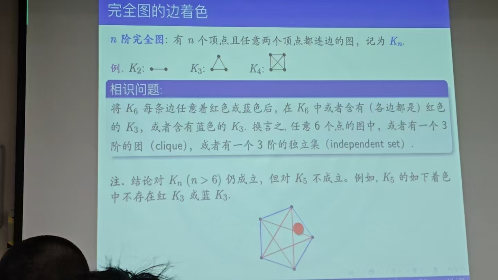

# Ramsey理论

## 抽屉原理

$
\begin{aligned}
&Dirichlet逼近定理\\
&\forall x\in R,n\in Z_{+}\\
&\exists p\in Z_{+},q\in Z,s.t. \\
&|px-q|<\frac{1}{n}\\
&\\
&证明:\\
&将[0,1)等分成n个区间I_{k}=[\frac{k-1}{n},\frac{k}{n})\\
&k=1,2,\cdots ,n\\
&考虑n+1个实数,y_1,\cdots ,y_{n+1}:\\
&y_{m}=mx-[mx],m=0,\cdots ,n\\
&显然y_{m}\in [0,1)\\
&故由抽屉原理可知\\
&\exists y_{m}和y_{m'}属于同一区间\\
&i.e. \exists k\in Z_{+}和m,m'\in N\\
&\cdots \\
&\\\\
&e.g.2:[1,2n]中任意取出n+1个数\\
&其中必有一个整除另一个\\
&\\\\
&e.g.3:CRT\\
&设(m,n)=1\\
&\forall a,b\in N,\exists x\in Z_{+},p,q\\
&s.t. x=pm+a=qn+b\\
&证明:a,m+a,2m+a,\cdots ,(n-1)m+a\\
&共计n个数\\
&被n除余数互不相同\\
&只需证明上述n个数构成mod n的完全剩余类\\
&简单验证即可\\
\end{aligned}
$

### 抽屉原理的应用——中国剩余定理

$
\begin{aligned}
&
\end{aligned}
$

### Erdos-Szekeres定理

$
\begin{aligned}
&任意一个n^2+1项实数列a_1,a_2,\cdots ,a_{n^2+1}\\
&中必然有n+1项的单调子数列\\
&\\
&Prove:\\
&令以a_{i}为首项的所有递增子序列中项数的最大值为p_i\\
&(1)若\exists p_{i}\geq n+1,则有长为n+1的递增子数列\\
&\\
&(2)若\forall i,p_{i}\leq n,\\
&由抽屉原理可知,这n^2+1个数中一定有n+1个数彼此相等\\
&\\
&不妨设p_{i_1}=p_{i_2}=\cdots =p_{i_{n+1}},其中i_1<i_2<\cdots <i_{n+1}\\
&\\
&下面证明:\\
&若p_{j}=p_{k},且j<k,则a_{j}>a_{k}\\
&否则(a_{j}<a_{k})\\
&则以a_{j}开头的递增子列一定比以a_{k}开头的递增子列长矛盾\\
&\\
&故知a_{i_1},a_{i_2},\cdots a_{i_{n+1}}构成了一个长度为n+1的递减子序列\\
&故知Erdos-Szekeres定理成立\\
\end{aligned}
$

## Ramsey定理（简式）和Ramsey数

### 六人相识问题

$
\begin{aligned}
&任意6人中,或有3人互相认识,或有3人互不相识.\\
\end{aligned}
$

### 完全图的边着色

$
\begin{aligned}
&一个图中完全子图称之为团\\
&一个图中的子图,子图间的所有顶点间都没有边相连,称之为独立集\\
&\\
&相识问题可以表述为:\\
&6阶图中要么有一个3阶团,要么有一个3阶独立集\\
&\\
&Tip:\\
&上述结论对K_{n}仍成立，但对K_{5}不成立\\
&\\
&对K_{5}做下述染色:\\
&
\end{aligned}
$

### Ramsey数和相识问题的一般情形

$
\begin{aligned}
&给定整数p,q\geq 2,是否存在n\in Z_{+},\\
&s.t. 将K_{n}的每条边任意着红色或蓝色后\\
&在K_{n}中,或者含有红色的K_{p},或者含有蓝色的K_{q}\\
&\\\\
&换言之:\\
&任意R(p,q)个点的图中,或者有一个p阶的团,或者有一个q阶的独立集\\
&\\\\
&将最小的满足上述条件的n记为R(p,q),称为Ramsey数\\
&\\
&R(3,3)=6\\
&R(p,q)=R(q,p)\\
&R(2,q)=q\\
&\\\\
\end{aligned}
$

### Ramsey定理(简式)

$
\begin{aligned}
&任给整数p,q\geq 3,数R(p,q)存在,当且仅当\\
&R(p,q)\leq R(p-1,q)+R(p,q-1)\\
&\\
&Prove:\\
&对p+q做归纳\\
&\\
&p+q=6时原命题显然成立\\
&\\
&假设当p+q<m时命题成立\\
&考虑p+q=m时的情况\\
&\\
&令n=R(p-1,q)+R(p,q-1):=r+s\\
&\\
&只需证:\\
&将K_{n}的边着红/蓝色后,在K_{n}中\\
&要么有红K_{p},要么有蓝色的K_{q}\\
&\\
&\forall K_{n}顶点x,\\
&x连出r+s-1条边\\
&\\
&则下面两种情况必发生其一:\\
&(1)这n-1条中有r条红边\\
&(2)这n-1条中有s条蓝色边\\
&\\
&对于情况(1):\\
&由归纳假设:\\
&K_{r}中有红色K_{p-1}或蓝色的K_{q}\\
&红 K_{p-1}\cup \{x\}= K_{p}\\
&对于情况(2):\\
&同理可得证\\
&\\\\
&Tip:\\
&若R(p-1,q)和R(p,q-1)均为偶数\\
&则有\\
&\\
&R(p,q)\leq R(p-1,q)+R(p,q-1)-1\\
&归纳可得Ramsey数的上界\\
&\\\\
\end{aligned}
$

### Ramsey数

$
\begin{aligned}
&Ramsey数的计算异常苦难\\
&目前已知的结果只有9个\\
\end{aligned}
$

### Ramsey数的下界

$
\begin{aligned}
&Erdos(1947):\\
&R(p,p)\geq 2^{\frac{p}{2}}\\
&假设p\geq 3,\\
&令G_{n}=\{边着红/蓝的所有K_{n}\}\\
&则|G_{n}|=2^{\binom{n}{2}}\\
&令G_{n}^{p}=\{G\in G_{n}:G含有红色K_{p}\}\\
&则|G_{n}^{p}|\leq \binom{n}{p}2^{\binom{n}{2}-\binom{p}{2}}(可能会产生重复)\\
&\\
&当n<2^\frac{p}{2}时\\
&我们只需证明:\frac{|G_{n}^{p}|}{|G_{n}|}\leq \frac{1}{2}\\
&\\\\
&LHS=\frac{\binom{n}{p}2^{\binom{n}{2}-\binom{p}{2}}}{2^{\binom{n}{2}}}=\frac{\binom{n}{p}}{2^{\binom{p}{2}}}\\
&=\frac{(n)_{p}}{p!2^{\binom{p}{2}}}\\
&归纳证明上式<\frac{1}{2}即可\\
&\\
&故由对称性可知\\
&\exists K_{n}的一个染色,其中既不含红K_{p},也不含蓝K_{q}\\
&\\\\
\end{aligned}
$

## Ramsey定理（通式）和幸福结局问题

**Ramsey 定理 (通式)**
任给正整数 $r, k$ 以及 $q_1, \dots, q_k \geq r$，存在 $n \in \mathbb{Z}^+$ 使得对 $[n]$ 的所有 $r$-子集的任一个 $k$-着色，一定存在 $1 \leq i \leq k$ 和相应的 $S_i \subseteq [n]$，使得 $|S_i| = q_i$ 并且 $S_i$ 的所有 $r$-子集都着第 $i$ 个颜色.

$
\begin{aligned}
&当r=1时,即为一般形式的抽屉原理\\
&当r=k=2时,通式即简式\\
\end{aligned}
$

### Ramsey定理(通式)在几何问题上的应用

$
\begin{aligned}
&设m\geq 3,则存在正整数N\\
&使得平面上任意N点(无三点共线)中,\\
&必有m个点构成凸m边形\\
&\\
&引理1:\\
&平面上无三点共线的任意五点中,\\
&必有四点构成凸四边形\\
&\\
&Prove:\\
&两两连接五个点,一定能形成凸边形\\
&若形成凸五边形或凸四边形,则结论得证\\
&\\
&若只形成三角形\\
&则必有两点在三角形内部\\
&用直线连接这两个内点\\
&则三角形必有两个顶点位于直线的同侧\\
&取这四个点即构成了凸四边形\\
&\\\\
&引理2:\\
&设平面上m\geq 4个点中无三点共线\\
&且其中任意四点都成凸四边形\\
&则这m个点必形成凸m边形.\\
&\\
&Prove:\\
&对m作归纳法:\\
&m=4时命题显然成立\\
&设m>4,则其中必有3点A,B,C\\
&使其余m-3个点都位于角BAC内部\\
&且在三角形ABC中没有电\\\\
&\\\\
&回到原定理的证明:\\
&当m=3时,取N=3即可\\
&当m\geq 4时,下证:取N=R^{(4)}(m,5)即可\\
&\\
&将N个点的四点自己分为两类:\\
&(1)形成凸四边形\\
&(2)不形成凸四边形\\
&\\
&由定义,在N=R^{(4)}
\end{aligned}
$