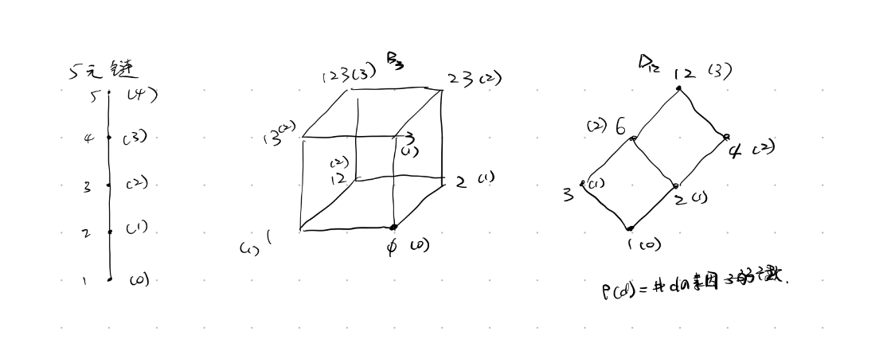
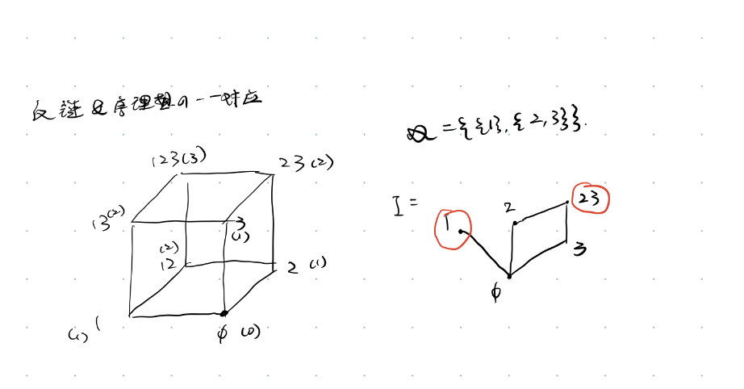
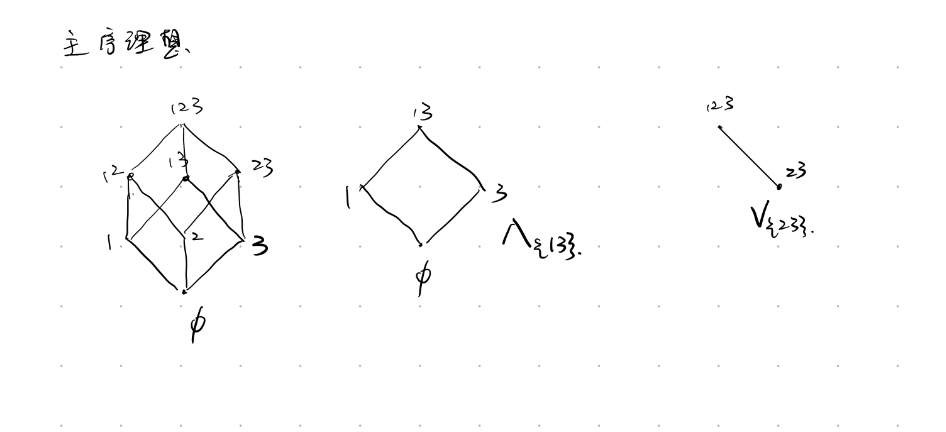
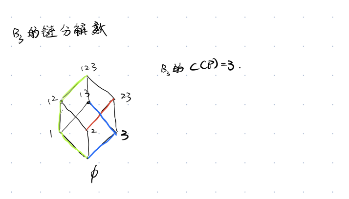
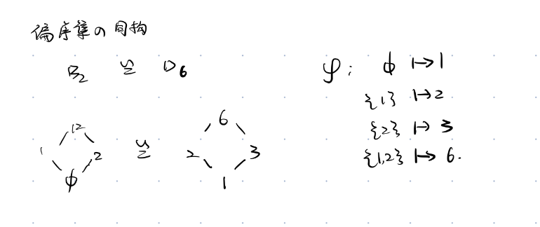
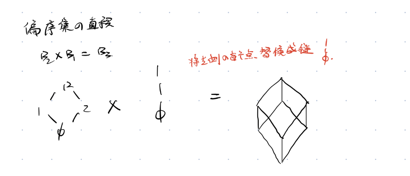

# 容斥原理及其推广
## 内容
$
\begin{aligned}
&设S是一个有限集,\ A_1,A_2,\cdots,A_n\subseteq S.\\
&则不满足任意一种性质(即不属于任何A_i)的元素个数为\\
&\left|S\setminus\bigcup_{i=1}^{n}A_i\right|
=|S|-\sum_{i}|A_i|+\sum_{i<j}|A_i\cap A_j|-\sum_{i<j<k}|A_i\cap A_j\cap A_k|+\cdots+(-1)^n\left|\bigcap_{i=1}^{n}A_i\right|.\\
&等价地,\\
&\left|\bigcup_{i=1}^{n}A_i\right|
=\sum_{i}|A_i|-\sum_{i<j}|A_i\cap A_j|+\sum_{i<j<k}|A_i\cap A_j\cap A_k|-\cdots+(-1)^{n-1}\left|\bigcap_{i=1}^{n}A_i\right|.
\end{aligned}$
## 证明
$
\begin{aligned}
&\forall x\in S\\
&只需证明:\\
&(1)x\notin A_i,\forall i\Rightarrow x对RHS贡献1\\
&(2)\exists i,s.t. x\in A_i\Rightarrow x对RHS贡献为0\\
&\\
&假设x恰好在k个A_i中\\
&不妨设为A_1,\cdots ,A_k\\
&\\
&故在|S|-\sum_{i}|A_i|+\sum_{i<j}|A_i\cap A_j|-\sum_{i<j<k}|A_i\cap A_j\cap A_k|+\cdots \\
&x贡献:1-k+\binom{k}{2}-\binom{k}{3}+\cdots (-1)^{k}1\\
&这是(1-1)^{k}\\
&当k=0时\\
&x的贡献为1\\
&当k>0时,x的贡献为0\\
&\\\\
\end{aligned}
$

## 另一种表述
$
\begin{aligned}
&设S是一个有限集,\\
&A_1,\cdots ,A_n\subseteq S\\
&令M_{k}=\sum_{1\leq i_1<i_2<\cdots<i_k\leq n}|A_{i_1}\cap \cdots \cap A_{i_{k}}|,k\geq 1\\
&表示恰好在k个子集中的元素个数\\
&且规定M_{0}=|S|\\
&则不在任何子集中的元素个数N_0=\\
&M_0-M_1+M_2-\cdots +(-1)^{n}M_n\\
&\\\\
\end{aligned}
$

## 特殊情形
$
\begin{aligned}
&假设|A_{i_1}\cap \cdots \cap A_{i_k}|仅依赖于集合个数k\\
&不依赖于具体有哪k个集合.\\
&a_0:=|S|\Rightarrow |M_{0}|=\binom{n}{0}a_0\\
&a_1:=|A_i|,\forall i\Rightarrow M_{1}=\binom{n}{1}a_1\\
&\vdots\\
&a_n:=|A_1\cap \cdots \cap A_n|\Rightarrow M_{n}=\binom{n}{n}a_n\\
&N_0=\binom{n}{0}a_0-\binom{n}{1}a_1\cdots +(-1)^{n}\binom{n}{n}a_n\\
&\\\\
\end{aligned}
$ 

## 例题
$
\begin{aligned}
&例:求从[n]到k元集的满射的个数\\
&令S=\{f:[n]\to \{y_1,\cdots ,y_k\}\}\\
&|S|=k^n\\
&A_i=\{f\in S|y_i不是f的像\}\\
&则N_0=|\overline{A_{1}}\cap \overline{A_{2}}\cap \cdots \cap \overline{A_k}|\\
&|A_i|=(k-1)^{n}\\
&|A_i\cap A_j|=(k-2)^{n}\\
&|A_{i_1}\cap \cdots \cap A_{i_{j}}|=(k-j)^{n}\\
&N_0=|S|-\binom{k}{1}(k-1)^{n}+\binom{k}{2}(k-2)^{n}-\cdots +(-1)^{k}\binom{k}{k}(k-k)^{n}\\
&\\\\
&=\binom{k}{0}(k-0)^{n}-\binom{k}{1}(k-1)^{n}+\binom{k}{2}(k-2)^{n}-\cdots +(-1)^{k}\binom{k}{k}(k-k)^{n}\\
&=\sum_{j=0}^{k}(-1)^{j}\binom{k}{j}(k-j)^{n}\\
&\\
&=\sum_{j=0}^{k}(-1)^{k-j}\binom{k}{j}j^n\\
&而从[n]到[k]的满射的个数=k!S(n,k)\\
&故知S(n,k)=\frac{\sum_{j=0}^{k}(-1)^{k-j}\binom{k}{j}j^n}{k!}\\
&其中S(n,k)是第二类Stirling数\\
\end{aligned}
$

## 应用
### 有限制的可重复组合
$
\begin{aligned}
&求方程x_1+x_2+x_3+x_4=20\\
&满足限制条件1\leq x_1\leq 6,0\leq x_2\leq 7\\
&4\leq x_3\leq 8,2\leq x_4\leq 6\\
&\\\\
&思路：\\
&将所有元素下界调整到0后考虑反面\\
&解:\\
&令y_1=x_1-1,y_2=x_2,y_3=x_3-4,y_4=x_4-2\\
&原方程\iff y_1+y_2+y_3+y_4=13(*)\\
&0\leq y_1\leq 5,0\leq y_2\leq 7\\
&0\leq y_3\leq 4,0\leq y_4\leq 4\\
&\\\\
&令S=\{(*)中非负整数解的个数\}\\
&|S|=\binom{4+13-1}{4-1}=\binom{16}{3}\\
&A_1=\{(*)满足y_1\geq 6 的非负整数解\}\\
&A_2,A_3,A_4同理定义\\
&\\\\
&N_0=|\overline{A_1}\cap \overline{A_2}\cap \overline{A_3}\cap \overline{A_4}|\\
&=\cdots (具体计算略)\\
\end{aligned}
$
### 错排问题

#### 递推关系

$
\begin{aligned}
&(I.)d_{n}=(n-1)(d_{n-1}+d_{n-2}),n\geq 3\\
&组合证明:\\
&第一个位置有n-1种放置的方法\\
&(1)若\pi (k)=1,那么剩下的方案数为d_{n-2}\\
&\\
&(2)若\pi (k)\ne 1\\
&那么考虑\\
&\begin{bmatrix}
2&\cdots &k&\cdots &n\\
2&\cdots &1&\cdots &n\\
\end{bmatrix}\\
&考虑上面的对应关系\\
&第一行表示的是位置\\
&第二行表示的是每个位置不能放对应的元素\\
&故知该种情况的结果即为d_{n-1}\\
&\\
&(II.)d_{n}=nd_{n-1}+(-1)^{n}\\
&Prove:\\
&d_n=(n-1)d_{n-1}+(n-1)d_{n-2}\\
&\cdots 直接求解数列通项即可(使用待定系数构造等比数列)\\
&\\\\
&Tip:\\
&利用递推关系2可以求得d_{n}的表达式:\\
&d_{n}=n!\sum_{j=0}^{n}(-1)^{j}\frac{1}{j!}\\
\end{aligned}
$

### Eular函数

$
\begin{aligned}
&\phi(n)=n\prod_{p\mid n}(1-\frac{1}{p})\\
\end{aligned}
$

## 偏序集

$
\begin{aligned}
&def:\\
&(1)自反性:x\leq x,\forall x\in P\\
&(2)反对称性:x\leq y,y\leq x\Rightarrow x=y\\
&(3)传递性:x\leq y,y\leq z\Rightarrow x\leq z\\
&\\
&例1:\\
&n元链n:设n\in Z_{+},则[n]连同数的大小关系构成一个偏序集\\
&\\
&例2:\\
&子集格B_{n}:设n\in N,则[n]的所有子集连同集合的包含关系\\
&构成一个偏序集\\
&\\
&例3:\\
&因子格D_{n},设n\in Z_{+},则n的所有正整数因子\\
&连同整数的整除关系构成一个偏序集\\
&\\\\
&def:\\
&设x,y\in P,若x\leq y或y\leq x,则称x和y是可比的\\
&\\
&P的子集:\\
&[x,y]:=\{z\in P|x\leq z\leq y\}\\
&称为P中一个闭区间\\
&若P中任意一个区间都是有限集\\
&则称P局部有限\\
&\\
&def:(覆盖关系和Hasse图):\\
&设x,y\in P,若x<y且不存在z\in P\\
&s.t. x<z<y,则称y覆盖x\\
&或称x被y覆盖\\
&记为x \lessdot y\\
&x\lessdot y\iff x<y且[x,y]=\{x,y\}\\
&\\
&局部有限偏序集完全由他的覆盖关系确定\\
&\\
&(有限偏序集的Hasse图)\\
&顶点为P的元素,边为覆盖关系\\
&若x<y,则y画在x"上面"\\
&\\
&B_{n}的Hasse图就是n维立方体\\
&\\
&def:偏序集P的一个子集称为一条链\\
&如果其中任意两个元素都可比\\
&链C称为饱和的,\\
&如果不存在z\in P/C\\
&s.t. \forall x,y\in Cs.t. x<z<y且C\cup\{z\}仍构成链\\
&\\
&Tip:\\
&局部有限偏序集中,\\
&链x_0<x_1<\cdots <x_n是饱和的\iff \\
&x_0\lessdot x_1<\lessdot\cdots x_{n}\\
&\\
&def(链的长度):\\
&有限链的长度定义为l(C)=|C|-1\\
&\\
&def (有限偏序集的长度):\\
&l(P):=max\{l(C)|C为P的链\}\\
&\\
&P的区间[x,y]的长度记为l(x,y)\\
&\\
&def(分次偏序集):\\
&若P中所有的极大链都具有相同长度n\\
&则称P是秩为n的分次偏序集\\
&此时存在唯一的秩函数\rho :P\to \{0,1,\cdots ,n\}满足:\\
&(1)若x是P的极小元,则\rho (x)=0\\
&(2)若x\lessdot y,则\rho (y)=\rho (x)+1\\
&若\rho (x)=i,则称x具有秩i\\
&\\
\end{aligned}
$

### 对比：极大链和饱和链
**极大链（maximal chain）**  
链 $C$ 在偏序集 $P$ 中称为极大，指的是：不存在严格包含它的更大链。  
等价说法：没有元素 $z\in P\setminus C$ 能加入 $C$ 后仍保持是链。

**饱和链（saturated chain）**  
链 $C=\{x_0<x_1<\cdots<x_k\}$ 称为饱和，指的是：任意相邻两点之间都不存在中间元素。  
等价刻画：对每个 $i$，$x_{i+1}$ 覆盖 $x_i$（记作 $x_i\lessdot x_{i+1}$）。  

### 反链和序理想

**反链（antichain）**  
在偏序集 $P$ 中，子集 $A$ 称为反链，若其中任意两个不同元素都不可比，即对任意 $x\ne y$，既不是 $x\le y$ 也不是 $y\le x$。

**序理想（order ideal / down-set / lower set）**  
在偏序集 $P$ 中，子集 $I$ 称为序理想（下集），若它对“小于等于”向下封闭：  
若 $x\in I$ 且 $y\le x$，则 $y\in I$。  

**对偶序理想（order filter / upper set）**  
在偏序集 $P$ 中，子集 $U$ 称为对偶序理想（上集/滤子），若它对“向上”封闭：  
若 $x\in U$ 且 $x\le y$，则 $y\in U$。  

注:当P有限时,P的反链$\mathcal{A}$与序理想I之间存在一一对应
$
\begin{aligned}
&\mathcal{A}=\{I的极大元\}\\
&I=\{x\in P|对某y\in A有x\leq y\}\\
&若I和\mathcal {A}满足上述对应关系\\
&则称\mathcal {A}生成I\\
\end{aligned}
$

### 主(对偶)序理想

**主序理想（principal ideal）**  
在偏序集 $P$ 中，对任意 $a\in P$，由 $a$ 生成的序理想定义为  
$$
\Lambda_ a=\{x\in P\mid x\le a\}.
$$  
这称为以 $a$ 为生成元的主序理想。

**主对偶序理想（principal filter）**  
对偶地，由 $a$ 生成的上集为  
$$
V_ a=\{x\in P\mid a\le x\}.
$$

### 链分解

这张图片展示的是关于**组合数学**中“链分解”与“宽度”的定义。以下是提取出的完整文字内容：

---

### 定义

若 $\mathcal{C} = \{C_1, \dots, C_k\}$，其中 $C_i$ 为偏序集 $P$ 中的**链**，并且 $\bigcup_i C_i = P$，则称 $\mathcal{C}$ 为 $P$ 的一个**链分解**，称 $k$ 为**链分解数**，记最小链分解数为 $c(P)$。

定义 $P$ 的**宽度** $w(P)$ 为最大反链的长度，即：

$$w(P) = \max \{|\mathscr{A}| : \mathscr{A} \text{ 是 } P \text{ 的反链}\}$$

$
\begin{aligned}
&Dilworth定理:w(P)=c(P)\\
&证明:\\
&我们首先证明:C(P)\geq W(P)\\
&(C(P)\leq W(P))的证明将在后续章节给出\\
\end{aligned}
$
$$
\begin{aligned}
&\text{证明 } c(P)\ge w(P).\\
&\text{设 } P=\bigsqcup_{i=1}^{k}C_i \text{ 为任意链分解}.\\
&\text{取任意反链 } \mathcal{A}.\\
&\text{则 } |\mathcal{A}\cap C_i|\le 1 \ (\text{链与反链至多交一元}).\\
&\Rightarrow |\mathcal{A}|\le \sum_{i=1}^{k}|\mathcal{A}\cap C_i|\le k.\\
&\text{因此 } w(P)=\max|\mathcal{A}|\le k.\\
&\text{对最小 } k=c(P)\text{ 仍成立，故 } c(P)\ge w(P).
\end{aligned}
$$

### 偏序集的同构

定义:如果偏序集 $P$ 和 $Q$ 之间存在双射 $\phi: P \to Q$，使得 $\phi$ 和 $\phi^{-1}$ 都保持序关系，则称 $P$ 和 $Q$ 同构，即：$$x \leq_P y \iff \phi(x) \leq_Q \phi(y)$$

### 偏序集的直积

定义偏序集 $P$ 和 $Q$ 的直积定义为集合$$\{(x, y) \mid x \in P, y \in Q\}$$上的偏序集 $P \times Q$，满足$$(x, y) \leq_{P \times Q} (x', y') \iff x \leq_P x' \text{ 且 } y \leq_Q y'$$$P$ 和自身的 $n$ 次直积记为 $P^n$。

