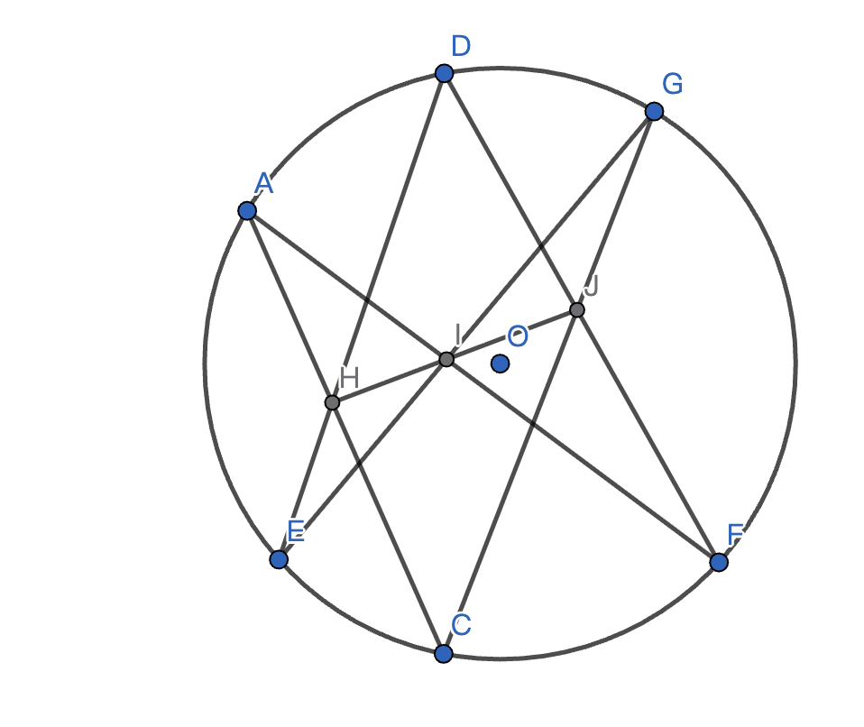

# 利用Pascal定理解决一道高考题
## 前言
$
\begin{aligned}
&笔者最近与朋友一起讨论了一道高中解析几何问题\\
&笔者起初并没有发现此题的几何背景\\
&在研究特例并猜出答案后\\
&\\
&笔者仔细观察图像才恍然大悟\\
&此题事实上就是Pascal定理\\
\end{aligned}
$
## Pascal 定理
$
\begin{aligned}
&Pascal定理是初等几何中的一个重要定理\\
&在2015年高联赛P2中有重要应用\\
&\\
&Pascal定理：\\
&圆内接六边形的对角线交点共线\\
\end{aligned}
$

$
\begin{aligned}
&如上图所示\\
&对于圆O而言\\
&AC\cap DE=H,AF\cap EG=I,EF\cap CG=J共线\\
&\\
&该定理可以使用Menelaus和Ceva给出一个优美的证明\\
&也可以利用面积变相同一直接使用三角计算完成证明\\
&由于本文的主要目标是解决一道高考问题\\
&所以Pascal定理的证明超过了本文的范围\\
&我们将将定理的证明放在补充部分\\
\end{aligned}
$
## 题目
$
\begin{aligned}
&给定曲线C:\frac{x^2}{4}+y^2=1\\
&设其与y轴正负半轴分别交于A_1,A_2两点\\
&
\end{aligned}
$