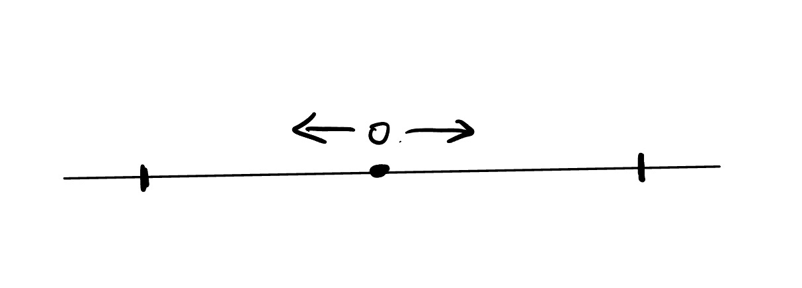

## 动力系统观点

$
\begin{aligned}
&为了更好的描述,我们首先对相关概念的定义进行回顾:\\
&\\
&平衡点:\\
&如果x=x_{0}是微分方程\dot{x}=f(x)的解,且f(x_{0})=0,则称x_{0}为平衡点\\
&对于x=x_{0},我们可以通过平移使得其平衡点变为0\\
&因此在后续概念的讨论中,我们默认平衡点为0\\
&\\
&稳定性:\\
&(这里指的稳定性是指Lyaponov稳定性)\\
&\forall \epsilon >0,\exists \delta >0\\
&当|x(t_{0})|<\delta 时,有|x(t)|<\epsilon,\forall t成立\\
&\\
&渐进稳定性:\\
&\forall \epsilon >0,\exists \delta >0\\
&当|x(t_{0})|<\delta 时,有|x(t)|<\epsilon,\forall t成立\\
&且\lim_{t\to \infty}x(t)=0成立\\
&\\
&\\
&Lipschitz存在唯一性定理:\\
&设\frac{dy}{dx}=f(x,y),y(x_{0})=y_{0}\\
&f在(x_{0},y_{0})附近是连续的且关于y满足Lipschitz条件\\
&那么在(x_{0},y_{0})附近存在唯一的解\\
&\\
&对于隐函数形式的微分方程而言\\
&Lipschitz存在唯一性定理常和隐函数定理一起使用\\
&隐函数定理:\\
&设F(x,y,p)=0\\
&若在(x_{0},y_{0},p_{0})附近F是连续可微的且\frac{\partial F}{\partial p}\ne 0\\
&那么在(x_{0},y_{0},p_{0})附近可将微分方程化为显式形式:\\
&p=f(x,y)\\
&\\
&解的延拓:\\
&Lipshitz存在唯一性定理通常只能保障在(x_{0},y_{0})附近存在唯一解\\
&但是我们可以通过解的延拓来得到在更大范围内的解\\
&延拓定理:\\
&若f定义在R\times R^{n}上\\
&且局部Lipschitz\\
&那么最大解若在有限时刻终止\\
&就必然有\lim_{t\to \beta^{-}}\sup ||x(t)||=+\infty\\
&(这也就是说在\beta时间处原解爆破)\\
&\\
&\\
&有了上面的概念,我们就可以继续引出\\
&辅助微分方程题目分析的重要工具:相图\\
&\\
&例如:\\
&我们考虑微分方程\dot{x}=x^{3}的全局解\\
&\\
&容易发现x=0是原方程的平衡点\\
&\\
&下面我们考虑如果初值在x=0附近\\
&那么解的行为会如何\\
&\\
&如果x(0)>0,那么\dot{x}>0,因此x(t)是单调递增的\\
&又由\dot{x}=x^{3}可知x会在有限时间爆破\\
&\\
&如果x(0)<0,那么\dot{x}<0,因此x(t)是单调递减的\\
&又由\dot{x}=x^{3}可知x仍然会在有限时间爆破\\
&图下图所示我们可以将相图按如下图像表示\\
&\\
&那么我们就可以很直接的得出结论:\\
&对于微分方程\dot{x}=x^{3},其全局解只有x=0\\
&\\
\end{aligned}
$

$
\begin{aligned}
&再比如我们考虑\\
&\dot{x}=\sqrt{x}\\
&显然我们只需考虑x\geq 0的情况\\
&x=0是唯一平衡点\\
&当x>0时,我们有\dot{x}>0,因此x(t)是单调递增的\\
&且不会在有限时间爆破\\
&设x(t)=\frac{1}{4}(t-c)^{2}\\
&此时我们发现x(t)的解可以写为如下形式\\
&x(t)=\begin{cases}
0,t\leq c\\
\frac{1}{4}(t-c)^{2},t>c\\
\end{cases}\\
&我们发现,x可以在0处停滞任意长的时间\\
&这样的状态我们称之为等待时间\\
\end{aligned}
$

### 等待时间和有限爆破的判定-Osgood型积分判据

$
\begin{aligned}
&设\dot{x}=f(x)\\
&则x(t)的解中存在等待时间的充要条件是\\
&\int _{0}^{\epsilon }\frac{dt}{f(t)}<+\infty(*)\\
&\\
&(*)式成立即表示x可以在有限时间内从0到达一个正数\\
&否则则表示x无法在有限时间内达到一个正数\\
&\\\\
&x(t)的解在有限时间爆破的充要条件是\\
&\int_{A}^{\infty}\frac{dt}{f(t)}<+\infty(**)\\
&(**)式成立即表示x可以在有限时间内从一个正数到达无穷大\\
&否则则表示x无法在有限时间内达到无穷大\\\\
&特别的,对于微分方程\dot{x}=x^{\alpha},我们有:\\
\end{aligned}
$

\(\boxed{
\begin{array}{c|c|c}
\alpha & \text{从 }0\text{ 离开} & \text{到 }\infty\\
\hline
0<\alpha<1 & \text{有限时间，可等待后离开} & \text{无限时间}\\
\alpha=1 & \text{无限时间} & \text{无限时间}\\
\alpha>1 & \text{无限时间} & \text{有限时间爆破}
\end{array}
}\)

### Lyaponov第二方法

$
\begin{aligned}
&设\dot{x}=f(x)\\
&f(0)=0\\
&若\exists V(x),s.t. \\
&V(x)>0,\forall x\ne 0\\
&V(0)=0\\
&且沿着轨道求导有\\
&\dot{V}(x)=\nabla V(x)\cdot f(x),\forall x\ne 0\\
&\\ 
&如果\dot{V}(x)\leq 0,则原微分方程在原点Lyaponov稳定\\
&如果\dot{V}(x)<0,则原微分方程在原点渐进稳定\\
&\\\\
&Lyaponov第二方法应用的经典例子:\\
&1.\begin{cases}
\dot{x}=-x+y\\
\dot{y}=-x-y\\
\end{cases}\\
&取V=x^{2}+y^{2}, \\
&则\dot{V}=2x\dot{x}+2y\dot{y}=2x(-x+y)+2y(-x-y)=-2(x^{2}+y^{2})<0\\
&故知(0,0)渐进稳定\\
\end{aligned}
$