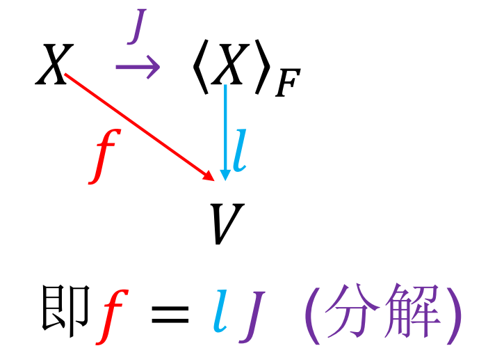

# 线性子空间
$
\begin{aligned}
&四个基本子空间:\\
&设T:V\to W 是Hilbert空间之间的线性映射\\
&T^{\dagger}:W\to V为其对偶\\
&那么下面四个子空间被称为基本子空间:\\
&Im(T),Ker(T),Im(T^{\dagger}),Ker(T^{\dagger})\\
&Tip:\\
&Hilbert空间:满足如下三条性质的空间\\
&(1)是某数域上的线性空间\\
&(2)其上定义了一个内积\\
&(3)由内积诱导出的范数诱导出的距离是完备的\\
&~~~~~(即每个Cauchy序列都熟练到Hilbert空间中的某个元素)\\
\end{aligned}
$
## 自由线性空间
$
\begin{aligned}
&集合不一定具有线性结构\\
&如何把它转化成线性空间\\
&也就催生了自由线性空间的概念\\
&自由线性空间的精神实质在于:\\
&可以把任何映射转化为线性映射\\
&\\\\
&设X为任意非空集合,称\\
&\langle X\rangle _{F}=\{\sum _{finite ~~~i}r_ix_i:x_i\in X,r_i\in C\}\\
&为由X生成的自由线性空间\\
&在形式上把X看成基\\
&\\\\
&我们可以定义从原集合到其生成的自由线性空间的典则嵌入\\
&J:X\to \langle X\rangle _F\\
&~~~~~~~~x\mapsto 1x\\
&且该典则嵌入具有普适性:\\
&对任何映射f:X\to V(线性空间),\\
&\exists 惟一线性映射l:\langle X\rangle _F\to V\\
&s.t. 下图可交换
\end{aligned}
$

## 直和
$
\begin{aligned}
&内直和和外直和\\
&\\\\
&\\
&外直和实际上是两个线性空间的笛卡尔积\\
\end{aligned}
$
## 旗
$
\begin{aligned}
&线性空间的维数就等于极大旗的旗长\\
&Fitting引理
\end{aligned}
$
